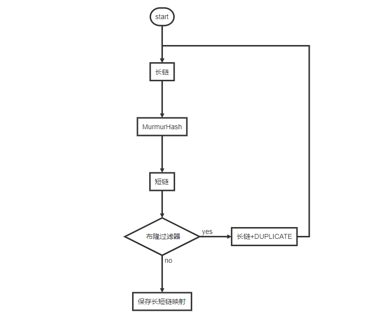

#Assignment
在本项目中,需通过SpringBoot实现短域名服务
##Requirement
### 目标
1. 提供两个API接口：
   1. 短域名存储接口：接受长域名信息，返回短域名信息 
   2. 短域名读取接口：接受短域名信息，返回长域名信息

### 限制
1. 生成的短域名最大长度为 8 字符
2. 采用SpringBoot，集成Swagger API文档
3. JUnit编写单元测试, 使用Jacoco生成测试报告(测试报告提交截图)
4. 映射数据存储在JVM内存即可，防止内存溢出

## 整体设计
###系统结构
1. 为了提高服务能力, 服务设计为分布式结构
2. 基于短域名长度为8位的特性, 将其区分为: 行位, 列位, 数据位. 
行位可以由路由模块来进行分配, 每台机器获取唯一ID. 列位由机器内部
自行指定, 代表每个发号器的唯一ID. 数据位即为号码生成方法使用.
行位 + 列位 + 数据位总和等于短域名总长度8.
3. TODO 发号器以及分配器均可以由多种方法实现, 对外隐藏生成模式.
分配器负责内部的负载均衡逻辑. 当前使用随机数选择(未来也可以改为
按权重, 顺序分配或其他方式)
4. 为了尽量保证长短链接对应关系的唯一, 及短连接的查询效率, 需运用
缓存, 本项目简单的实用了Caffeine本地缓存. 分布式系统可以基于本地缓存
扩展为专门的缓存服务, 长期未使用的号段, 可以通过数据持久化服务转为离线
数据. 并写入搜索引擎中, 提供二阶段查询.

### 功能实现
1. 简单实现了基于自增逻辑来进行短连接发号的发号器, 以及基于随机数取
ID来进行发号器选择的分配器. 使用了一个While循环来处理发号器号码发满
导致本次服务时效的情况. 在最坏的case下, 随机数取发号器 + loop的方式
会造成严重的RT上升. 后续可以优化分配器选择方式 以及配置超时时间.
2. 当前发号器采用加锁来保证一致性. 可以考虑替换为异步消息队列的方式来
运行
3. 新的长域名转短域名请求进来后, 有限查询现有缓存是否存在该映射. 存在则
直接返回.

### 未来改进
1. 优化发号器以及分配器的实现方式.
2. 本地缓存在单机故障后无法恢复, 考虑使用分布式缓存/数据库/离线持久化方案, 搭配
搜索引擎进行历史数据查询.

## API文档

## 功能及性能测试
### 返回码说明
Response_code 自定义服务状态码 返回值语义：
- "200" : "服务正常"
- "300" : "参数错误"
- "400" : "系统错误"
- "500" : "其他错误"
### 获取短链

### 获取长链

### Jacoco 覆盖率

注释：不包含配置文件与自定义异常

### 性能测试
使用 Apache AB 进行对应性能测试.
我们可以看到Tomcat 仅有一个Connect的时候
QPS一直保持在1400左右. 

AB加大并发会导致用户平均请求等待时间 由
Time per request:       45[ms]。提高到143[ms].
(由于同时只处理一个Connection当用户侧并发提升后等待时间会变长)

在单链接请求方62并发的情况下, P99 RT为79ms. QPS 1400. 平均RT 45ms.

## 个人信息
###基本信息
姓名：袁康翔
电话：15623929291
邮箱：285511594@qq.com
居住地址：杭州市余杭区仓前街道奥克斯时代未来之城

###教育背景
2013 - 2017, 计算机系统工程 荣誉学士, 奥克兰大学

2017 - 2019, 信息技术 硕士, 墨尔本大学

###工作经历
2019.8 - 2020.10, 深圳市腾讯计算机系统有限公司, 职位: C++ 后端开发工程师
工作内容：负责王者荣耀AI后台服务器模块的开发与维护, 参与服务器系统结构设计, 主要使用MCP++ 框架.

2020.11 - 至今, 淘宝(中国)有限公司, 职位：高级开发工程师
工作内容：主要负责淘宝特价版搜推离线系统的开发与演进工作, 参与搜推在线引擎的开发及迭代, 主要涉及Blink, ODPS, AIOS(TensorFlow)等技术方向.

###其他信息
####性能测试详细指标：
1. N = 10000, C = 62 
2. N = 124000, C = 62 
3. N = 248000, C = 62 
4. N = 456000, C = 62 
5. N = 124000, C = 200 