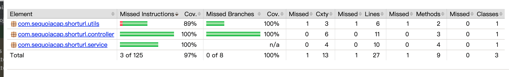
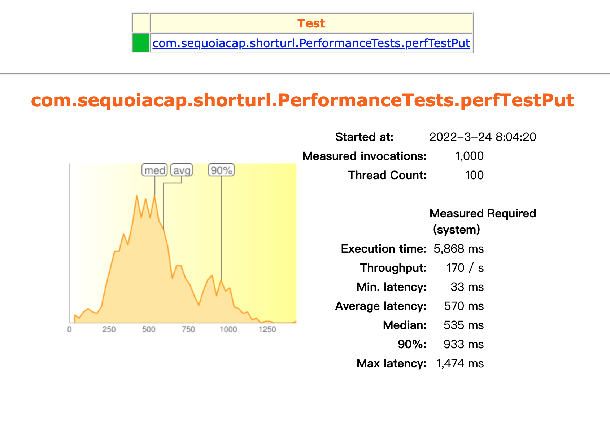
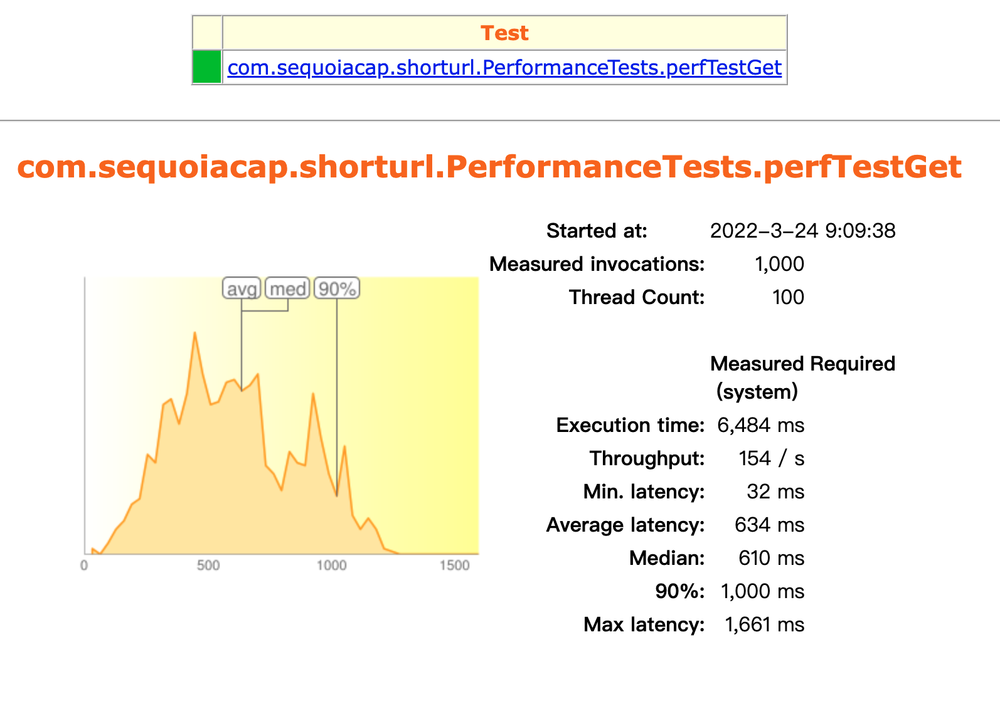
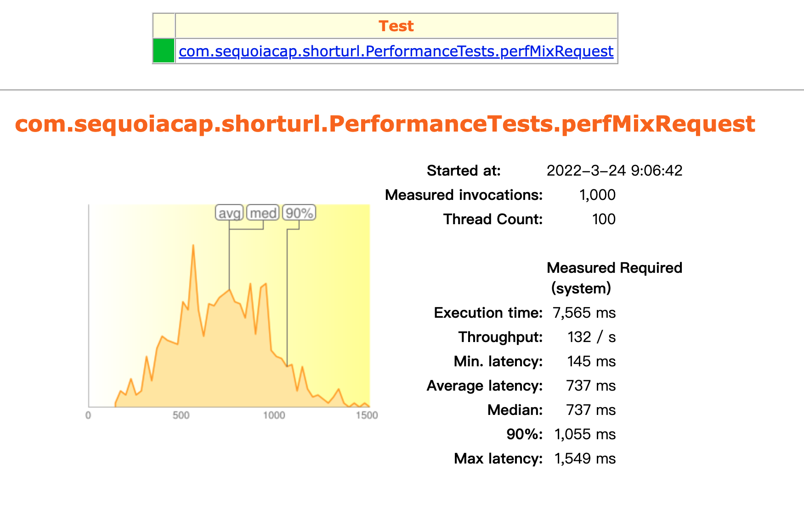

#短域名服务
##需求分析
- 短域名长度最大为 8 个字符
要做到8个字符内，又要支持大数量，目前最合适的是高进制数，这里选择62进制，8个字符支持218340105584895个
- 接口并发
通常一个长域名存储一次，读取多次，读取并发更大些，如果做性能优化，这是一个优化点，比如某部分域名读取量很大可以单独缓存到一个map中

##设计实现
- 短域名存储接口
1. 入参地址格式校验，错误格式的url返回错误信息提示
2. 根据内存大小指定支持的存储域名数防止内存溢出，作为配置项参数，application.properties中max_support_url_count
3. 短域名使用自动递增数使用AtomicLong并转换为62进制
3. 按需求域名数据存储在内存中，使用map方式存储，即：map<"短域名","长域名">。并发情况下选择ConcurrentSkipListMap
4. 为了防止同一个长域名重复调用接口，导致重复存储，需要实现判断是否存储过，如果有，返回之前生成好的短域名，但这个会消耗些性能，如果实际使用场景很少
   会出现重复调用，可以去掉这个判断处理逻辑。当前采用校验重复并反查短域名
   目前防重复存储实现方式是另建一个反向map<"长域名","短域名">,之所以新建一个，是因为containsValue效率非常慢，containsKey快很多，
   对重复的长域名也可以方便的取出对应的短域名
   还有一种使用布隆过滤方案查重，可以不用建反向map<"长域名","短域名">节省内存，但是并发情况下通过value查key效率很差，未采纳

- 短域名读取接口
1. 根据短域名map提取长域名
2. 为命中域名返回错误提示信息

# swagger文档

http://localhost:8000/swagger-ui.html   
个人偏喜欢下面左侧菜单版
http://localhost:8000/doc.html

## Jacoco单元测试覆盖率

## 性能测试
存储性能测试

读取性能测试

存储读取混合性能测试，存读比例1比4
