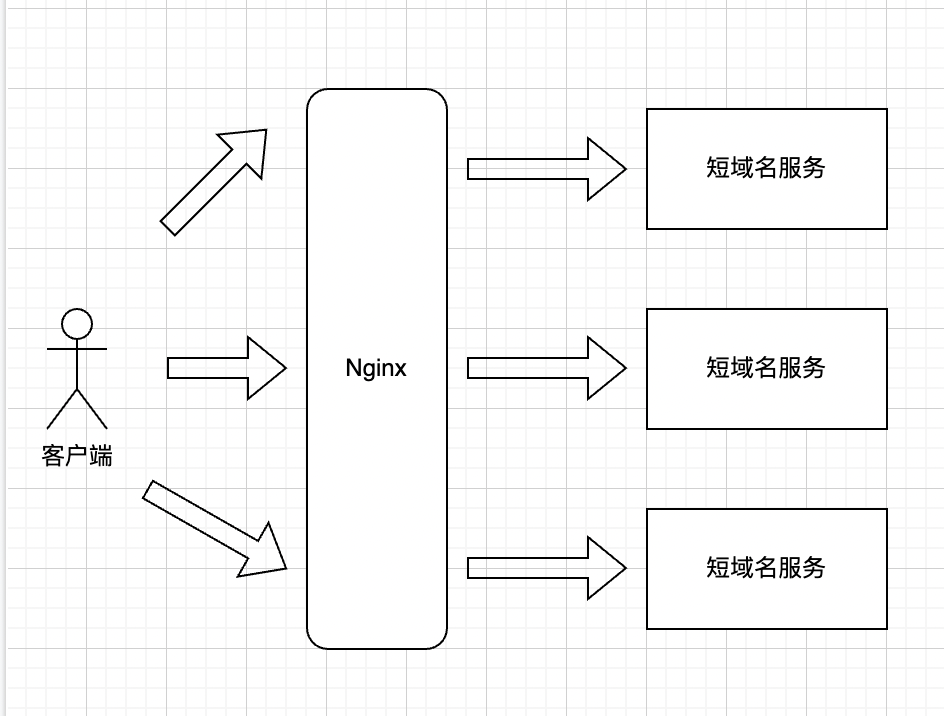
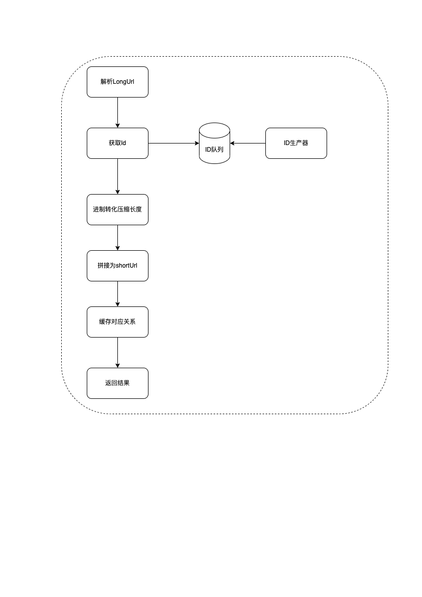
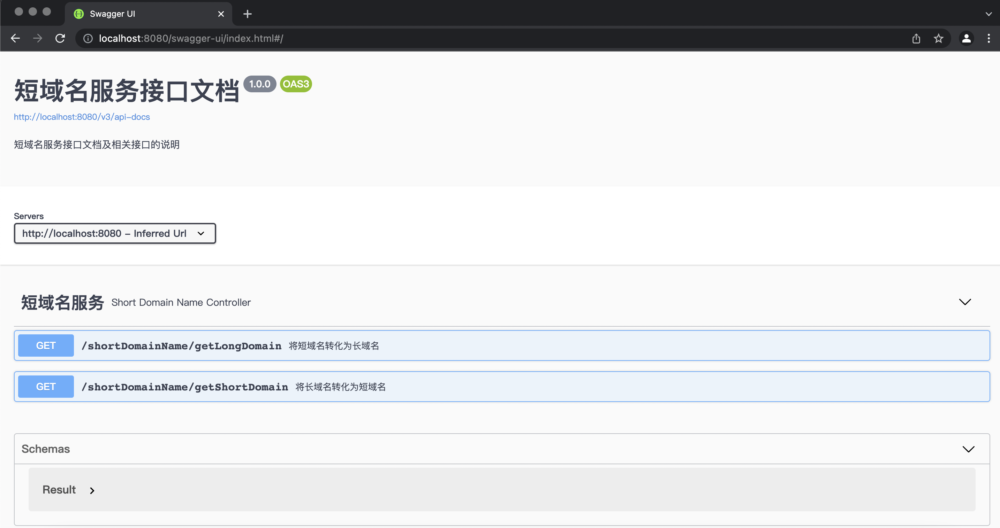
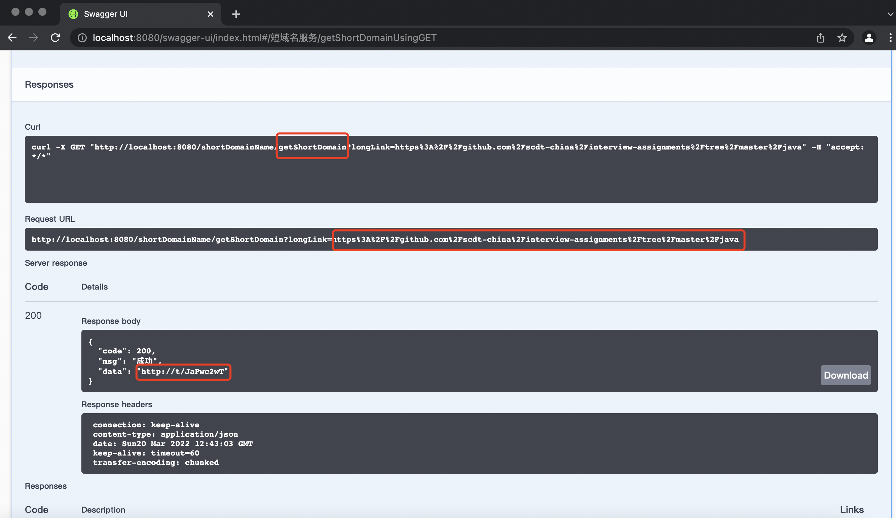
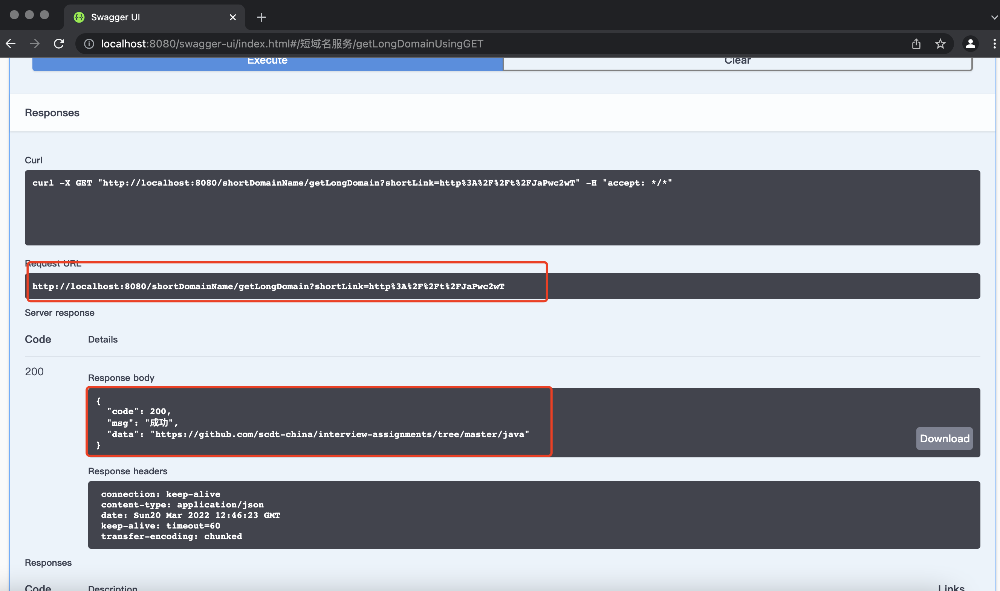
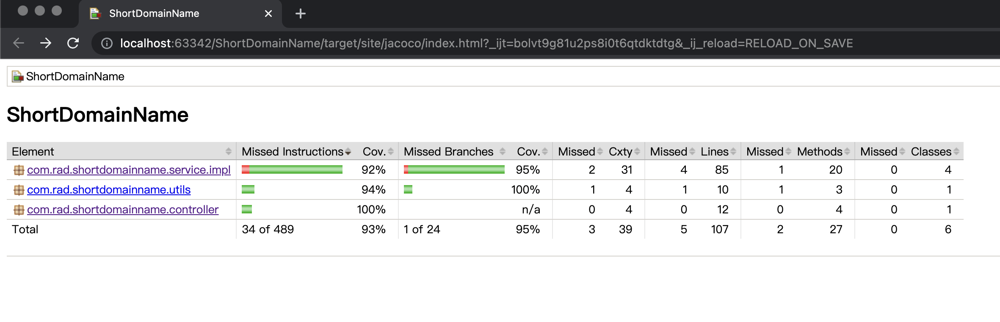
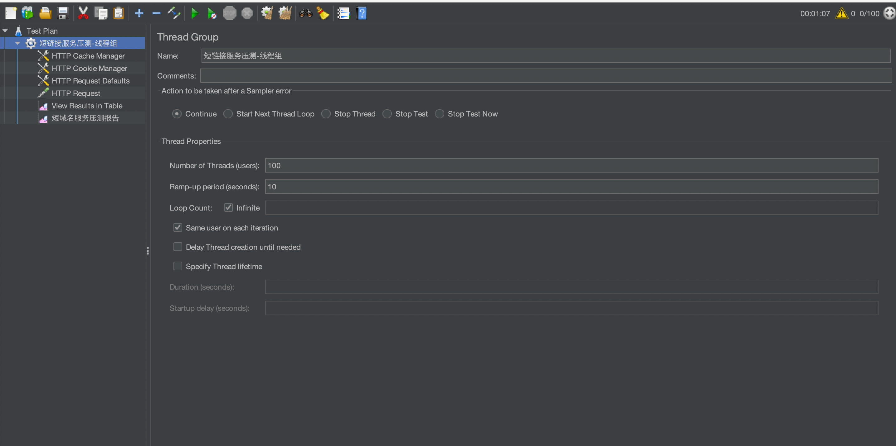
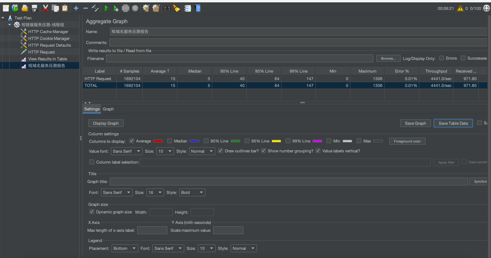
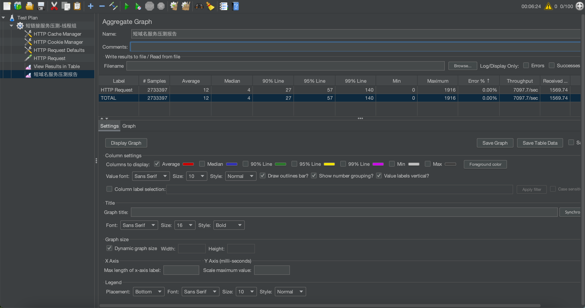
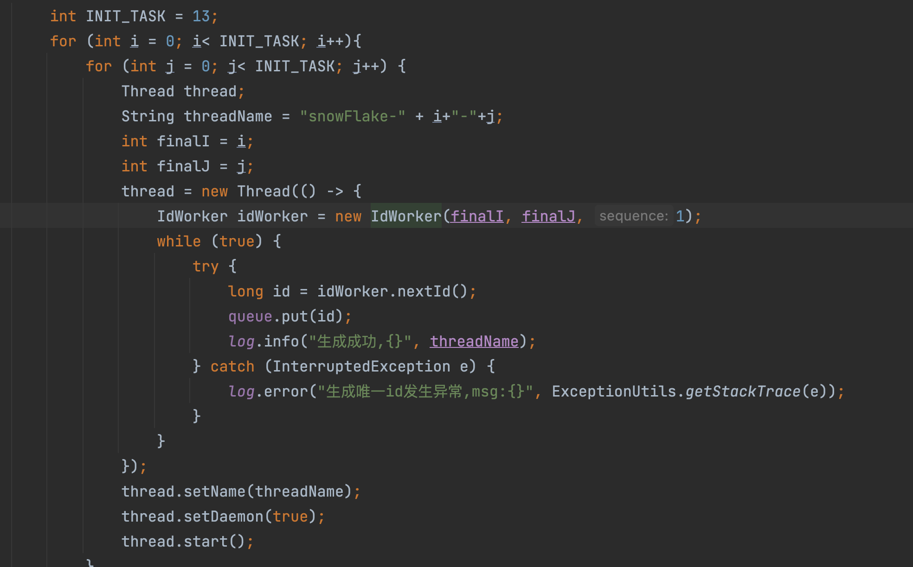

# 1.需求及其背景
## 1.1 需求概要
实现短域名服务（细节可以百度/谷歌）
撰写两个 API 接口:
* 短域名存储接口：接受长域名信息，返回短域名信息
* 短域名读取接口：接受短域名信息，返回长域名信息。
限制：
* 短域名长度最大为 8 个字符
* 采用SpringBoot，集成Swagger API文档；
* JUnit编写单元测试, 使用Jacoco生成测试报告(测试报告提交截图)；
* 映射数据存储在JVM内存即可，防止内存溢出；
## 1.2 背景知识
顾名思义，就是将长网址缩短到一个很短的网址，用户访问这个短网址可以重定向到原本的长网址（还原）。这样可以达到易于记忆、转换的目的，常用于有字数限制的微博、二维码等场景。

# 2.设计思路

## 2.1 压缩长度
如何能压缩长度,我们想到的就是比较简单的就是使用进制转化,例如我们将2进制的数字101转化为10进制的5,就能缩短字符的长度。
需求中给出的短域名长度最大为8个字符。当前互联网上的网页总数量大概是45亿,超过了2^32(4294967296)
网址如果只使用数字和大小写字母(10+26+26=62)的话,可以将其看成是62进制,62^8(2.183401055849e+14)远超过了网页总数量。

## 2.2 映射
因为是长域名和短域名一一对应,不考虑有几率发生hash碰撞的情况,我们需要生成一个全局唯一的id算法。
我们采用的是使用比较多的雪花算法
### 2.2.1 雪花算法的介绍
SnowFlake算法生成id的结果是一个64bit大小的整数，它的结构如下图：

1. 1bit，不用，因为二进制中最高位是符号位，1表示负数，0表示正数。生成的id一般都是用整数，所以最高位固定为0。
2. 41bit-时间戳，用来记录时间戳，毫秒级。
- 41位可以表示2^41-1个数字，
- 如果只用来表示正整数（计算机中正数包含0),可以表示的数值范围是：0 至2^41-1,减1是因为可表示的数值范围是从0开始算的，而不是1。
- 也就是说41位可以表示(2^41-1)个毫秒的值，转化成单位年则是年则是(2^41-1)/(1000*60*60*24*365) = 69年
3. 10bit-工作机器id，用来记录工作机器id。
- 可以部署在2^10=1024个节点，包括5位datacenterId和5位workerId
- 5位（bit）可以表示的最大正整数是2^5-1 = 31，即可以用0、1、2、3、....31这32个数字，来表示不同的datecenterId或workerId
4. 12bit-序列号，序列号，用来记录同毫秒内产生的不同id。
- 12位（bit）可以表示的最大正整数是2^12-1 = 4095，即可以用0、1、2、3、....4094这4095个数字，来表示同一机器同一时间截（毫秒)内产生的4095个ID序号。
由于在Java中64bit的整数是long类型，所以在Java中SnowFlake算法生成的id就是long来存储的。

SnowFlake可以保证：
1. 所有生成的id按时间趋势递增
2. 整个分布式系统内不会产生重复id（因为有datacenterId和workerId来做区分）

## 2.3 存储
因为长链接转化为短链接的过程是不可逆的,所以我们需要将其对应关系存储下来。
因需求中要求映射数据存储在JVM内存即可,防止内存溢出,我们除了需要缓存之外还需要回收策略。
Caffeine一个高性能的Java缓存库,Caffeine因使用WindowTinyLfu回收策略,提供了一个近乎最佳的命中率。
所以我们选择了Caffeine来缓存。

# 3.架构设计


负载平衡是一种常用的技术来优化利用资源最大化吞吐量，减少等待时间，并确保容错。
可以使用nginx的作为一种非常高效的HTTP负载平衡器，将流量分配到多个应用服务器上提高性能，可扩展性和高可用性。

```conf
http{
    upstream myapp1 {
        server 127.0.0.1:8080;
        server 127.0.0.2:8080;
        server 127.0.0.3:8080;
    }
    server {
        listen 80;
        location / {
            proxy_pass http://shortDomain;
        }
    }
}
```

# 4.核心流程
## 4.1 长域名到短域名
  
使用生产者消费者,能够异步生产Id,生产者在在初始化完成之后,后台会有一个线程一直在生产id,直到队列满为止。请求来的时候,会从队列中取出id。

## 4.2 短域名到长域名
请求的时候会从缓存中获取长域名,如果不存在则,获取为空。


# 5.Swagger
## 5.1 SwaggerUi

## 5.2 获取短链接
例如：
长链接:https://github.com/scdt-china/interview-assignments/tree/master/java
=>
短链接:http://t/JaPwc2wT


## 5.3 获取长链接
例如：
短链接:http://t/JaPwc2wT
=>
长链接:https://github.com/scdt-china/interview-assignments/tree/master/java


# 6.单元测试


# 7.压测
机器:MacBook Pro (13-inch, M1, 2020)  
CPU:Apple M1  
内存:16GB  
配置为100线程并发



压测6分21秒后,总请求数为1692104,错误率为0.01%,QPS为4441。

可以适当调整线程数(可以在保证workerId和datacenterId够用的情况下,单机可以设置多个worker并行生成id,下图是设置了线程数为13*13的情况下)可以提高性能




# 7.展望
## 产生ID
目前只是单机部署,若需要集群部署的话，可以参考https://tech.meituan.com/2017/04/21/mt-leaf.html  
美团的Leaf-snowflake方案,步骤启动的：
1. 启动Leaf-snowflake服务，连接Zookeeper，在leaf_forever父节点下检查自己是否已经注册过（是否有该顺序子节点）。
2. 如果有注册过直接取回自己的workerID（zk顺序节点生成的int类型ID号），启动服务。
3. 如果没有注册过，就在该父节点下面创建一个持久顺序节点，创建成功后取回顺序号当做自己的workerID号，启动服务。  

这样可以避免指定workerID发生重复导致产生重复id。除了每次会去ZK拿数据以外，也会在本机文件系统上缓存一个workerID文件。当ZooKeeper出现问题，恰好机器出现问题需要重启时，能保证服务能够正常启动。这样做到了对三方组件的弱依赖。一定程度上提高了SLA

## 存储
可以使用Redis来存储短域名和长域名的对应关系


