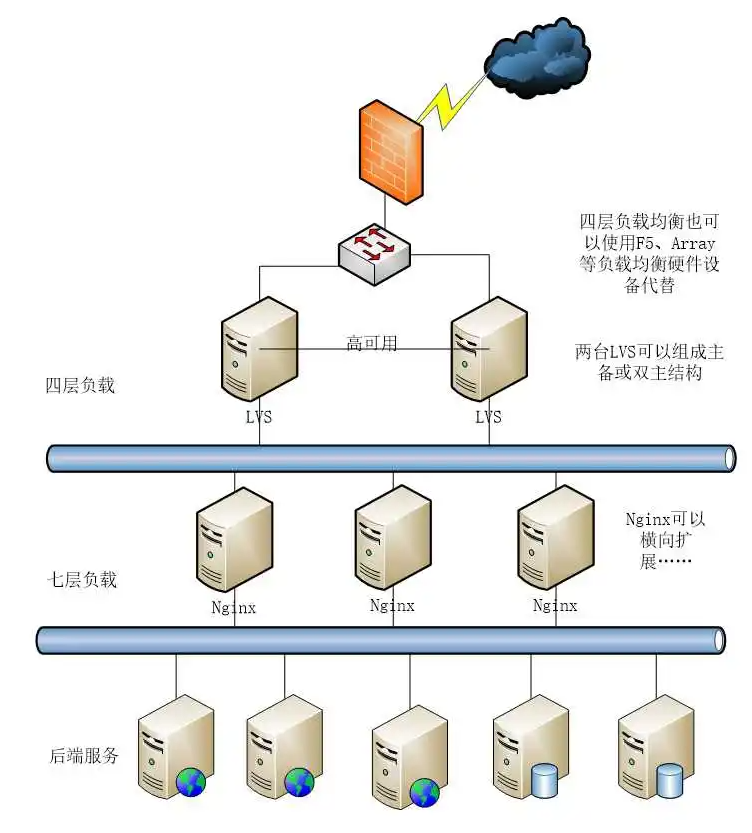
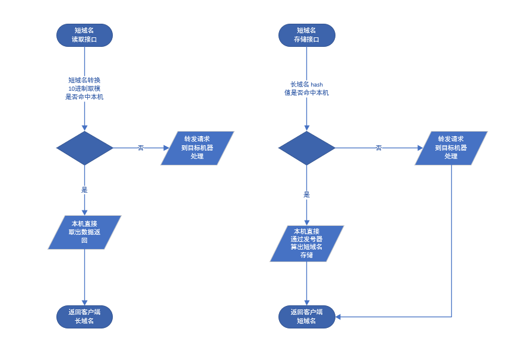
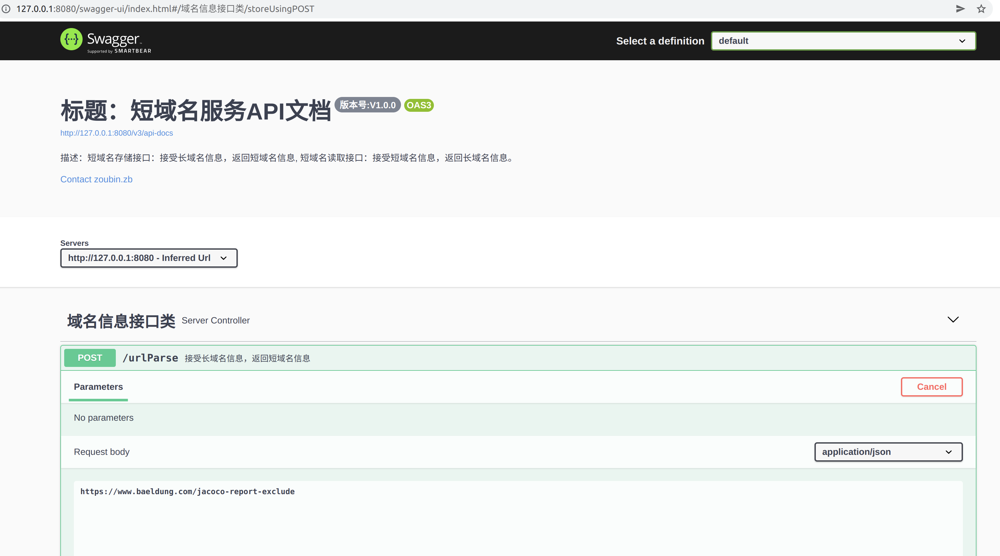
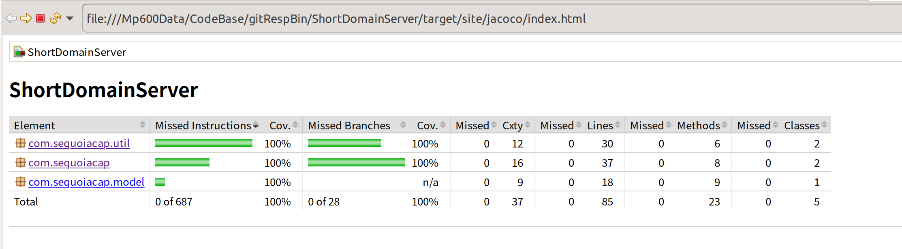
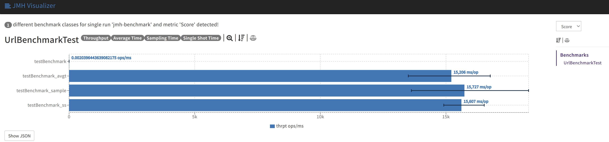

## 设计思路
* 此系统主要核心是长域名编码成短域名的算法，然后考虑分布式部署和存储方案，使其具有高可用，高性能，高扩展等特性，编码方式分为以下2种：

###### md5+hash
* 长域名转换短域名基于 md5 编码，然后做 hash 转换，此方式转出来的短域名无规则性，不易被破译，但是 md5 和 hash 都会产生冲突，随着长域名数量增长，冲突率也会增高，即使用一些方法对冲突进行处理也会导致后期的短域名生成的耗时大幅增加

###### 发号器
* 基于自增id发号器生成短域名，此方式缺点在于规律性比较强，有可能被破译，可以使用转成62进制数的方式在规定的短域名长度内支持更多数量的长域名转换并且增加破译的难度，发号器可以分布式的产生，每个发号器服务的的初始值隔开，步长保持一样就可以不产生重复的号码，此算法需要使用LRU Cache存储长域名到短域名的映射，短域名到长域名的映射可以永久存储，也可以在长域名淘汰的时候清除，具体看业务需不需要支持太久没使用的长域名生成的短域名还能继续访问

## 架构设计与流程
 ###### 选型
  * 选择上述思路的第二种算法实现

  ###### 架构设计
  * 部署使用两级负载均衡方案，客户端经过 dns 路由到地区所在 lvs 四曾负载均衡，再转发到七层 nginx 负载均衡，最后转发到后端 springboot （tomcat）集群，这里有一个优化点可以在 nginx 上使用 luajit + httpclient 模块获取接口长短域名参数，做 hash 运算直接路由到后端目标机器，可以减少 tomcat服务器之间的转发，少一跳进一步提高性能 ，部署图如下：
   
  
  
  ###### 流程图
  

## Swagger-Ui

## Jacoco 单测覆盖率

## 系统性能测试方案以及测试结果
###### 方案 
使用 jmh 压力测试，集成到 maven test里面，在根目录执行命令 mvn clean verify -Dmaven.test.jvmargs='-agentlib:xxxagent -Xss256k -Xmn1g -Xms4g -Xmx4g -XX:+UseConcMarkSweepGC -XX:+CMSParallelRemarkEnabled -XX:+UseCMSCompactAtFullCollection -XX:LargePageSizeInBytes=128m -XX:+UseFastAccessorMethods -XX:+UseCMSInitiatingOccupancyOnly -XX:CMSInitiatingOccupancyFraction=70'， 压测参数：
 * @BenchmarkMode(Mode.All)
 * @Warmup(iterations = 0)
 * @Measurement(iterations = 3, time = 30, timeUnit = TimeUnit.SECONDS)
 * @Threads(32)
 * @Fork(1)

###### 结果
