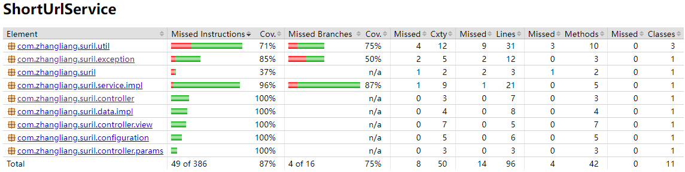

[TOC]

短域名服务设计文档
===
## 需求 
撰写两个 API 接口:  
- 短域名存储接口：接受长域名信息，返回短域名信息；
- 短域名读取接口：接受短域名信息，返回长域名信息。

### 限制
- 短域名长度最大为 8 个字符；  http://surl.com/fwweesfgt
- 采用SpringBoot，集成Swagger API文档；
- JUnit编写单元测试, 使用Jacoco生成测试报告(测试报告提交截图)；
- 映射数据存储在JVM内存即可，防止内存溢出。

## 逻辑结构图

## 覆盖率
> 说明  
> 简单起见，只测试了控制器，因为是 demo，依赖代码各种 **分支未测试穷尽**，但测试方式都一样
> 这里达到了87% ，应该满足大部分公司要求的覆盖率范围了

