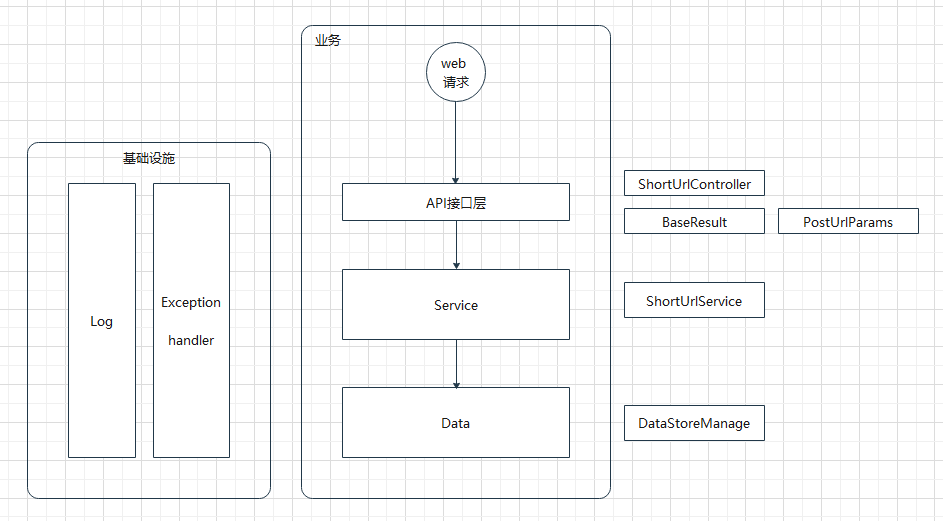
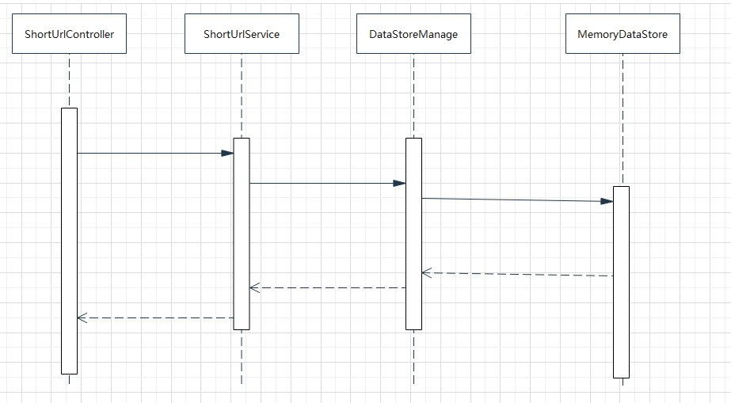
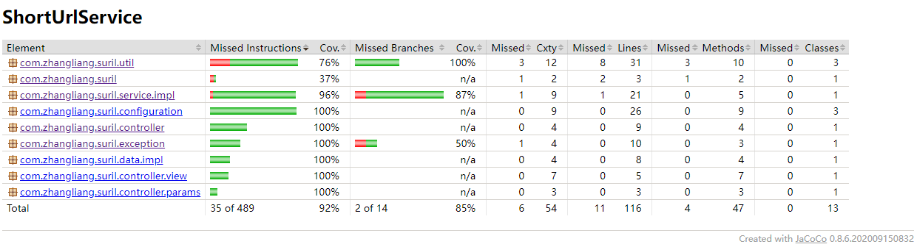
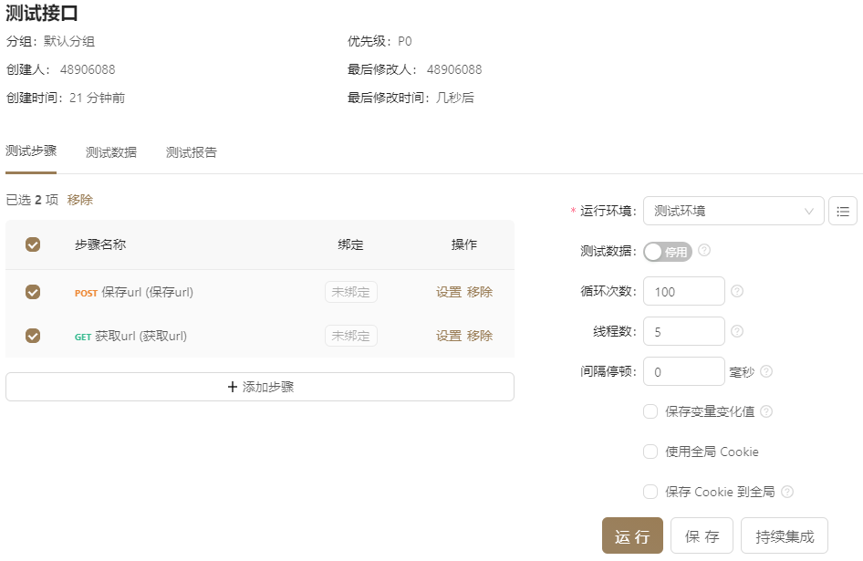
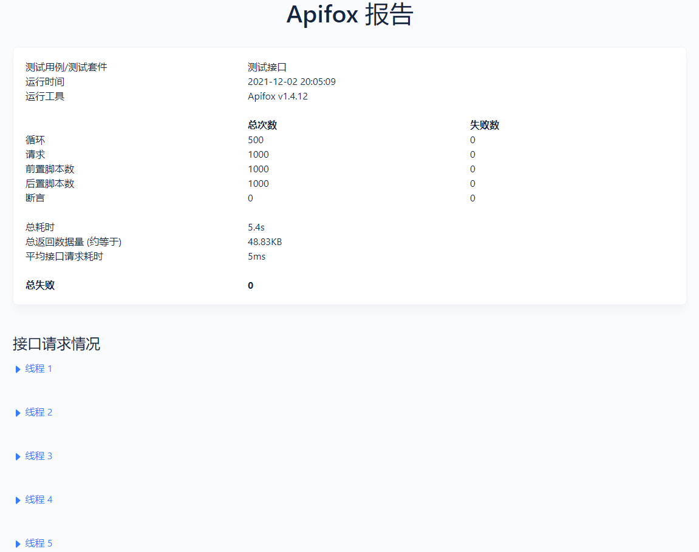

[TOC]

短域名服务设计文档
===
## 需求 
撰写两个 API 接口:  
- 短域名存储接口：接受长域名信息，返回短域名信息；
- 短域名读取接口：接受短域名信息，返回长域名信息。

### 限制
- 短域名长度最大为 8 个字符；  http://surl.com/fwweesfgt
- 采用SpringBoot，集成Swagger API文档；
- JUnit编写单元测试, 使用Jacoco生成测试报告(测试报告提交截图)；
- 映射数据存储在JVM内存即可，防止内存溢出。

## 详细设计

### 逻辑结构图
1. 简单的三层结构；
2. 加了本地日志；实际项目中需要使用filebeat之类的做旁路收集；
3. 加了全局异常处理；代码里面只处理了Exception，简单起见未处理其子类错误，实际项目中应根据子类分别处理异常；
4. 全局统一的消息，方便统一前后端代码，以及错误消息统一；实际项目的错误代码统一管理在数据库中，项目启动时加载到文件；
5. 配置文件 `application.yml` 可从gitlab上拉取，做简单的配置中心；然后再运行；实际正式项目可使用配置中心；

### 时序流程
这里说明两个接口的整个调用链路（简化）

### 短URL生成方式
参见 `DefaultShortUrlService` 中 `processShortUrl` 方法;  
从a-z A-Z 0-9 中选9个数拼成一个8位url path  
具体长度可以在配置中配置

### 全局异常处理
程序异常统一交由 `RestExceptionHandler` 处理，正式环境中需要对每种异常独立一个 `exception handler` ；  
真实环境中需要其他信息，比如 `requst path` ，`params` 等需要记录到日志；可继续在此基础上实现；  

### 日志
采用`logback` 打印日志（logback-spring.xml），正式环境需要使用 filebeat 等工具做旁路上报到日志中心；  
且需要多日志做监听和告警；

### 环境配置
程序启动时需要指定环境 `java -jar --spring-profiles-active=prod`，上到生产环境；

### 统一前端消息
使用`message.properties` 定义消息代码

### 统一模型验证消息
使用`ValidationMessages.properties` 定义验证消息

### 打包镜像发布

### 启动脚本
`start.sh`
放在 server 服务器中，由维护工具自动调用启动；

## 测试
### 覆盖率
> 说明  
> 简单起见，只测试了控制器，因为是 demo，依赖代码各种 **分支未测试穷尽**，但测试方式都一样
> 这里达到了87% ，应该满足大部分公司要求的覆盖率范围了

### 性能测试
一般本地测试，开发环境测试用简单的工具就可以
比如jmeter 等等，我这里用了一个apifox 的工具来简单的做了性能测试

通用测试方法就是开多少线程，跑多少次循环，然后得到 平均访问耗时，吞吐量，和失败率等数据；

如果要上线正式环境，需要先在测试环境跑测试，可以使用更专业的工具，基本的操作都差不多，无非这几步骤：

### 通用步骤
1. 准备测试数据，或者mock工具；
2. 建立测试项目，添加用例；
3. 每个用例可以执行一连串接口，或者单个接口；执行所需参数，为1准备；
4. 设置跑这些用例的 线程数，循环数，请求间隔；设置采样率等等各种参数；
5. 得到报告，平均请求耗时，吞吐量，失败率，等等。
