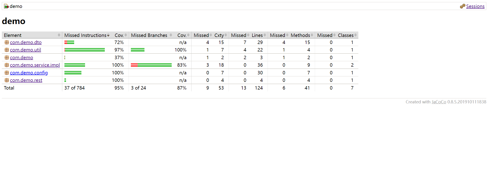

#### 设计思路
- 短域名生成算法
    ~~~
      利用62个可打印字符0-9 a-z A-Z，通过随机生成32位UUID，由于UUID都为十六进制， 所以将UUID分成8组，每4个为一组，
  然后通过模62操作，结果作为索引取出字符,这样大大降低重复率，来作为短域名.
  ~~~
#### 简单的实现方案
- 长域名转短域名
    ~~~
      用户传入长域名链接，后端将长域名链接做MD5编码。同时根据短域名的算法，生成短域名，将短域名与长域名作为一对键值对存入缓存，
  并将长域名MD5编码后的值作为缓存的key,短域名作为Value存入缓存。如果多次传入相同的长域名,则MD5编码值相同，直接获取Map中的
  短域名
  ~~~
- 短域名获取长域名
    ~~~
    根据短域名作为key,取出缓存中value，即对应的长域名。返回
    ~~~

#### 问题及解决方案
 - JVM内存
    ~~~
      目前长短域名数据存储是在JVM内存中。
   (1)数据存储量大时(长域名越来越多)，会有内存溢出的风险
    
    解决方案：
      (1)改变数据存储策略，持久化至数据库或缓存Redis
      (2)单机节点数据存储在JVM内存，可适当调整jvm内存分配大小，避免内存溢出。 
   ~~~
 - 短域名重复
     ~~~
       短域名生成算法，在数据量几千万或几亿条以后，会出现重复短域名。
      
    解决方案：
      更换短域名生成规则算法，用数据库序列编号自增，值按62进制表示   
    ~~~