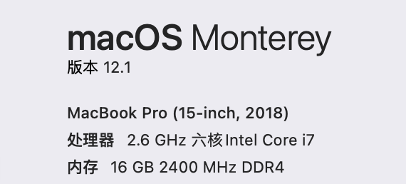
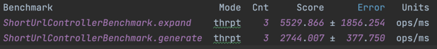
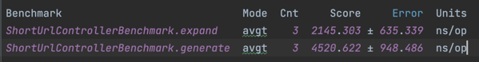
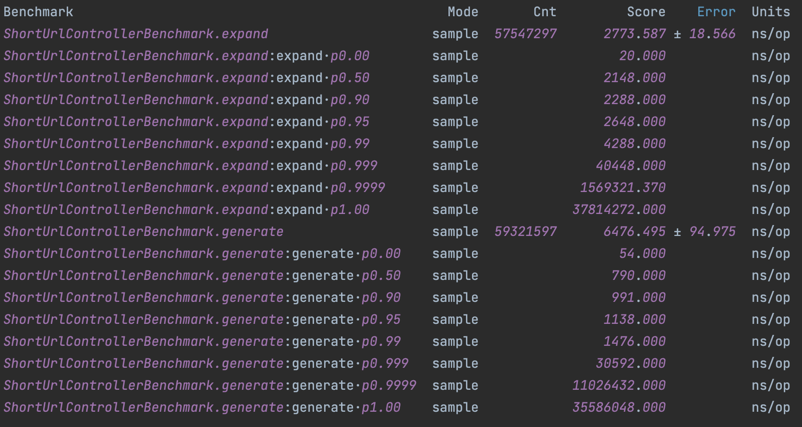
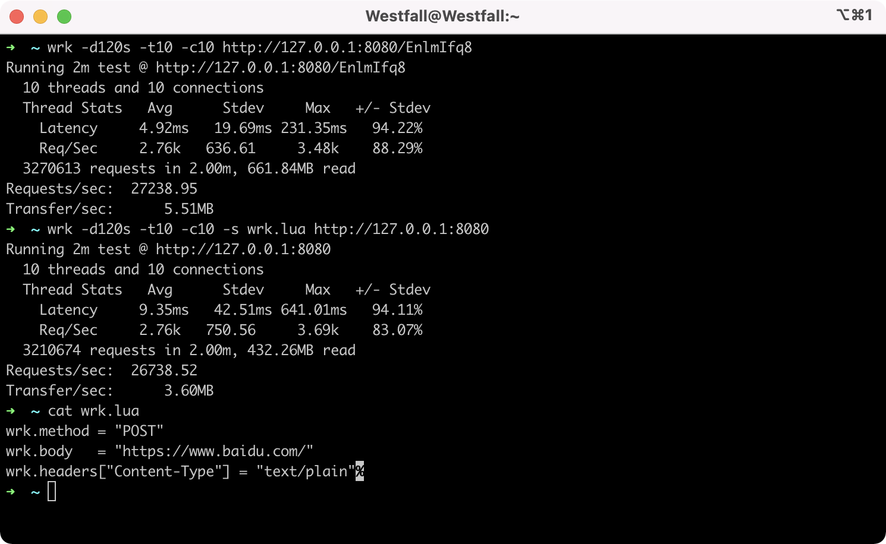

# 性能测试

JDK：Oracle JDK 11   
IDE：IntelliJ IDEA

## 接口基准测试
工具 JMH:1.33  
吞吐量：   
   
平均耗时：   
   
耗时采样：   
   
## HTTP基准测试
> 单机测试，无集群条件

工具：wrk（HTTP benchmarking tool）   
10线程10连接，压测2分钟，读取27000+QPS，生成26000+QPS，与JMH结果对比，主要消耗在网络IO上    

