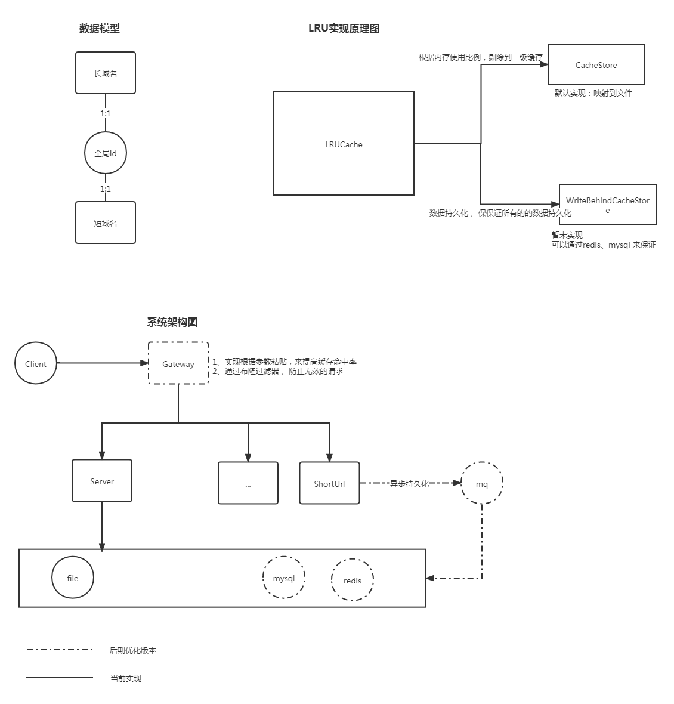
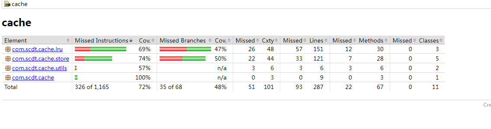

## 版本迭代记录
### 0.0.1
- 整体设计
- 实现初步版本
### 0.0.2
- 添加了注释
- 清理计划后期做的冗余代码
- 整理pom

## 需求分析
### 实现长短链接映射
- 如果有一种算法能直接通过计算进行互转，但存在转换冲突问题，要解决冲突不可避免需要 借助于其他存储媒介；
- 直接 用全局唯一id映射对于的URL，然后将id 转换成 m进制，通常 数字、大小写字母等 10 + 2*26；全局唯一id，为了支持分布式，使用方便，直接使用雪花算法生成；
- 根据上面的分析，需要hash的结构存储上面的映射。hash结构 通常会有2类方案: 1）本地缓存(堆外、堆内）；2）其他存储组件(file、Redis、mysql等）。
- （暂不考虑）未知 是否要设置ttl，定时清理历史数据；

### SLA要求进行分析
#### 高性能
 - 根据20/80原则，大部分的URL都是不常用的，只有很少的一部分是热点URL。那只需要重点关注一下20%的流量就可以。那映射结构hash，可以使用本地缓存(承接热点流量) 和 其他的缓存(保证能获取到数据）
 - 本地缓存是有限的，因此需要实现对应的淘汰策略，默认直接采用lru算法，淘汰对象会被迁移到2级缓存中。
 - 保证无状态，可以快速水平扩容
      

#### 高可用
- 无状态，水平扩容，保证灾备
- 数据直接持久化到外部存储中间件(mysql、Redis等)，外部存储中间件采用高可用部署方案。

#### 高扩展
 - 定义的扩展接口: 
   - 本地缓存淘汰算法
   - 其他缓存扩展(file)
   - 数据持久扩展
   - 序列化
## 重要设计
- 本地缓存（堆内内存）LRU
- 二级缓存： 
    - 对于堆内内存不够，会出现对象淘汰情况，这些可以将这部分剔除到更大的缓存里； 
    - 当下次从二级缓存中获取时， 直接将当前对象激活升级到本地缓存中， 删除在二级缓存的存储；
    - 默认实现：使用一个文件， 将文件映射位置存储在内存中（暂未做：这里会有脏空间， 应该需要定时清理整理，保证利用率的提高）
## 架构图


## 代码结构说明
### 代码分层
 这边参考DDD的四层分层架构
 - 用户接口层： endpoint 对外提供的服务接口
 - 应用层： application
 - 领域层： domain 
 - 基础层:  infrastructure 配置、工具类等都在这一层
## 测试
### 测试图片

### http 性能测试
暂无
### 本地生产消费 跑100 0000 压测记录
>测试说明： 
> 为了防止单轮测试不准确， 通过多轮测试，来保证数据的准确性
> 测试的场景是全生产、全消费，实际场景应该会比这个测试结果更好
> 重点统计指标：获取记录平均、最小、最大时间

从以下测试结论， 看出平均延迟很低， 但最大时间 和最小延迟时间过大，会有毛刺的； 可以对其二级缓存进一步优化，可以借助于分布式缓存或者使用多个文件，来支持更大的并发；
```html
[INFO] Running com.scdt.assignment.endpoint.ShortURLEndpointPerfTest

[testProduceMixedConsume] round 1 of 5
-----------------------------------------------
Total test time = 9735 ms.
Total item count = 1000000
Producer thread number = 4
Consumer thread number = 4
Total consuming time =  38932 ms.
Average consuming time = 9733 ms.
Average consuming time per item = 0 ms.
Min consuming time per item  = 0 ms.
Max consuming time per item = 2352 ms.
Total producing time =  38176 ms.
Average producing time = 9544 ms.
Average producing time per item = 0 ms.
Min producing time per item = 0 ms.
Max producing time per item = 2352 ms.
-----------------------------------------------
[testProduceMixedConsume] round 2 of 5
-----------------------------------------------
Total test time = 5601 ms.
Total item count = 1000000
Producer thread number = 4
Consumer thread number = 4
Total consuming time =  22400 ms.
Average consuming time = 5600 ms.
Average consuming time per item = 0 ms.
Min consuming time per item  = 0 ms.
Max consuming time per item = 1114 ms.
Total producing time =  21841 ms.
Average producing time = 5460 ms.
Average producing time per item = 0 ms.
Min producing time per item = 0 ms.
Max producing time per item = 1114 ms.
-----------------------------------------------
[testProduceMixedConsume] round 3 of 5
-----------------------------------------------
Total test time = 5652 ms.
Total item count = 1000000
Producer thread number = 4
Consumer thread number = 4
Total consuming time =  22603 ms.
Average consuming time = 5650 ms.
Average consuming time per item = 0 ms.
Min consuming time per item  = 0 ms.
Max consuming time per item = 947 ms.
Total producing time =  21845 ms.
Average producing time = 5461 ms.
Average producing time per item = 0 ms.
Min producing time per item = 0 ms.
Max producing time per item = 949 ms.
-----------------------------------------------
[testProduceMixedConsume] round 4 of 5
-----------------------------------------------
Total test time = 6616 ms.
Total item count = 1000000
Producer thread number = 4
Consumer thread number = 4
Total consuming time =  26460 ms.
Average consuming time = 6615 ms.
Average consuming time per item = 0 ms.
Min consuming time per item  = 0 ms.
Max consuming time per item = 1752 ms.
Total producing time =  25233 ms.
Average producing time = 6308 ms.
Average producing time per item = 0 ms.
Min producing time per item = 0 ms.
Max producing time per item = 1752 ms.
-----------------------------------------------
[testProduceMixedConsume] round 5 of 5
-----------------------------------------------
Total test time = 6772 ms.
Total item count = 1000000
Producer thread number = 4
Consumer thread number = 4
Total consuming time =  27082 ms.
Average consuming time = 6770 ms.
Average consuming time per item = 0 ms.
Min consuming time per item  = 0 ms.
Max consuming time per item = 1971 ms.
Total producing time =  26118 ms.
Average producing time = 6529 ms.
Average producing time per item = 0 ms.
Min producing time per item = 0 ms.
Max producing time per item = 1972 ms.
-----------------------------------------------

```

