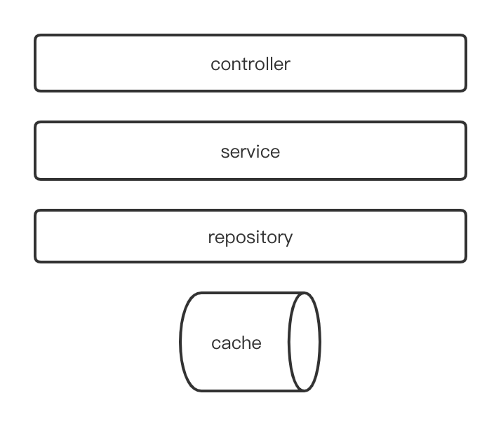

# 短域名服务设计文档

## 介绍

For [interview-assignments](https://github.com/scdt-china/interview-assignments/tree/master/java)

## 设计思路

### 需求举例
当某平台需要广播某个链接时，需要对原链接进行压缩至短链接，为了切合实际我们为短链接添加一个可配置的hostname前缀（https://www.sequoiacap.com），例如： 

  - 原链接：https://github.com/scdt-china/interview-assignments/tree/master/java

  - 短链接：https://www.sequoiacap.com/l3Iq
  
### 核心要求解析：

1、 映射数据存储在JVM内存即可，防止内存溢出
  
  - 由于存储后还需要根据短链换回长链接，那么就涉及到查询查询效率问题。 
  - 需要考虑生成短链时的幂等性
  - 并发情况下，由于没有数据库事务，需要考虑在生成短链接时对，原链接加锁
  - 考虑为防止内存溢出，缓存数据需要使用软引用
  
2、 短域名长度最大为 8 个字符
  
  - 

### 短域名算法
* 
* 主要思路，维护一个线程安全的自增id，每来一个长url，将其与一个自增id绑定，然后利用base62将该自增id转换为base62字符串，即完成转换。
* 因为使用自增id，Base62容易被爬虫遍历，所以将Base62初始字符顺序随机打乱，防止被爬虫

### 缓存选型

* HashMap
* guava cache

  * Guava的CacheBuilder支持SoftReference和WeakReference值，以及其他基于大小和时间的驱逐策略。

* spring cache (Caffeine)
* https://github.com/ben-manes/caffeine/wiki/Eviction-zh-CN 驱逐问题
* https://www.javadoc.io/doc/com.github.ben-manes.caffeine/caffeine/2.9.3/com/github/benmanes/caffeine/cache/CaffeineSpec.html

### 架构设计图

