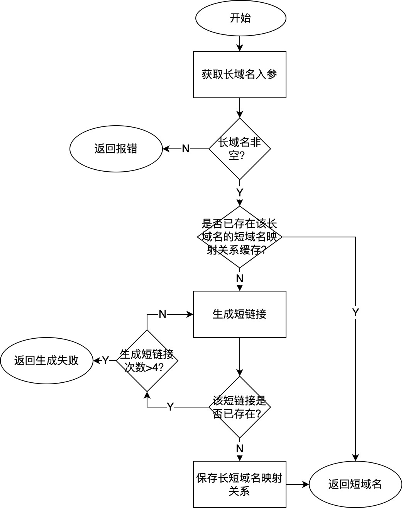
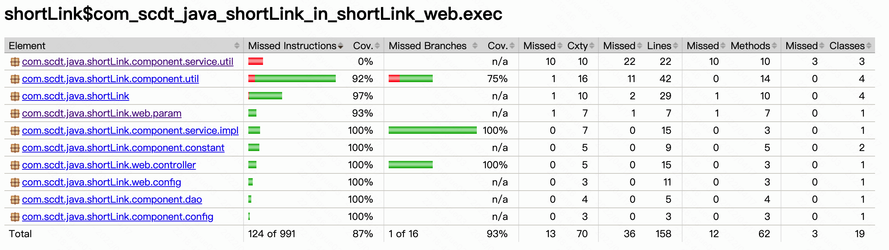

# 一、需求分析

> &emsp;&emsp;实现短域名服务，撰写两个 API 接口:短域名存储接口：接受长域名信息，返回短域名信息、短域名读取接口：接受短域名信息，返回长域名信息。

&emsp;&emsp;该需求的功能诉求明确，但没有数据量级、并发量级等方面的信息，因此设计中针对这些问题需要一个可适配的方案。

# 二、技术方案设计

## 2.1、业务流程图

## 2.2、存储方案

&emsp;&emsp;数据存储于LodingCache中，cache的初始化大小及最大大小可根据实际业务场景预估的数据量通过配置文件修改，通过最大大小设置防止内存溢出。

&emsp;&emsp;将长链接-短链接映射关系存储于cache1，短链接-长链接映射关系存储于cache2，在代码层面上实现逻辑隔离，一方面是为了避免个功能相互影响，另一方面是为了适配有可能存在的数据物理隔离。这是因为，由于该场景大概率是读多写少场景，通过短链接获取长链接的请求量较高，因此cache2有更高的性能要求。

&emsp;&emsp;对cache1和cache2的插入操作需要注意两点：其一，这两项操作应当封装成一个事务，因为任一项操作失败则另一项操作没有意义且会出现问题；其二，针对写操作，在并发情况下需要考虑同步问题，因此使用synchronized加锁。

## 2.3、算法选择

两种常见算法优缺点如下表所示：

算法|优点|缺点
:--:|:--:|:--:
自增id|不会生成重复短链|需要引入自增id生成及存储工具并处理并发等问题
摘要算法|简单易实现|生成短链可能存在重复

&emsp;&emsp;本设计采用摘要算法，针对存在短链接冲突的可能性，采用循环的方式尝试生成4次短链接，若4次都存在冲突则返回生成短链接失败。

# 三、测试用例

测试用例包含以下场景的校验：

+ 空字符串输入返回业务异常400
+ 相同长链接重复生成的短链接应幂等
+ 短链接正确还原
+ 不存在的短链接返回业务异常400
+ 系统内部异常返回500
+ 存在1次生成冲突时能够正常生成短链
+ 存在4次生成冲突时返回业务异常400

