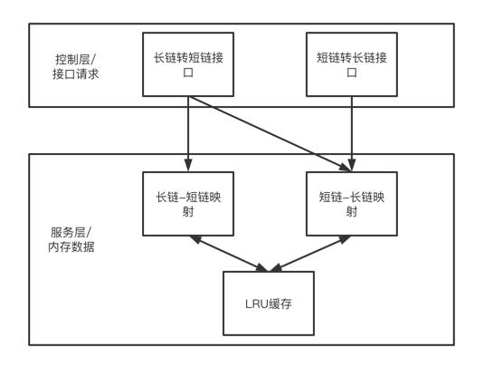

#设计思路
1. 主要维护3个map在内存中，第一个是短链-长链的映射，第二个是长链-短链的映射，第三个是存放有短链的LRU缓存。
2. 对于每次长链转短链的请求，如果是不存在的长链，则转换为短链后，分别在3个map中存入对应值，然后返回短链。 若是已存在的长链，则根据长链-短链的映射，查询后直接返回短链。
3. 对于每次短链转长链的请求，则直接根据短链-长链的映射返回对应值。
4. 对于每次插入和查询，都会对应更新LRU缓存。插入时如果超过限定的容量，会清理LRU中最老最不常用的映射，同步清理对应的长短链映射，避免一直扩容导致OOM。
5. 短链生成的逻辑采用了比较简单的随机数生成，生成8位0-61的随机数，根据短链常用字符数组的下标拼接对应短链。

##简单架构图

#所做假设
1. 单机单实例，对短链的量和并发要求有限。
2. 不需要持久化。

#关于jacoco测试
1. 整体代码量较小，且短链碰撞几率极低。在无法碰撞的情况下，部分碰撞后的处理代码无法达成航覆盖和分支覆盖。
2. 目前的覆盖率是基于调整了map容量为32的情况下进行的测试。map容量过大时，测试代码需要同步调整才能实现一样的覆盖率。取小容量做单元测试的原因是出于方便。
   
   
   
