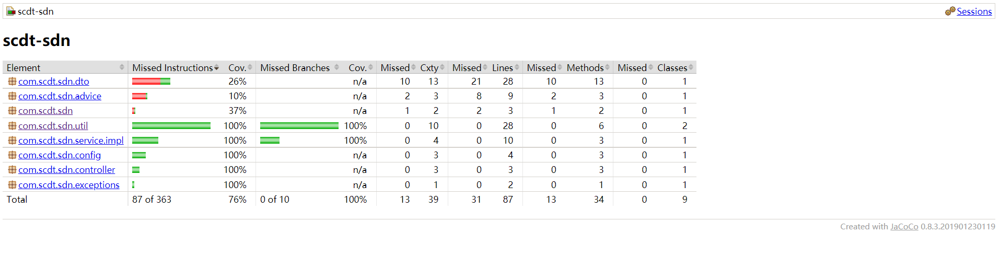
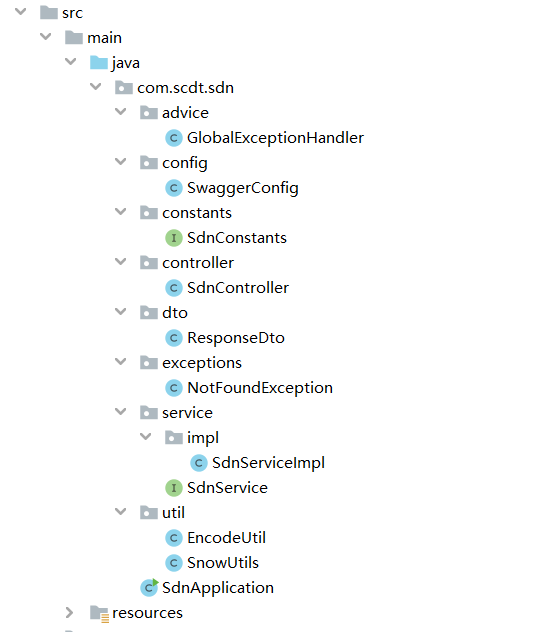

## 一、设计思路

1.将接收的请求中的长域名映射为一个自增数字id；

2.将数字id压缩为8位的字符串；

3.压缩过程可以使用10进制转62进制的方式实现；

4.为了控制62进制长度为8位，那数字id长度不能超过15位；

5.使用线程安全的Hashmap存储62进制id和长域名的对应关系，避免并发情况下数据出现问题；

## 二、接口访问地址

[swagger地址](http://127.0.0.1:8080/sdn-web/swagger-ui.html#/%E5%86%85%E9%83%A8%E6%8E%A7%E5%88%B6%E5%B1%82)

## 三、单元测试结果
controller、service、util层代码覆盖率达到100%

## 四、代码结构
额外增加controller层的统一异常拦截，避免暴露系统错误信息给外部用户；
