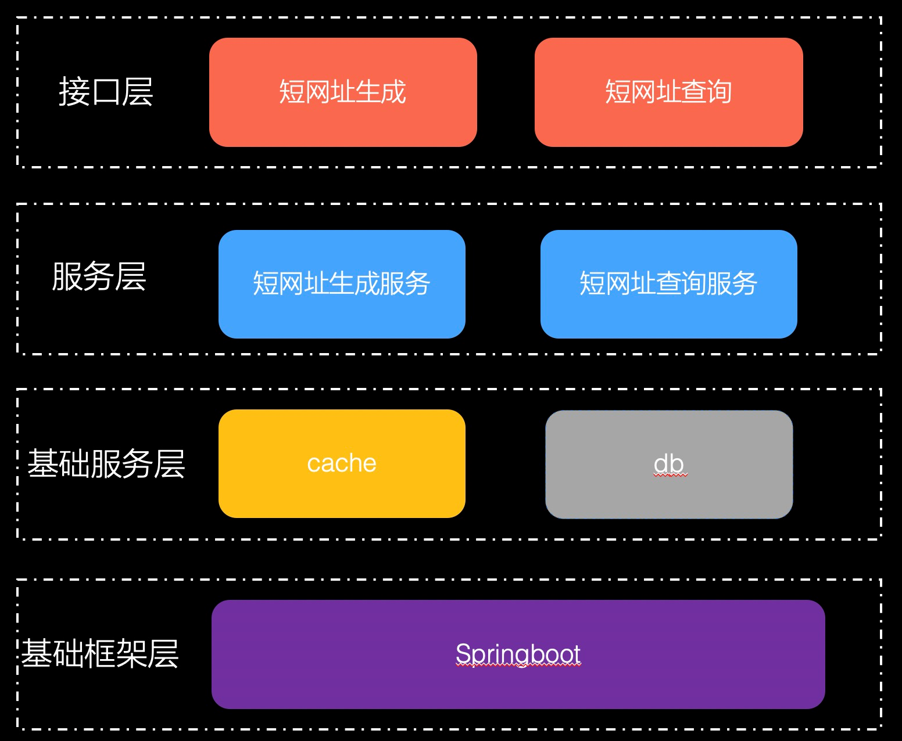

##方案设计
###背景：
- 短网址（Short URL）,也称短地址、短域名、短链接、短URL、短址，是一种互联网上的技术与服务。此服务可以提供非常短的URL代替原来较长的URL，通俗讲，就是形式上比较短的网址，也可以理解为把长的URL转成短的URL。 短网址的本质是实现了一个映射函数f:X->Y，该映射函数必须满足两个特点：
1. 如果x1 != x2，则f(x1) != f(x2) ；
2. 对应每一个y，都能够找到唯一一个x，使得y = f(x) ；

短网址常见微博、微信等社交软件中，比如微博限制字数为140，如果需要包含连接，但是这个连接非常长，将会占用非常大的篇幅。比较常见的短网址服务：
- 微博：http://t.cn
- 谷歌：https://goo.gl/
- 百度：http://dwz.cn/

结合应用场景，可以发现短地址的作用比较明显
- 内容需要
- 用户友好
- 规避关键词、域名屏蔽

###需求：
撰写两个 API 接口:
- 短域名存储接口：接受长域名信息，返回短域名信息
- 短域名读取接口：接受短域名信息，返回长域名信息。

限制：
- 短域名长度最大为 8 个字符
- 采用SpringBoot，集成Swagger API文档；
- JUnit编写单元测试, 使用Jacoco生成测试报告(测试报告提交截图即刻)；
- 映射数据存储在JVM内存即可，防止内存溢出；

###实现方案
短网址和长链接是一一对应的，常用的方案有：唯一ID生成短网址、压缩长链接。如下所述：

####方案一
建立短网址和长链接的对应关系，并产生一个唯一不变的ID，常用数据库自动增长的主键，常规结构：id、long_url、short_url
- 生成62位的字母表（26个小写字母+26个大写字母+10个数字）
- 找到每一个长地址对应的ID，生成一个N位的62进制数
- 根据该62进制数，查找字母表，生成短网址
- 映射关系可以存储在DB或者Redis，具体参考业务场景是否需要考虑查询效率、延迟、并发等

####方案二
通过算法对长链接进行压缩，生成唯一的短网址，一般通过哈希算法，将一个长的字符串转换成一个固定长度的哈希值，我们可以利用哈希算法，来生产短网址；
利用MurmurHash算法生成32bits的哈希值，作为短网址；

####方案对比
- 方案一比较简单，能保证唯一，且可逆，但是随着自增ID越来越长，短网址会越来越长；
- 方案二常规算法不是很复杂，且可以控制短网址的位数，但会存在碰撞，如果作为基础服务，且无法估量调用量的情况下，需要考虑；

结合实际情况，短网址生成采用方案二实现：
- 其中短网址和长网址通过jvm内存映射存储，创建了一个ConcurrentHashMap，保存短网址和长网址的映射；
- 生成短网址接口会判断是否已存在长短网址的映射，存在则直接返回；
- 生成短网址接口限制最长原始网址长度小于8192，同时会校验网址的合法性；
- 考虑可能出现的内存溢出问题，当生成短网址接口捕获到OutOfMemoryError错误时，会主动清空存储数据，但不影响当次服务；
- 由于网址映射存储于jvm内存，没有持久化，系统停止的时候，数据会100%丢失；

如果该系统需要真正的上线提供服务，那还有一些点需要优化：
- 数据持久化，利用外部的缓存系统和数据库共同存储数据；
- 数据备份，不管是数据库还是缓存系统，都没法保证100%不丢数据，所以较为安全的做法需要有数据备份，可以在极端情况下恢复数据；
- 用户体验，完善各种异常报错提示；

####系统分层

