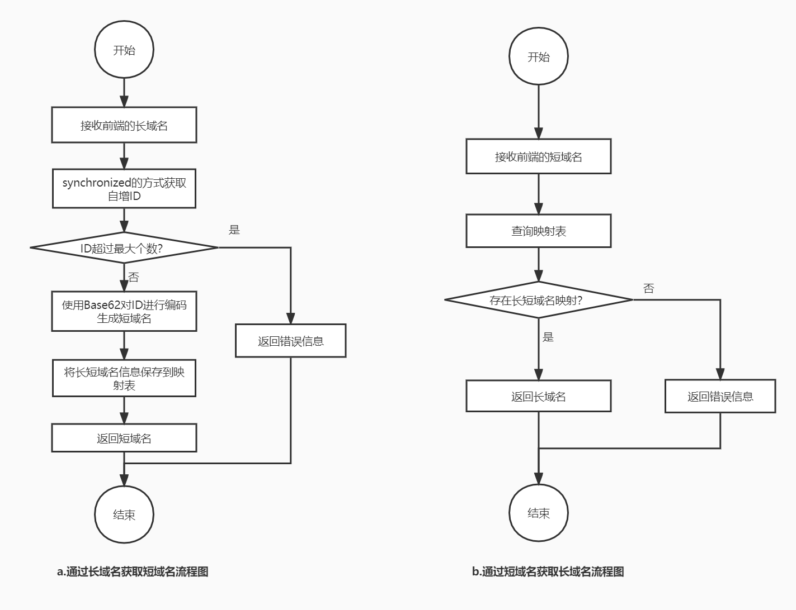

# 系统设计

## 设计思路

    1，通过自增ID采番之后，使用【0-9A-Za-z】62进制编码，8位的62进制可以保存218340105584895个短域名。
    ※ 62进制编码使用【0-9A-Za-z】的乱序为基础，避免恶意攻击。
    ※ ID的自增处理使用synchronized约束，避免并行处理出现问题
    2，使用map保存长短域名的映射，最大限制1亿个，防止内存使用过大。
    3，使用junit进行单体测试，并用Jacoco记录覆盖率
    4，集成Swagger API文档：localhost:8080/shortDomain/swagger-ui.html

## 架构设计图

## 所做的假设

    1，重启后会清空保存的长域名
    2，最多保存1亿条长域名的映射
