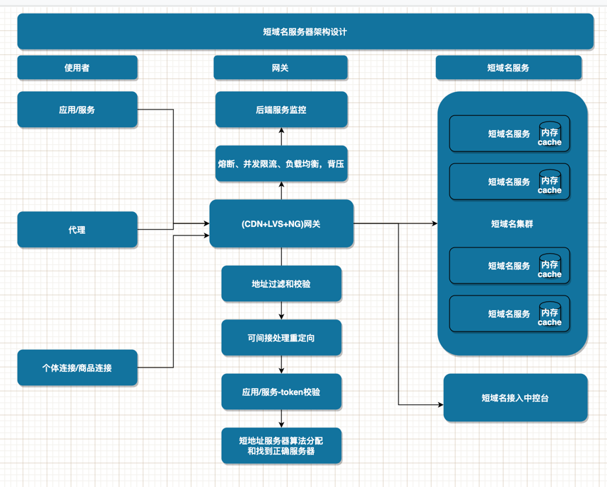
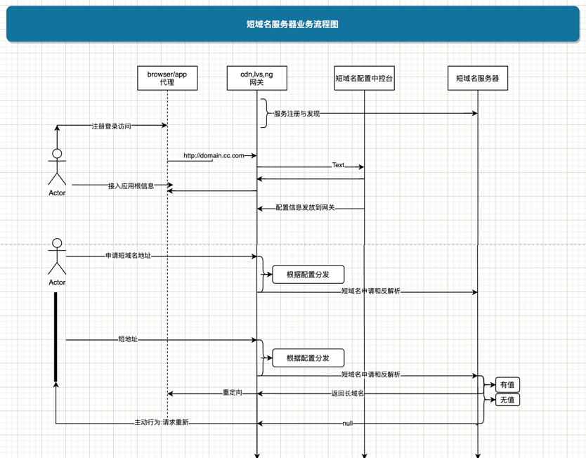
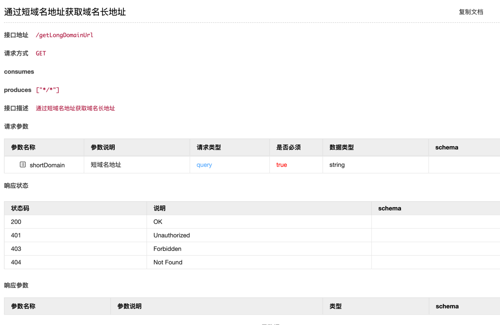
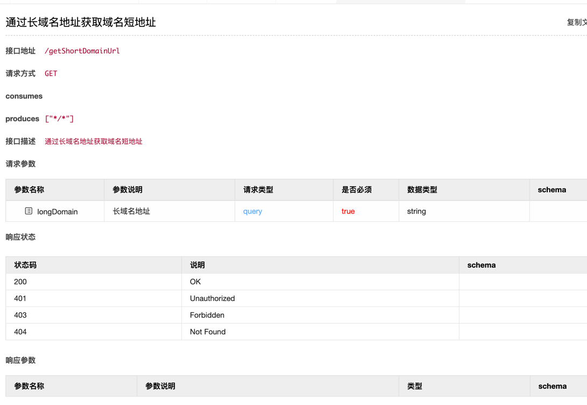
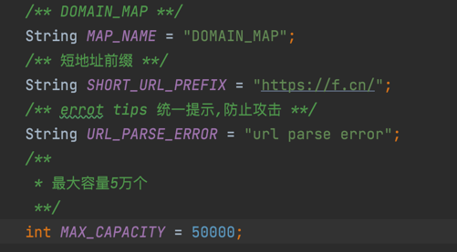
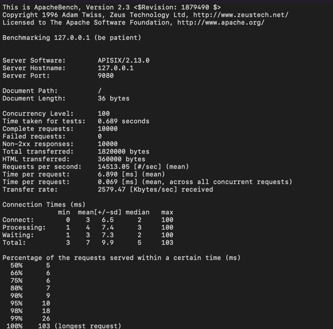
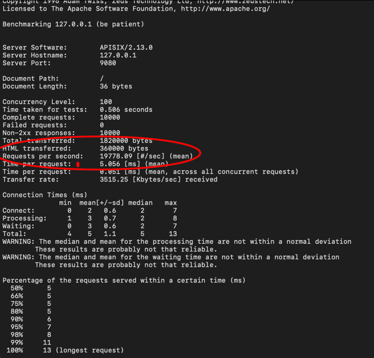
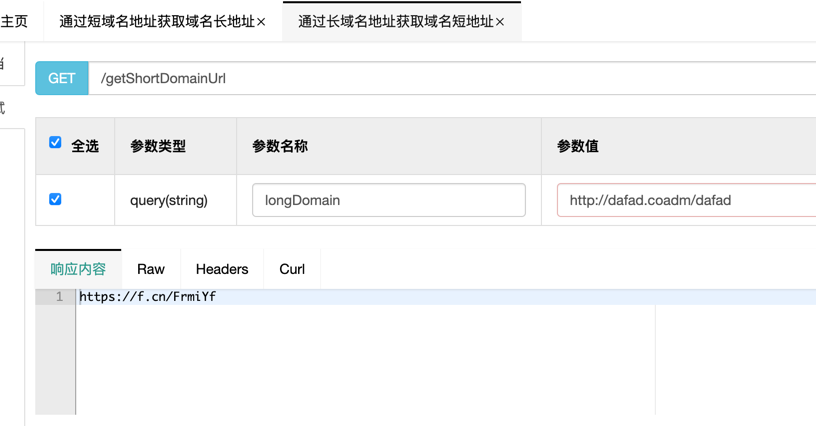
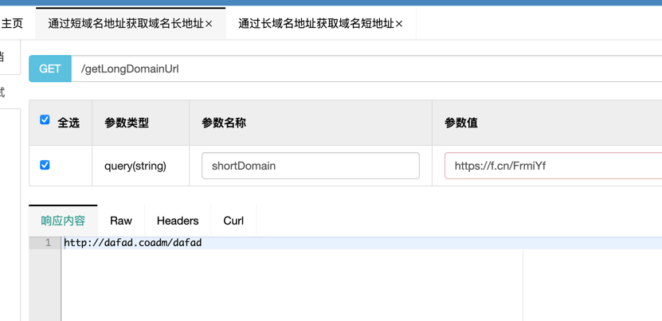
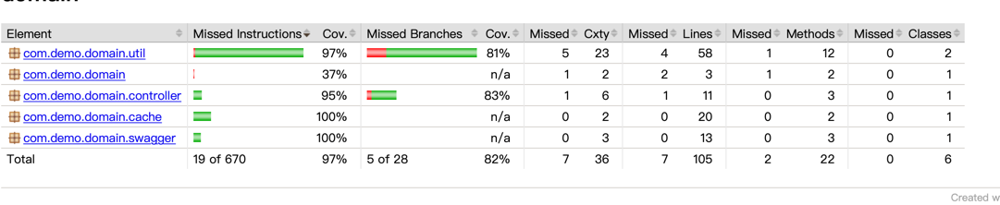

# 实现短域名服务
注意:
如果出现图片不能展示，类似情况，可F12查询具体原因，
一般都是网段和ip被禁止访问,拦截在DNS层，需要下载到本地查阅该文档，谢谢，花了大半天左右时间，大致就想到这些，还可以优化升级
## 开发者信息
- 手机号码/微信:18971400861
- 邮箱:1299578272@qq.com
## 需求:
- api需求内容
  - 接口
    - 短域名存储接口：接受长域名信息，返回短域名信息
    - 短域名读取接口：接受短域名信息，返回长域名信息
  - 限制与要求:
    - 短域名长度最大为 8 个字符
    - 采用SpringBoot，集成Swagger API文档；
    - JUnit编写单元测试, 使用Jacoco生成测试报告(测试报告提交截图)；
    - 映射数据存储在JVM内存即可，防止内存溢出；
  
## 需求分析
    
### 需求理解:
```
1.对一映射的原域名和短域名相互解析,市场需求理解，需要提供一个固定的域名,比如short.cn
  后面加不到8位字符的上下文，https://sort.cn/12345678->实际地址解析出来为https://www.baidu.com
2.采用jvm内存存储域名,最大为8个字符,采用[a~z,A~Z,0~9],共62个字符,最大极限域名
  62的8次方的=（2的8次方-2)^2的3次方=217万亿左右,要求数据存在内存，如果不让内存溢出，只能通过限流方式+过期处理，只存储部分数据到缓存
3.如果要保证高性能和高可用的话UUID和Twitter Snowflake算法，减少碰撞，但是根据时间生成的过期了，短地址可能会变，
  根据请求url采用不可逆算法,短地址不会随着而变化，概率低
```
### 需求背景与收益
  - 1.实时监控推广数据，便于及时根据数据调整运营策略
  - 2.多维度数据报表，分析更深入，清晰了解用户画像
  - 3.特定场景跳转链接，满足个性化推广需求
  - 4.智能过滤假量，数据更加真实有效
  - 5.永久有效，不用担心过期导致推广链接失效
  - 6.简化长链接，使推广内容更美观，减少占用短信推送字数 
### 需求商业模式
  - 1.价值模型出发，企业收益不是主要，主要是面向企业用户，企业痛点，企业业务方向展开收益
  - 2.可以面向企业-通过每秒发放短地址收费
  - 3.可以合作生态推广产品
## 架构设计
1.短域名服务器架构设计  

2.短域名服务器业务流程图

### 使用者说明
都需要去短域名接入中控台注册、登录、配置
- 应用/服务
  - 面对企业客服-企业应用和服务
- 代理
  - vpn地址，穿透.配一个，代表一组域名地址
- 个体连接
  - 开发者单个地址
  - 开发者单个域名根地址
### 网关设计说明
- 1.网关作用
  - 为短域名服务器保驾护航，保证服务高可用
  - 安全控制，防止攻击
  - 处理服务调用分发
  - 监控客户端来源和统计、监控后端服务实际能力(比如从响应时间,qps,tps)
  - 对请求转发按最短和最通畅路线分发
- 2.网关特殊处理
  - 指定具体服务对应的短域名服务器
  - 处理xss，csrf等攻击
  - 分析DDos工具
  - 控制协议和url地址范围
### 短域名服务器设计说明
#### 1.需求技术选择
  - spring boot+spring mvc+swagger +新浪短地址算法
#### 2.开发设计说明
- 1.采用新浪短地址6位码模式
  ```
  1.将长网址用md5算法生成32位签名串，分为4段,，每段8个字符；
  2.对这4段循环处理，取每段的8个字符, 将他看成16进制字符串与0x3fffffff(30位1)的位与操作，超过30位的忽略处理；
  3.将每段得到的这30位又分成6段，每5位的数字作为字母表的索引取得特定字符，依次进行获得6位字符串；
  4.这样一个md5字符串可以获得4个6位串，取里面的任意一个就可作为这个长url的短url地址。
  ```
- 2.采用一个map互存长短地址映射，<longUrl,shortUrl>和<shortUrl,longUrl> 加快检索和避免重复生成
- 3.为了防止内存溢出，应该控制缓存存储个数，作为案例，简单设计LRU-cache,LinkedHashMap存在这个机制，重写本类输出->LRUCache(加锁控制)
- 4.内存数据存在性设计: 
  ```
  1.已经生成过的短域名,无须再次生成
  2.不同的长域名地址，短域名地址可能产生碰撞重复，此时递归，改变salt值，重新计算，直到不碰撞为止
  3.如果短域名获取长域名地址失败，客户端代理，应用或者服务、个体链接需要重新处理生成流程
#### 3.API设计
1.出参和入参设计可参考http:/127.0.0.1:9080/doc.html


2.校验设计
  可以采用严格的市场域名，也可以简单验证，因为域名协议很多，此处简单验证-"[a-zA-z]+://[^\\s]*"
  统一提示: url parse error 
3.参数初始化：

### 测试分析
-- 不做jvm参数大调整，采用默认:
  1.数据发压机器最佳线程数一般是核心线程数到核心线程数2倍之间取值
  2.
  -Xms4086m -Xmx4096m 不做其他参数调整
  6核cpu 
  LuaCahce可以存储 1.4万=4g,瓶颈是存储策略导致
  Hazelcast存储容量能力稍微好些，但是实际不需要那么大容量，即使没有可以重新生成

  ab测试:
  ab -n 10000 -c 100 http://127.0.0.1:9080/ >> ss.log

  
  
#### swagger测试结果
- 通过长域名地址获取域名短地址

- 通过短域名地址获取域名长地址

#### JUnit编写单元测试-jacoco信息


### 打包部署

1.mvn package 或者mvn install 可以加参数去掉测试
2.spring boot可配成可执行jar,建议采用该方式，方法可百度

    

