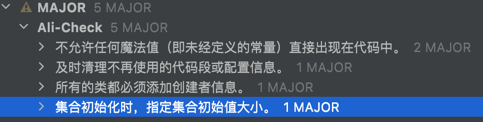

# 实现短域名服务
注意:
如果出现图片不能展示，类似情况，可F12查询具体原因，
一般都是网段和ip被禁止访问,拦截在DNS层，需要下载到本地查阅该文档，谢谢，花了大半天左右时间，大致就想到这些，还可以优化升级
## 开发者信息
- 手机号码/微信:18971400861
- 邮箱:1299578272@qq.com
## 需求:
- api需求内容
  - 接口
    - 短域名存储接口：接受长域名信息，返回短域名信息
    - 短域名读取接口：接受短域名信息，返回长域名信息
  - 限制与要求:
    - 短域名长度最大为 8 个字符
    - 采用SpringBoot，集成Swagger API文档；
    - JUnit编写单元测试, 使用Jacoco生成测试报告(测试报告提交截图)；
    - 映射数据存储在JVM内存即可，防止内存溢出；
  
## 需求分析
    
### 需求理解:
```
1.对一映射的原域名和短域名相互解析,市场需求理解，需要提供一个固定的域名,比如short.cn
  后面加不到8位字符的上下文，https://sort.cn/12345678->实际地址解析出来为https://www.baidu.com
2.采用jvm内存存储域名,最大为8个字符,采用[a~z,A~Z,0~9],共62个字符,最大极限域名
  62的8次方的=（2的8次方-2)^2的3次方=217万亿左右,要求数据存在内存，如果不让内存溢出，只能通过限流方式+过期处理，只存储部分数据到缓存
3.如果要保证高性能和高可用的话UUID和Twitter Snowflake算法，减少碰撞，但是根据时间生成的过期了，短地址可能会变，
  根据请求url采用不可逆算法,短地址不会随着而变化，概率低
```
### 需求背景与收益
  - 1.实时监控推广数据，便于及时根据数据调整运营策略
  - 2.多维度数据报表，分析更深入，清晰了解用户画像
  - 3.特定场景跳转链接，满足个性化推广需求
  - 4.智能过滤假量，数据更加真实有效
  - 5.永久有效，不用担心过期导致推广链接失效
  - 6.简化长链接，使推广内容更美观，减少占用短信推送字数 
### 需求商业模式
  - 1.价值模型出发，企业收益不是主要，主要是面向企业用户，企业痛点，企业业务方向展开收益
  - 2.可以面向企业-通过每秒发放短地址收费
  - 3.可以合作生态推广产品
## 架构设计
1.短域名服务器架构设计  

2.短域名服务器业务流程图

### 技术选型
#### 基于jvm内存缓存-hazelcast框架
- 1.hazelcast

  Hazelcast 是一种分布式 IMDG，即内存数据网格，被 Nissan、JPMorgan、Tmobile 等公司广泛应用于各行各业
  - 主要特性:
    - 支持多种数据结构-Hazelcast 支持与 Map 一起使用多种数据结构。一些示例是锁、信号量、队列、列表等。
    - 快速 R/W 访问-鉴于所有数据都在内存中，Hazelcast 提供非常高速的数据读/写访问。
    - 高可用性-Hazelcast 支持跨机器分发数据以及额外的备份支持。这意味着数据不是存储在一台机器上。因此，即使机器出现故障（在分布式环境中经常发生），数据也不会丢失。
    - 高性能-Hazelcast 提供了可用于在多个工作机器之间分配工作负载/计算/查询的构造。这意味着计算/查询使用资源 fROM 多台机器，这大大减少了执行时间。
    - 易于使用-Hazelcast 实现并扩展了许多 java.util.concurrent 结构，这使得它非常易于使用和与代码集成。在机器上开始使用 Hazelcast 的配置只需要将 Hazelcast jar 
      添加到我们的类路径中
  - 使用场景:
    - 开发需要高可扩展性、性能和可用性的应用程序的非常有用的工具
    - 基于内存集群与分布式场景
- 2.Guava Cache

  Google Guava Cache是一种非常优秀的本地缓存解决方案,提供了基于容量、时间、引用的缓存回收方式
内部实现采用LRU算法,基于引用回收很好的利用了java虚拟机的垃圾回收机制
  - 主要特性:
    - 同ConcurrentHashMap类似
  - 使用场景:
    - 愿意消耗一些内存空间来提升速度
    - 预料到某些键会被多次查询
    缓存中存放的数据总量不会超出内存容量
- 3.Ehcache

  Ehcache是一个纯java进程内存缓存框架,具有快速、精干等特点,是Hibernate中默认的CacheProvider
  - 主要特性:
    - 快速、简单、支持多种缓存策略
    - 支持内存和磁盘缓存数据,因为无需担心容量问题
    - 缓存数据会在虚拟机重启的过程中写入磁盘
    - 可以通过RMI、可插入API等方式进行分布式缓存(比较弱)
    - 具有缓存和缓存管理器的侦听接口
    - 支持多缓存管理实例,以及一个实例的多个缓存区域
    - 提供Hibernate的缓存实现
  - 使用场景:
    - 单个应用或者对缓存访问要求很高的应用
    - 简单的共享可以,但是不合适涉及缓存恢复、大数据缓存
    - 如果系统比较大型,存在缓存共享,分布式部署,缓存内容大这几点便不合适使用该缓存
    - 在实际工作中,更多是将Ehcache作为与Redis配合的二级缓存
- 4.Caffeine

  caffeine是Google基于java8对Guava Cache的重写升级版本,支持丰富的缓存过期策略,尤其是TinyLfu淘汰算法,提供了一个几乎最佳的命中率
  - 主要特性:
    - 同Guava Cache
    - 读写性能很好
  - 使用场景：
    - caffeine使用和Guava Cache非常相似

- 5.对比分析图:

  |比较项|Hazelcast|	Ehcache|	GuavaCache|	caffeine|
  |-----|---------|--------|-----|-----|
  |读写性能|	好|	好	|好	|很好|
  |淘汰算法|	最多-有占比，有size，有LRU...	|LRU、LFU、FIFO|	LRU	|W-TinyLFU|
  |功能丰富度	|功能丰富|	功能丰富	功能丰富,支持刷新和虚引用|	功能和GuavaCache很相似|
  |工具大小	|一般|	一般|	较小	|一般|
  |是否支持持久化|	是|	是	|否	|否|
  |是否支持集群	|是	|是	|否	|否|
  将 Hazelcast 与 Ehcache、Guava 和 Caffeine 等其他缓存进行比较可能不是很有用。
  但是综合考虑，Hazelcast 是分布式缓存，即跨机器/JVM 传播数据。虽然Hazelcast 在单个 JVM 上也能很好地工作，但是在分布式环境中更有用。
  如果切换短域名算法，单机上hazelcast是可以和其他本地缓存一样存储，
  但是遇到部署一个很大的集群+分布式场景的域名服务器，hazelcast就会自我组件集群，更好的服务于具体服务。
  不仅如此，hazelcast数据存活策略较多
### 使用者说明
都需要去短域名接入中控台注册、登录、配置
- 应用/服务
  - 面对企业客服-企业应用和服务
- 代理
  - vpn地址，穿透.配一个，代表一组域名地址
- 个体连接
  - 开发者单个地址
  - 开发者单个域名根地址
### 网关设计说明
- 1.网关作用
  - 为短域名服务器保驾护航，保证服务高可用
  - 安全控制，防止攻击
  - 处理服务调用分发
  - 监控客户端来源和统计、监控后端服务实际能力(比如从响应时间,qps,tps)
  - 对请求转发按最短和最通畅路线分发
- 2.网关特殊处理
  - 指定具体服务对应的短域名服务器
  - 处理xss，csrf等攻击
  - 分析DDos工具
  - 控制协议和url地址范围
### 短域名服务器设计说明
#### 1.需求技术选择
  - spring boot+spring mvc+swagger +新浪短地址算法
#### 2.开发设计说明
- 1.采用新浪短地址6位码模式
  ```
  1.将长网址用md5算法生成32位签名串，分为4段,，每段8个字符；
  2.对这4段循环处理，取每段的8个字符, 将他看成16进制字符串与0x3fffffff(30位1)的位与操作，超过30位的忽略处理；
  3.将每段得到的这30位又分成6段，每5位的数字作为字母表的索引取得特定字符，依次进行获得6位字符串；
  4.这样一个md5字符串可以获得4个6位串，取里面的任意一个就可作为这个长url的短url地址。
  ```
- 2.采用一个map互存长短地址映射，<longUrl,shortUrl>和<shortUrl,longUrl> 加快检索和避免重复生成
- 3.为了防止内存溢出，应该控制缓存存储个数，作为案例，简单设计LRU-cache,LinkedHashMap存在这个机制，重写本类输出->LRUCache(加锁控制)
- 4.内存数据存在性设计: 
  ```
  1.已经生成过的短域名,无须再次生成
  2.不同的长域名地址，短域名地址可能产生碰撞重复，此时递归，改变salt值，重新计算，直到不碰撞为止
  3.如果短域名获取长域名地址失败，客户端代理，应用或者服务、个体链接需要重新处理生成流程
#### 3.API设计
1.出参和入参设计可参考http:/127.0.0.1:9080/doc.html


2.校验设计
  可以采用严格的市场域名，也可以简单验证，因为域名协议很多，此处简单验证-"[a-zA-z]+://[^\\s]*"
  统一提示: url parse error 
3.参数初始化：

### 测试分析
-- 不做jvm参数大调整，采用默认:
  1.数据发压机器最佳线程数一般是核心线程数到核心线程数2倍之间取值
  2.
  -Xms4086m -Xmx4096m 不做其他参数调整
  6核cpu 
  LuaCahce可以存储 1.4万=4g,瓶颈是存储策略导致
  Hazelcast存储容量能力稍微好些，但是实际不需要那么大容量，即使没有可以重新生成

  ab测试:
  ab -n 10000 -c 100 http://127.0.0.1:9080/ >> ss.log

  
  
#### swagger测试结果
- 通过长域名地址获取域名短地址

- 通过短域名地址获取域名长地址

#### JUnit编写单元测试-jacoco信息

#### 代码扫描-TODO


### 打包部署

1.mvn package 或者mvn install 可以加参数去掉测试
2.spring boot可配成可执行jar,建议采用该方式，方法可百度


    

