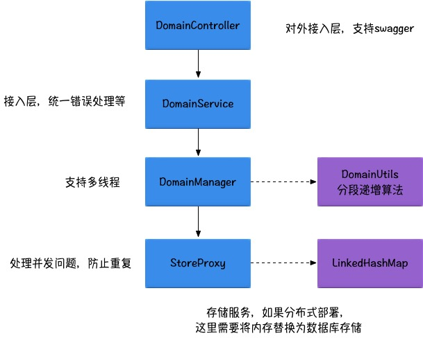
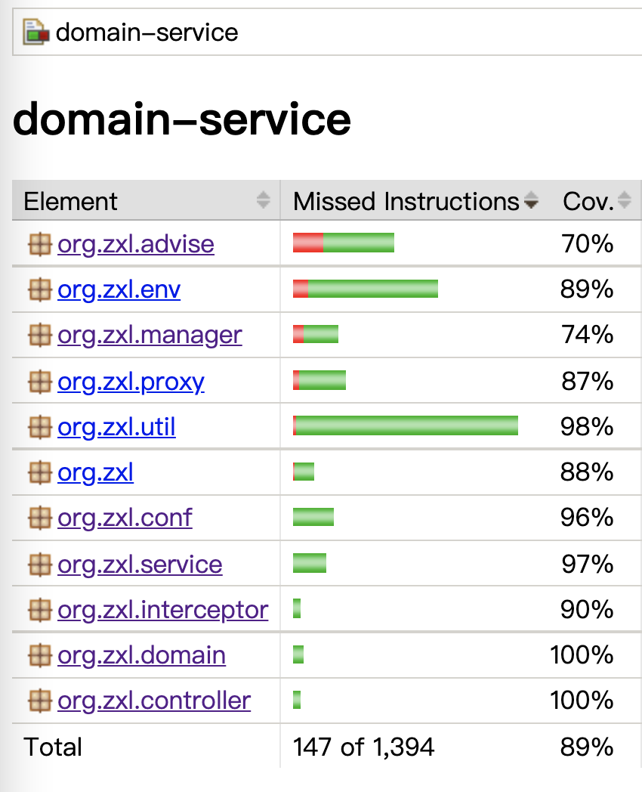

# domain-service 短域名服务

# 项目背景

    用途:
    1. 长域名转换为短域名服务 
    

# 项目架构

## 设计思路

1. 存储是使用了 6位的62进制存储， 62^6 已经达到500多亿的存储量了。
2. 采用单JVM拉取数字分段，然后递增序号获取短连接数字；
3. 时间有限，尽量简化了设计；

## 简单的架构图

## 假设

1. 项目是单机假设，如果需要分布式部署，为了防止重复需要将 StoreProxy的存储逻辑放到 mysql、redis等集中缓存里去。
2. 为了防止内存溢出，单机最大存储限制了100万个链接；

# 框架

    1. mvc使用的spring mvc
    2. 代码简化编写使用了lombok
    3. 接口文档&接口测试使用的swagger2
    

# api命名规范
    大体遵循restful风格

# swagger 

> 启动App后访问：http://localhost:8081/api/swagger-ui.html

# 单元测试

项目根目录执行 mvn test 后， 会在 target/jacoco-ut 目录下生成测试报告，浏览器打开 index.html 即可.
> 行覆盖率已经85+ 了， 实在没时间写那么多单元测试了，先这样了

