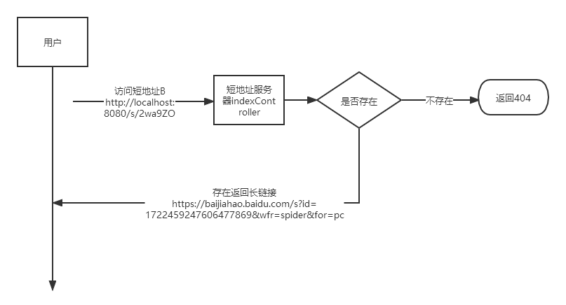
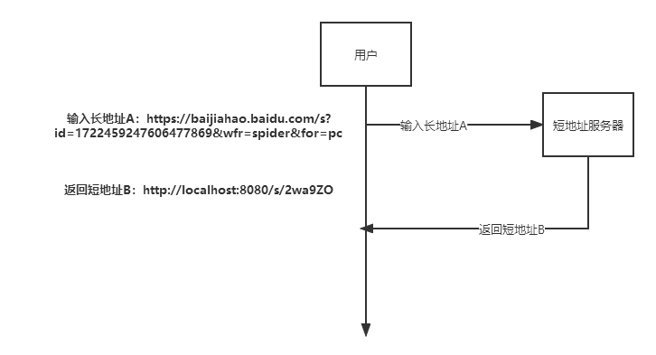
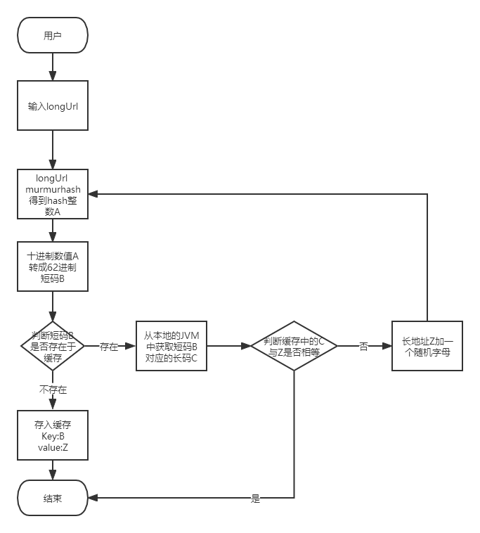
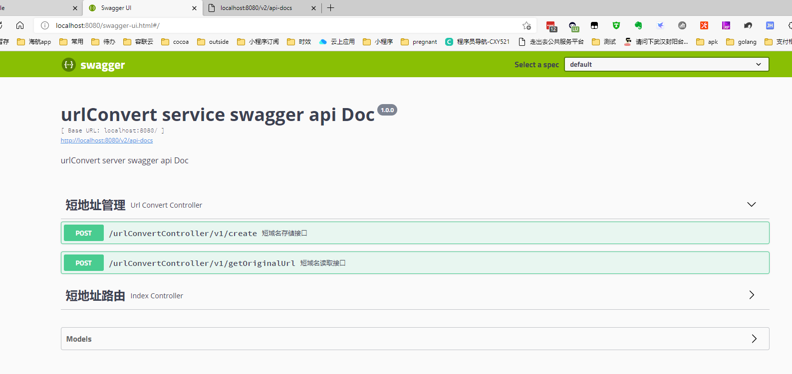
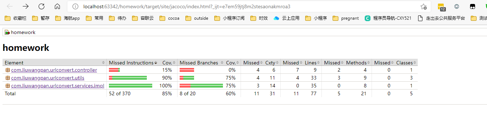

# 系统设计说明

### 设计思路

   
   
      

   
URL 短链，就是把原来较长的网址，转换成比较短的网址。经常可以在在短信和微博里可以经常看到短链的身影。之前在LeetCode中也看到过类似的题目，最核心的功能就是
长短链之间的转换，以及短地址和长地址之间的关系映射,根据当前场景限定 映射数据存储在JVM内存，暂不考虑服务器或者容器方案解决(集群，redis等)，经查询了解，主要方案有：
  

    1. 采用非加密hash算法,hash算法可以将任意长度的字符串，转化为固定长度的hash值，
    先把长地址hash成短地址的10进制hash值,然后再转成62进制缩短作为短地址,存到本地缓存;
    
    2. 采用自增id,可以使用jdk自带Atomiclong,或者采用雪花算法生成单调递增id,然后把生成的id同样转成62进制作为短地址;

方案选择：
        本次采用了方案1,使用了murmurhash算法,拥有更好的平衡性和更低的碰撞率,该算法已在Redis、MemCache、Cassandra、HBase等开源中间件中广泛使用,相对成熟
      稳定，murmurhash对长地址经过hash,得到32位的hash10进制的整数值，然后再转成62进制,不管长地址生成多少次短地址,所产生的短地址都是一样的,除非有hash碰撞;
        
        hash碰撞处理,在生成短链后,用短链在缓存中获取，如果存在从缓存中,和当前传入的长链做比较，如果不同，说明产生链hash碰撞，则给长链前面加入 "*_"(*是一个随机英文字母), 再生成短链。
    
        为什么不用方案2?
            
            a)采用自增id,一个长地址会多次生成会有多个短地址,用户体验不好,如果为了解决重复问题,就需要每次生成的时候判断长地址是否已经生成过,
     那么就需要多缓存一层长地址的数据,并且每次生成长地址的时候，需要去校验是否已经生成过,性能相对hash来说有所下降;
     
            b)另外自增值一直会自增,对于过期的短链所占用的id无法再次利用；
            
            c)发号器,需要考虑并发加锁,并发情况下,会增加耗时
            
 方案1关键逻辑处理流程   
 
 
存储方案
    
        因为存储在jvm中,本地缓存的高性能读写至关重要，而对于短地址服务，也是读多写少, 最终选择了Caffeine cache,集成了Spring 的CacheManager,
    后面如果切成如redis会比较方便,Caffeine cache支持LRU,可以优雅的避免内存溢出问题,当然这也要取决于服务所部署的机器,以及合理的参数设置;
     
        目前最大容量设置的是1024*10000,有效期是30天,当然生产环境需要根据场景调配,如果需要更长的时效已经单日更高的并发,那么相应机器
    内存也应该增加。

### 数据假设以及性能测试
   默认短域名当前项目地址+s/${shortUrl}
   

单机单线程模拟随机生成url 长度为30的url  单条占用内存 264 byte,jvm Caffeine cache 缓存空间设置最大5000000
堆内存设置-Xmx2048m -Xms2048m 超过1000W 会产生内存溢出, 1000W数据,内存增加到5096M,测试数据如下

|数据量  |耗时统计 |内存占用 |hash碰撞次数|
|----- |----- |----- |-----|
|100W|3185ms|252M|112|
|200W|5472ms|509M|462|
|500W|18775ms|1007M|2816|
|1000W|33342ms|2639M|11715|

lru测试,当Caffeine cache 最大长度设置500W，超过500W，控制台出现lru回收日志,单机存储会成为瓶颈,内存消耗数和生成的短链数成正比增长.
   
    
### 技术选型
- spring boot 2.6.2
- local cache caffeine +Spring Cache manager
- hash murmurhash
- swagger 地址: http://localhost:8080/swagger-ui.html  api:http://localhost:8080/v2/api-docs

### 项目包结构以及说明
        ｜configs(配置信息)
        ｜controller（web请求接口）
        ｜services(服务层)
        ｜common(公共类，定义异常类)
        ｜enums(定义枚举类)
        ｜model（对象）
            |(controller层接口请求与响应)
                |request (类名以Request结尾)
                |reponse (类名以Response结尾)
        ｜utils(工具类)

### Jacoco单元测试覆盖率
   
  
    
   
