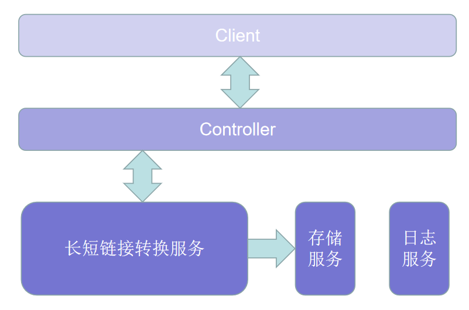
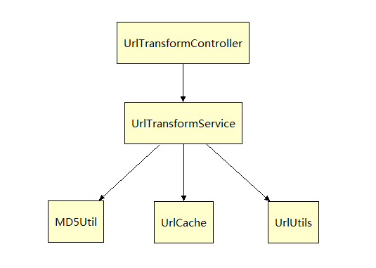
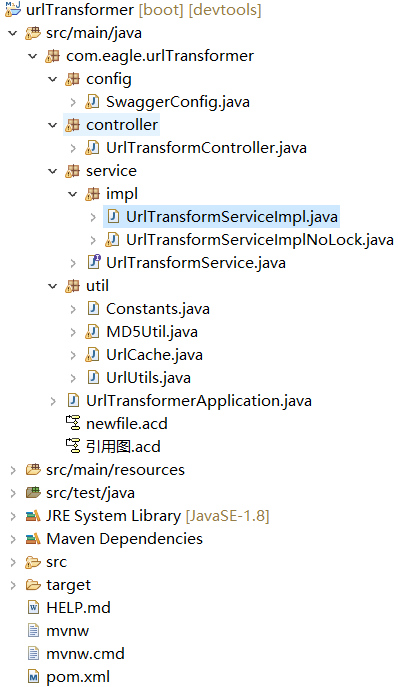

# 短域名服务设计文档

### 	设计思路

需要设计一个基于内存的长短域名转换服务，需要解决如下几个关键问题

1. 短域名生成策略：

   * 算法
     * 将长网址md5生成32位签名串,分为4段, 每段8个字节;
     * 对这四段循环处理, 取8个字节, 将他看成16进制串与0x3fffffff(30位1)与操作, 即超过30位的忽略处理;
     * 这30位分成6段, 每5位的数字作为字母表的索引取得特定字符, 依次进行获得6位字符串;
     * 总的md5串可以获得4个6位串; 取里面的任意一个就可作为这个长url的短url地址;
     * 若按照以上算法生成的短域名与缓存中有重复，则使用随机方式在【ａ－ｚＡ－ｚ０－９】这６２个字符串随机取出获得８位字符串作为短域名，为防止此步骤生成的短域名也与缓存中存在重复，可以设置重试次数（也可先打乱待选字符顺序后再次随机选取８位）。

2. 处理并发生成短域名的问题

   * 为了应对并发生成与读取长短域名，长短域名映射底层使用ConcurrentMap存储，然而在存储长域名的接口中需要先判断此域名是否已经存在于缓存中，然后决定是否要生成对应的长短域名映射（即此处是典型的Check then Act），因此需要额外的同步操作，避免在高并发时对多个请求相同长域名存储接口调用生成映射关系，重复存储。两种思路：
     * ==(1).显式的同步代码块==：将“检查是否有重复，以及之后的生成短链接”逻辑代码块使用synchorinize关键字或者Lock对象保护起来 ，多线程并发生成短链接时串行执行；
     * ==（2)不使用显式的同步代码块==：使用两个ConcurrentMap分别保存shortUrl-longUrl键值对，以及longUrl-shortUrl键值对，生成短链接的saveUrl方法，请求进入方法判空之后就第一时间将longUrl用putIfAbsent存入longUrl-shortUrl键值Map中，此时对应的value赋值为长度等于零的字符串，待之后生成完短链接后替换此空字符串。==若可以存入map中，①表示这个longUrl是第一次过来请求，继续正常的做后面的生成短链接逻辑；②两个map由于淘汰策略的原因数据已经不完全一致了，即有可能在longUrl-shortUrl中不存在此长链接数据，而在shortUrl-longUrl中存在此长链接键值对，因此需要做判断。==如果无法存入，表示此longUrl已经被请求过，无需再次生成短链接 直接从longUrl-shortUrl键值Map中取出即可，此处有可能返回为空（在另一个并发线程以相同的longUrl先一步请求，并且此时还未执行完时，返回为空），使用循环取值直到返回不为空为止。

   思路（1）是空间优先，因为同步的原因将导致生成短链接的方法基本是串行执行；思路（2）是空间换时间，多一个map，存储空间为原来的两倍，但是代码中没有显式的同步块，并发性较思路（1）有很大提升。我们可以基于实际的场景以及硬件设备情况来选取实现方式。提交作业中UrlTransformServiceImplNoLock为思路（2）的实现，UrlTransformServiceImpl为思路（1）的实现。

3. 长短域名映射数据的存储

    * 基于并发存储的问题，而且不能无限制的存储让内存爆炸，选用google的 ConcurrentLinkedHashMap数据结构，一方面它本身支持同步，另一方面 设置最大存储容量，它支持LRU淘汰策略，以保护不会使内存溢出

### 设计图

#### 工程结构图

### 假设

* 本设计假设只部署一台服务供客户端调用；如果需要部署多台服务，则需前置一个分发策略服务（分发策略为单机，以最简单的轮询为例）：存储长域名时根据分发策略（比如最简单的【hash函数（longUrl）%服务数量】）将请求分发到某台机器，在这台服务器上完成短域名的计算以及长短域名映射的存储，将短域名返回，此时分发服务需要记录短域名所在的机器信息，下次客户端发来根据短域名获取长域名请求时，直接定位到短域名所在的机器完成服务。==此处在分发服务上也可能会遇到后端服务返回的短域名重复问题（后端各个服务机器上自己不重复，但不同的机器之间产生了重复），因此分发服务也需要有重试机制：如发现重复后再次调用后端服务产生映射关系，而后端服务也需要做出一点设计上的改变不然大概率会返回与前一次调用结果相同的短域名==
* 映射数据结构的容量需要根据所部署机器的实际情况进行设置，此处假定容量是1000000。
* 存储映射时做了同步，尝试获取锁的时间为1s，此处需要根据存储数据量、并发大小做相应的测试后确定一个合理的值。
* 若需要考虑机器故障、断电等恢复情况，可以使用一个线程异步处理映射数据序列化到本地文件，重启时可以从文件恢复。

注：代码中UrlCaffeineCache为使用Caffeine组件实现缓存的方式，尚未来得及测试，可以忽略。

## 性能测试

* 本机配置:  i5 2.4G 8C16G 
* 使用jmeter 设置9个线程（因为待测程序为计算密集型，合理情况线程数应该是cpu核数+1），对上述思路（2)非显式同步版本UrlTransformServiceImplNoLock的saveUrl 接口实现， 持续请求90秒，TPS在11500左右，切换成测试思路（1)中同步版本实现，TPS在490左右。然而在缓存达到容量上限触发淘汰策略后TPS有较大回落。
  * 使用 类似  jstack -gc pid  10000 1000 监控命令 ，分析GC情况，调整 年轻代以及老年代的大小，尽量减少FULL GC频率，根据硬件设备具体情况来选择垃圾收集（JVM内存大于8G选G1, 小于8G根据情况选ParNew+CMS），之后进行复测。

