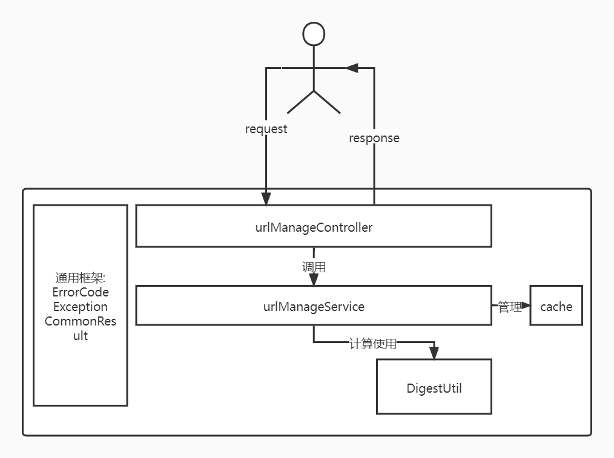
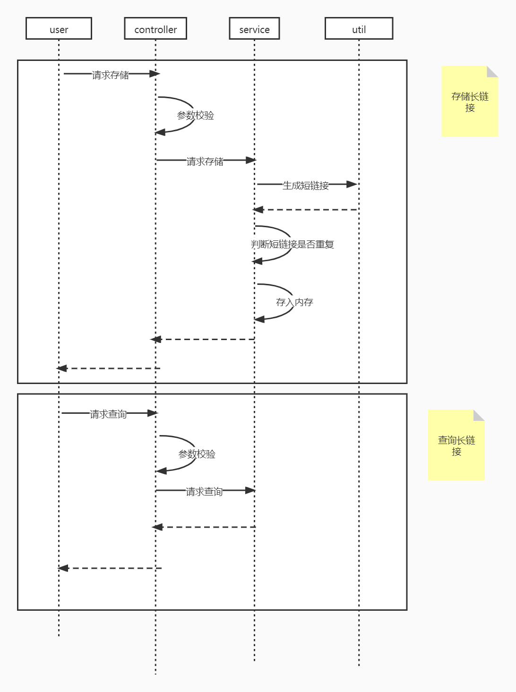
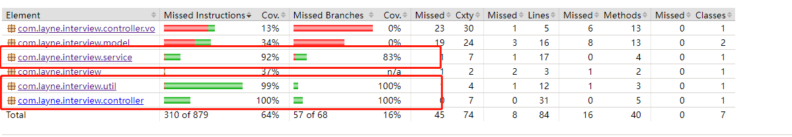

#设计文档

## 1.设计思路
刚拿到问题，思考了一下这个项目需要达成的目的：
+ 能够在内存中存储长短域名的映射关系
+ 能够合适的处理api接口各种请求，包括不合法请求
+ 在保证代码质量的前提下提高性能

脑袋里就形成了一个springBoot简单项目的雏形，controller接受请求，service进行逻辑处理并管理缓存数据，缓存使用map存放映射数据，至于提高性能，那是在能保证完整需求的基础上再追求。

结构大体想好以后，就开始思考项目实现的细节，我认为比较重要的细节有以下几点：
+ 在确定使用map的情况下，使用什么map更加适合我们的场景
+ 计算短域名的算法应该怎么编写以及如何保证生产短域名的唯一性
+ 如何避免系统被重复或者非法请求拖垮

针对以上三个问题，我的思路如下
> 1.在我们的场景中，虽然明面上的需求只有通过短域名获取长域名，只有单向的映射关系。但是仔细推敲逻辑发现，在存储长域名的场景，如果有相同长域名重复请求存储，
> 每次都需要生成一个唯一的短域名，浪费性能。所以我准备存储双向的映射关系，防止以上情况的发生。此时我选择了guava的BiMap，它对于使用两个单向map存储的好处是可以节省内存，同时避免在修改
> 数据时两个map之间的同步问题。
>
> 2.使用MD5算法可以生成一个八位以下的短域名，但是会有极小重复的概率，所以我新增了使用自增sequenceId来都兜底的方案，保证短域名映射的唯一性。
> 
> 3.在请求进入系统的时候就要对请求进行校验，同时对于系统内部的错误要及时catch住，返回处理的结果，保证请求都能有回复。

## 2. 架构图
 

## 3. 假设
### 3.1 存储升级
可以升级为redis进行值的存储，不依赖与内存，保证性能的前提下还可以获得更大的存储空间以及扩展性。
### 3.2 配置文件
配置文件可以统一放在一个文件，注入进属性中，这样可以集中管理。或者是在数据库中新增配置表，应用初始化时在数据库中读取配置信息进行初始化
### 3.3 自增id
如果数据存储在redis中的话，可以使用redis的Incr 命令存储一个自增id作为sequence
### 3.4 短域名的生成
在长域名md5之后，其实是可以生成四个短域名的，这里默认使用了最后一个短域名作为生产的短域名，其实可以在四个中进行选择，防止重复情况的产生
### 3.5 并发量
如果并发量变得很大，可以指定在通过短域名的分段，来将请求分配到不同的服务器，减少单台服务器压力。

## 测试报告
