# Java Assignment

## 这是什么？

### Assignment

#### 实现短域名服务（细节可以百度/谷歌）

撰写两个 API 接口:

- 短域名存储接口：接受长域名信息，返回短域名信息
- 短域名读取接口：接受短域名信息，返回长域名信息。

限制：

- 短域名长度最大为 8 个字符
- 采用SpringBoot，集成Swagger API文档；
- JUnit编写单元测试, 使用Jacoco生成测试报告(测试报告提交截图即刻)；
- 映射数据存储在JVM内存即可，防止内存溢出；
  - ==黄色部分为思路初步分析==
  - ==如果存储在jvm中,需要设计缓存淘汰算法,否则可能出现内存溢出==.
  - ==如果是相同的长地址,应该生成一样的短域名,以便于节省内存空间,防止内存溢出.可以使用布隆过滤器或先检查是否在缓冲中,在的话直接返回缓存中的值.==
  - ==由于使用内存存储缓存,应该缓存限制大小==
- 其他优化思路:
  - ==应该考虑扩展性,比如访问次数限制,是否加密等==

**递交作业内容**

- 源代码(按照生产级的要求编写整洁的代码，使用gitignore过滤掉非必要的提交文件，如class文件)
- Jacoco单元测试覆盖率截图(行覆盖率和分支覆盖率85%+)
- 文档：设计思路、简单的架构图以及所做的假设(Markdown格式)

**加分项**

- 系统性能测试方案以及测试结果

## Job Description

### 岗位职责

1. 负责公司内部自用产品开发，能够独立的按产品需求进行技术方案设计和编码实现，确保安全、可扩展性、质量和性能;
2. 在负责的业务上有独立的见解和思考，对业务产品具有独立沟通、完善业务需求和识别方案风险的能力;
3. 具有持续优化、追求卓越的激情和能力，能持续关注和学习相关领域的知识，并能使用到工作当中;
4. 具备和第三方供应商进行沟通，对设计方案进行审核的能力;

### 要求

1. 5年软件研发/解决方案设计工作经验(金融领域经验加分)；
2. Java基础扎实，熟悉高级特性和类库、多线程编程以及常见框架(SpringBoot等)；
3. 具备基本系统架构能力，熟悉缓存、高可用等主流技术；
4. 持续保持技术激情，善于快速学习，注重代码质量，有良好的软件工程知识和编码规范意识；

# 二.题目设计思路

### 一.什么是短域名

#### 1.为什么要用短连接

那么为啥要用短链表示，直接用长链不行吗，用短链的话有如下好外

1)、链接变短，在对内容长度有限制的平台发文，可编辑的文字就变多了最典型的就是微博，限定了只能发 140 个字.

2).生成二维码连接

3).有些平台不识别场链接,比如钉钉

#### 2.短连接跳转原理

主要步骤就是访问短网址后重定向访问 B，使用301 或 302 都是重定向，到底该用哪个，这里需要注意一下 301 和 302 的区别.

301是永久重定向,虽然短地址一经生成就不会变化,但是如果用了301， Google，百度等搜索引擎，搜索的时候会直接展示真实地址,也无法手机cookie,User Agent 等信息.302便于收集用户的信息,推荐使用302.但302已被废弃,建议采用临时重定向303.

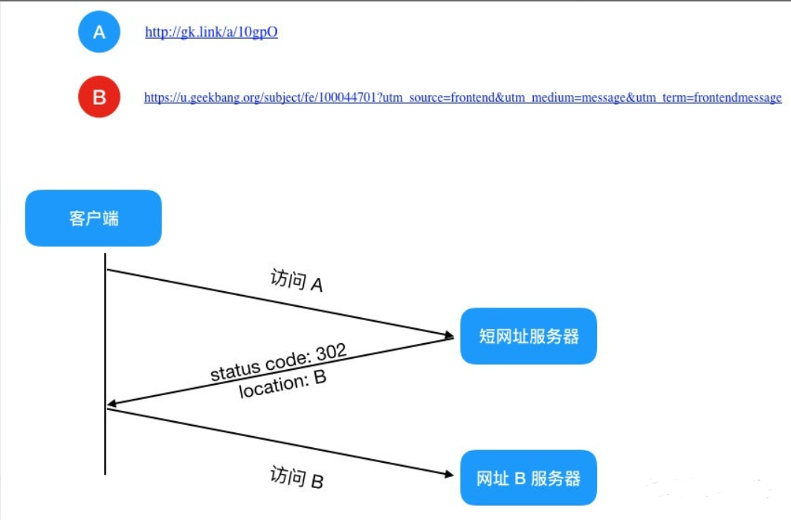

### 二.整体思路

#### 1.短网址长度

62^6或者62^7远远大于现有url网址总和,因此使用8位表示短地址有些浪费,建议使用6位或者7位即可满足要求 .

短网址的长度该设计为多少呢？ 当前互联网上的网页总数大概是 45亿(参考 [http://www.worldwidewebsize.com](http://www.worldwidewebsize.com/))，超过了 2^32=4294967296232，那么用一个64位整数足够了。

一个64位整数如何转化为字符串呢？，假设我们只是用大小写字母加数字，那么可以看做是62进制数，log62(2^64−1)=10.7，即字符串最长11就足够了。

实际生产中，还可以再短一点，比如新浪微博采用的长度就是7，因为 62^7=3521614606208，这个量级远远超过互联网上的URL总数了，绝对够用了。

#### 2.短网址生成方式.

##### 	2.1不建议使用hash()方式,有可能产生碰撞.

​      最容易想到的办法是哈希，先hash得到一个64位整数，将它转化为62进制整，截取低7位即可。但是哈希算法会有冲突,需要使用redis或数据库额外处理从冲突,不建议此题目使用. 哈希算法推荐 Google 出品的 MurmurHash 算法,效率优于MD5和SHA算法.

#####     ==2.2建议使用分布式发号器的方式生成不重复的long整型id==.

​	方案1: uuid. uuid通常都很长,超过8位,不符合要求.

​    方案2: mysql集群做发号器.

​    多台MySQL服务器。前面讲了单台MySQL作为发号服务器，那么自然可以扩展一下，比如用8台MySQL服务器协同工作，第一台MySQL初始值是1，每次自增8，第二台MySQL初始值是2，每次自增8，以此类推.

​      方案3: 雪花算法

​      ==使用雪花算法生成19位Long整型id后,然后转换为62进制数据,截取低7位==.

Twitter 有个成熟的开源项目，就是专门做这个的，[Twitter Snowflake](https://github.com/twitter/snowflake) 。Snowflake的核心算法如下：

最高位不用，永远为0，其余三组bit占位均可浮动，看具体的业务需求而定。默认情况下41bit的时间戳可以支持该算法使用到2082年，10bit的工作机器id可以支持1023台机器，序列号支持1毫秒产生4095个自增序列id。

**如何缩短域名？**

3002604296 这个哈希值是十进制的，那我们把它转为 62 进制可缩短它的长度，10 进制转 62 进制如下：

于是我们有 (3002604296)10 = (3hcCxy)16，一下从 10 位缩短到了 6 位！于是现在得到了我们的短链为 [http://gk.link/a/3hcCxy](https://link.zhihu.com/?target=http%3A//gk.link/a/3hcCxy)

**6 位 62 进制数可表示 568 亿的数，应付长链转换绰绰有余**

#### 3.短域名反解析为长域名   

将长域名转化为短域名后,由于需要做反向解析,所以==生产中建议将结果放入硬盘或缓存中保存.但由于此题目指定将缓存存在jvm中,需要自己设计一个key-value缓存容器==

3.1由于要求使用的是内存存储,为了防止内存溢出,需要涉及淘汰策略.这里设定内存大小为2g,使用LRU最久未使用淘汰策略.按每个k-v键值对1kb计算,2g内存需要存储为 2x1024x1024个元素.

3.2.为了提高并发效率,可以使用布隆顾虑器,或者直接查重,如果存在,直接从缓存中查询并获取短域名;如果没有再走生成短域名方法

#### 4.要考虑为生成短域名访问的扩展性预留出接口,便于后期扩展.

#### 5.预防攻击

​	5.1 限制单日ip地址的请求数量

​    5.2 如果长地址在内存中,直接返回短地址.防止重复生成短地址,耗尽短地址资源.

​           可以在内存中以长地址为key,短地址为value进行存储.一旦收到长域名,发现存在,则直接从内存获取,而不是获取新的id,生成新的短地址.

#### 6.生产中建议使用springboot的过滤器实现转短域名到长域名的跳转

​    虽然本题目未做要求,但访问短域名时,应能够通过短域名跳转至长域名,进行跳转. 可使用过滤器进行跳转.

#### 7.生产中请求短链的高并发架构设计

在电商公司，经常有很多活动，秒杀，抢红包等等，在某个时间点的 QPS 会很高，考虑到这种情况，我们引入了 openResty，它是一个基于 Nginx 与 Lua 的高性能 Web 平台，由于 Nginx 的非阻塞IO模型，使用 openResty 可以轻松支持 100 w + 的并发数，一般情况下你只要部署一台即可，同时 openResty 也自带了缓存机制，集成了 redis 这些缓存模块，也可以直接连 mysql。不需要再通过业务层连这些中间件，性能自然会高不少

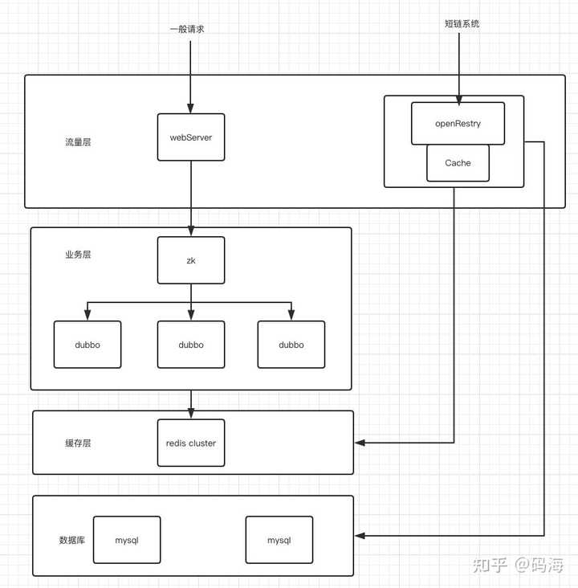![img]

如图示，使用 openResty 省去了业务层这一步，直达缓存层与数据库层，也提升了不少性能

####  8.测试案例集群方案设计:

由于只有一台普通笔记本电脑,测试用例可在本机单机通过虚拟机搭建伪集群,架构如下.

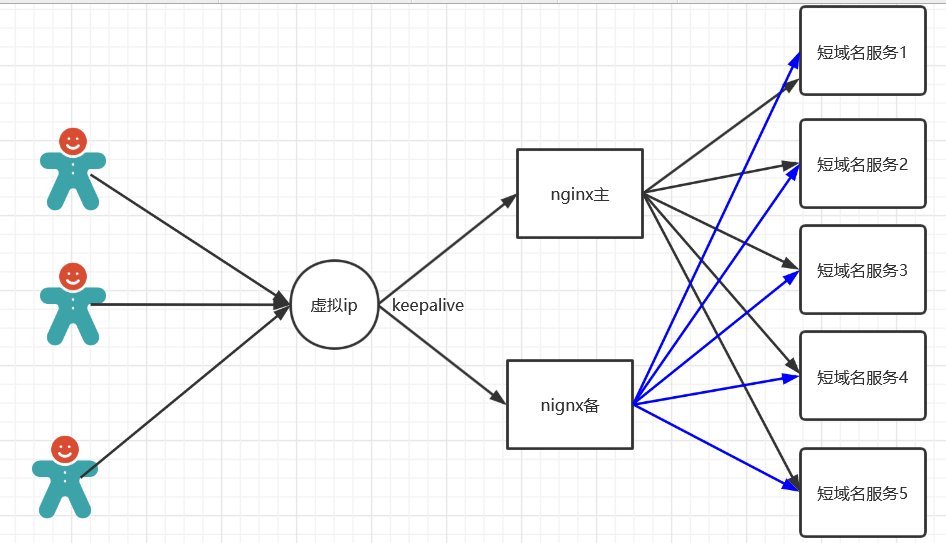

域名规划: 192.168.1.50,使用域名manage.leyou.com

nginx高可用规划:

| 虚拟ip       | ip           | 主机          | nginx端口 | 默认主从 |
| ------------ | ------------ | ------------- | --------- | -------- |
| 192.168.1.50 | 192.168.1.51 | short-proxy-1 | 88        | MASTER   |
|              | 192.168.1.52 | short-proxy-2 | 88        | BACKUP   |

反向代理到以下10台节点.

在本机部署10台短域名转换服务器.

| 编号 | ip地址+端口号     |
| ---- | ----------------- |
| 1    | 192.168.1.53:9080 |
| 2    | 192.168.1.53:9081 |
| 3    | 192.168.1.53:9082 |
| 4    | 192.168.1.53:9083 |
| 5    | 192.168.1.53:9084 |
| 6    | 192.168.1.53:9085 |
| 7    | 192.168.1.53:9086 |
| 8    | 192.168.1.53:9087 |
| 9    | 192.168.1.53:9088 |
| 10   | 192.168.1.53:9089 |

# 三.测试用例及说明

### 1.测试截图

1. 长域名转短域名

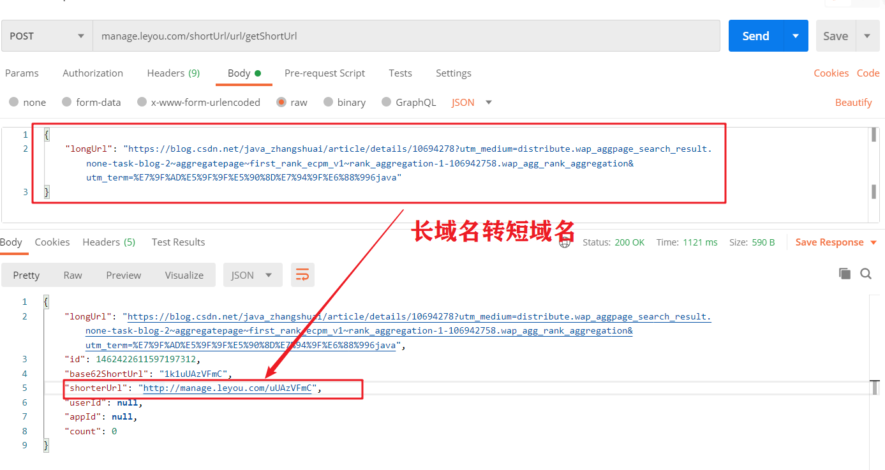

2. 短域名转长域名.

   由于使用内存存储数据,无法直接用单元测试测试短域名转长域名.使用postman进行测试如下

   1). 先使用长域名转短域名

   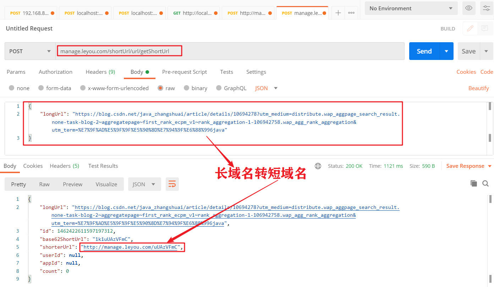

​       2) 用相应的短域名,转化为长域名

### 2.junit测试

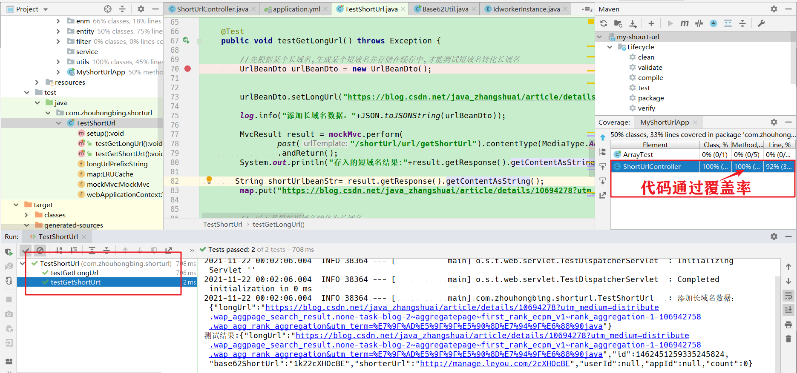

### 3.Jacoco测试覆盖

代码覆盖率截图如下:==分支覆盖率100%,行覆盖率92.3%==

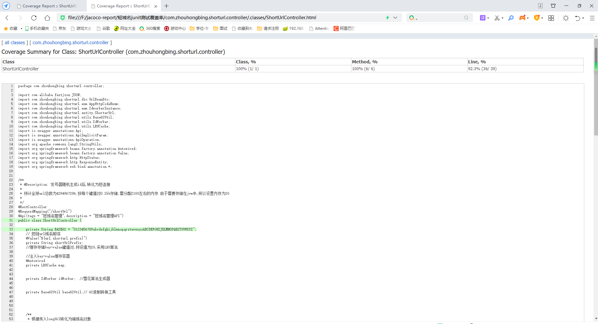

jacoco仅能覆盖长域名转短域名的方法.

### 4.JMeter性能测试

1.长域名转短域名测试,5线程运行15分钟

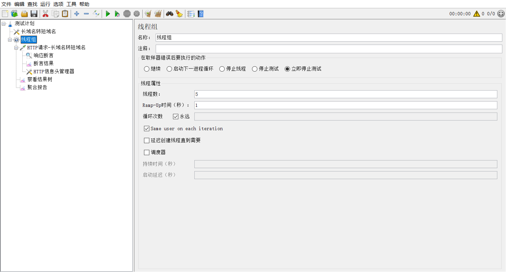

随机生成长域名,返回短域名对象

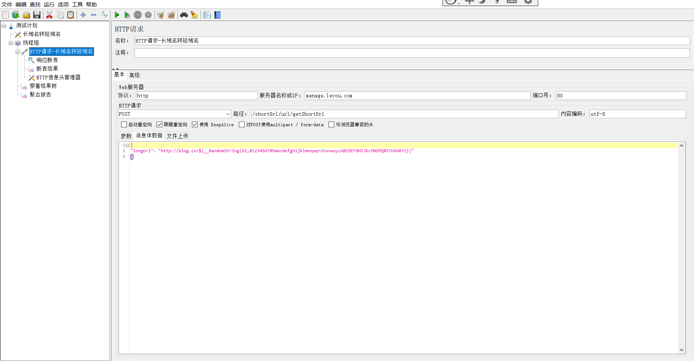

返回结果如下:包含短域名的json对象

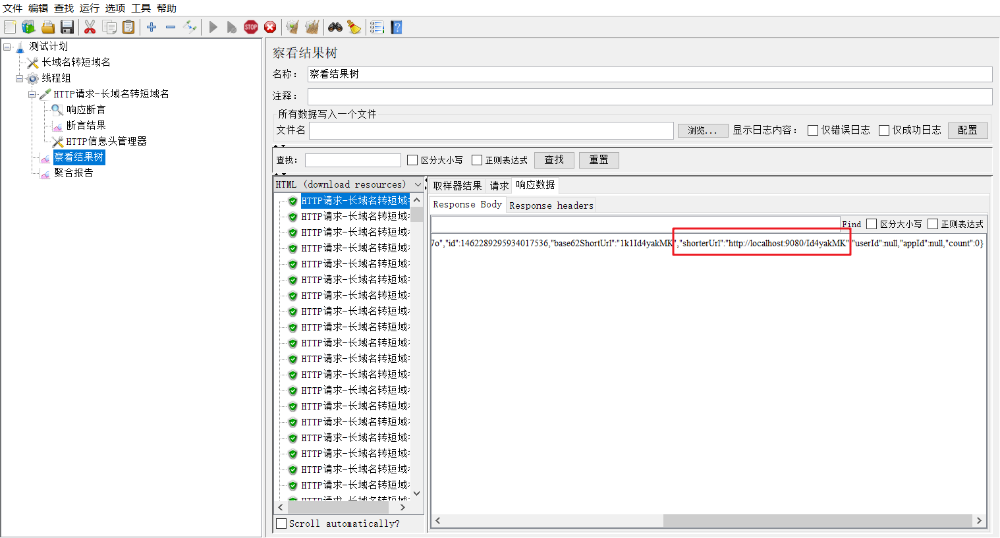

#### 1)5条线程同时压力测试运行5分钟:

结果为:==5分钟访问次数45万次,平均相应时长3毫秒,吞吐量1301.3/sec,错误率0%==

#### 2)5线程同时运行压力15分钟:

结果为:==15分钟访问次数117万次,平均相应时长5毫秒,吞吐量1331.3/sec,错误率1.04%==

### 5.swagger接口文档截图

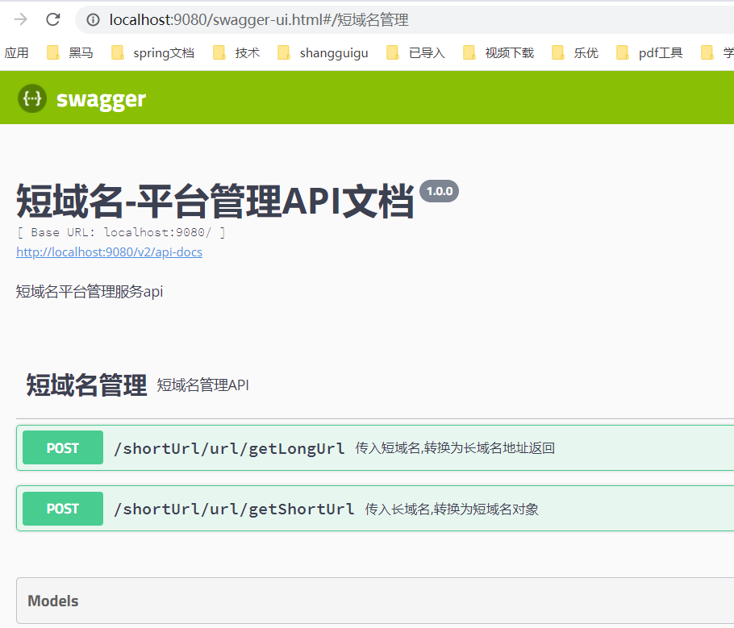

