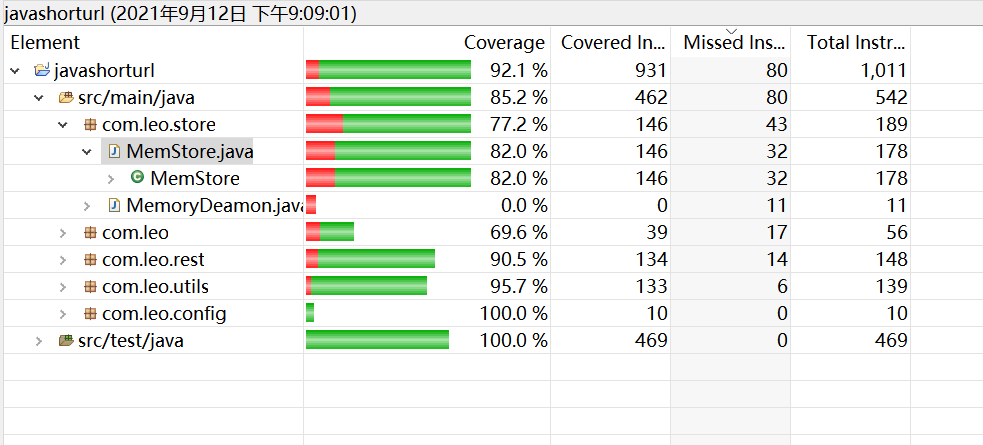
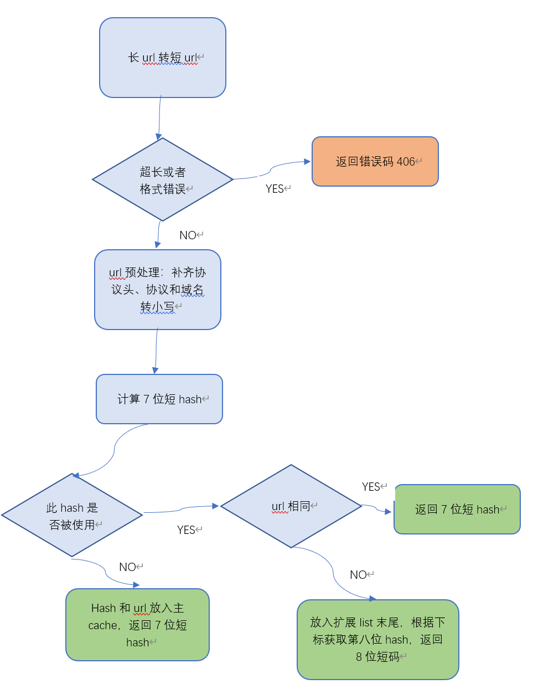
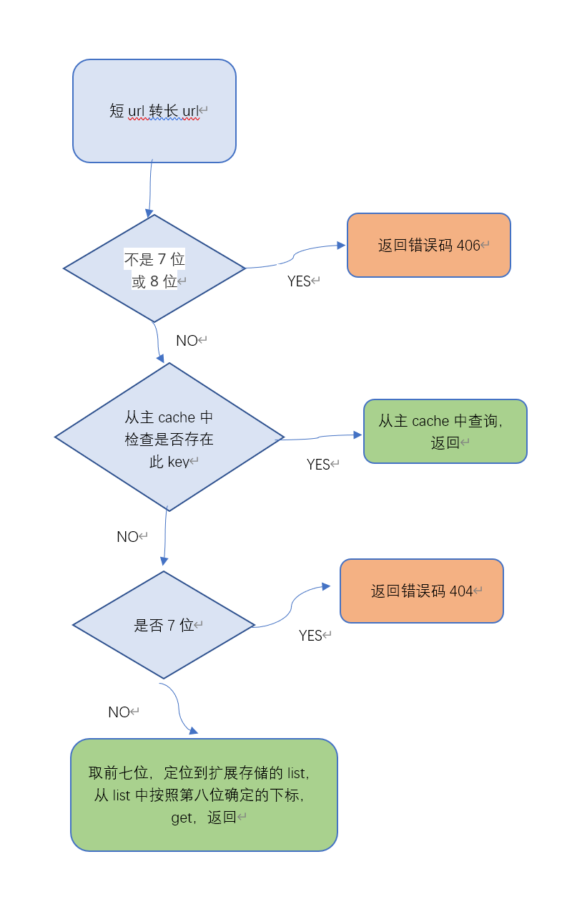

[toc]

几年前本人做的python短码项目：[short_url/shorturl.py at master · zdcin/short_url · GitHub](https://github.com/zdcin/short_url)  支持千万url，生产中使用

## 1 方案选型

短url有两种典型解决方案：hash法 与 短码分配法

**hash法**： 用原始url做hash，如果hash太长，再次做hash转为短码， 两次hash过程中都可能发生hash冲突，此办法需要解决hash冲突。

**短码分配法**： url与短码的对应关系完全由服务器控制和记录，二者一般没有可计算的对应关系。此种办法不会产生类似hash冲突的碰撞问题。

短码字符集使用**数字和大小写字母**共62个字符， 62^7 = 35.2* 10 ^12  = 3.5 万亿空间， 剩余一位 做 碰撞处理， 可以容纳62个碰撞，非极端情况够用了。
hash双向计算都很快速，计算出的短码也相对稳定，因为我们只有内存，这样是更优的方案。
将来即使切换到数据库，该方案也能优雅应对，对数据库的依赖更少。
碰撞位如果不够的话，可以增加一位变成9个字符，或者从前一位借几个数，如借10变成620个冲突项，两种方案都可以权衡考虑。

采用**MurmurHash**128位hash算法，计算速度更快，针对url的散列更均匀。

## 2 关键问题解决办法

**url输入约束：**

* url最大长度问题：url最大长度限制为 512个字符，虽然浏览器中可以更长，为了减少恶意攻击和极端情况下的性能恶化，这里设置为512，同时作为可调的配置参数，提升灵活性
* url格式检查，禁止非法url写入，防范攻击
* url协议与域名不区分大小写的问题： 统一将协议名和域名转为小写，防止不必要的空间浪费

**内存溢出问题：**

* 使用软引用或者弱引用方式，防止内存中存储的短码和url map发生内存溢出
* 考察了google 的mapmaker，最新版本时弱引用方式，会导致命中率严重降低，不理想
* 最终自己实现 软引用map方式， 只在必要时（发生OOM之前）才会回收内存中url映射数据，是相对于mapmaker更优的方案

**hash冲突数据存储的数据结构：**

* 使用列表方式存储，写入时最多检查62次，但查询只需要按照下标查找，短码系统中查询远多于写入，所以使用列表方式。

## 3 代码覆盖率

3 处理流程图

**长转短**

**短转长：** 

**清理失效key：**

每5分钟的定时程序， 遍历主cache，判断软引用中保存的url是否被清理，如果被清理，清理掉此key

  

