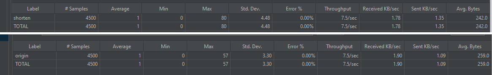

#短网址服务

###项目简介
 
  提供通过初始网址获取短网址和根据短网址返回初始网址的服务

###设计思路
  短网址生成算法如下：

 - 1)将长网址md5生成32位签名串,分为4段, 每段8个字节;

 - 2)对这四段循环处理, 取8个字节, 将他看成16进制串与0x3fffffff(30位1)与操作, 即超过30位的忽略处理;

 - 3)这30位分成6段, 每5位的数字作为字母表的索引取得特定字符, 依次进行获得6位字符串;

 - 4)总的md5串可以获得4个6位串; 取里面的任意一个就可作为这个长网址对应的短网址;

###架构设计
   整个项目分为四个模块，模块依赖由上至下

    API模块      接口定义，做基本的参数校验
    Service模块  具体业务逻辑处理
    Dao模块      数据访问相关处理
    Common模块   包含工具类和异常、枚举等通用类

###Swagger文档地址

  http://localhost:8080/swagger-ui/index.html#/

###代码覆盖率
  

###性能测试
  使用JMeter对本机做压力测试
  环境：CPU4核 内存16G 系统Windows10
  
  1000线程循环三次下两个接口的响应时间较低，错误率为0。主要是因为本身逻辑比较简单且存储是本地内存。
