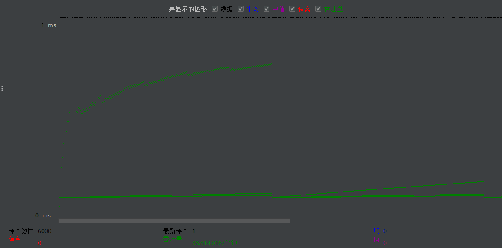

[TOC]

##### 需求
撰写两个 API 接口:
- 短域名存储接口：接受长域名信息，返回短域名信息
- 短域名读取接口：接受短域名信息，返回长域名信息。

限制：
- 短域名长度最大为 8 个字符
- 采用SpringBoot，集成Swagger API文档；
- JUnit编写单元测试, 使用Jacoco生成测试报告(测试报告提交截图)；
- 映射数据存储在JVM内存即可，防止内存溢出；

##### 需求分析

注：之前没有接触过短域名相关的内容，在仔细查看需求后，先去百度搜索什么是短域名，弄清楚了什么是长链接和短链接，又找到短链接在线生成尝试了下效果。经过查找的资料和我个人的分析，发现原来短链接只是长链接按照一定的规则生成的，而短链接前面的域名则是可以自己定义。

`http://mhy.cn/bIZ3y2`
- 整个短链接的构成 ： 协议 + 域名 + 根据长链接生成的字符串
- 长链接要怎么转换位对应的字符串
- 通过在线生成短链接，浏览器F12发现访问短链接时会302到长链接
- 需要定义两个接口，一个存储一个读取，考虑到需要测试可用性，还需要定义一个短链接重定向长链接的接口

##### 设计思路

- 生成短链接这部分我在网上查找多种实现方式进行对，最终方案如下：
  - 把长链接MD5加密成32位字符串，并分成四个8位一组的字符串
  - 将得到的8位字符串转换位16进制 并与 0x3FFFFFFF 进行位与运算
  - 循环6次，把得到的值与 0x0000003D 进行位与运算，取得字符数组chars索引，把取得的字符相加，每次循环按位右移5位
  - 上个步骤循环几次就会得到长度位几的字符串，顾得到的位4个长度位6的字符串
  - 这4个字符串每一个都可以当作该长链接对应的短链接字符串，随机取其中一个返回。

- 存储长链接接口
  - 调用生成短链接字符串方法
  - 拼接短链接，例如 `http://mhy.cn/visit/bIZ3y2`
  - 建立长链接与短链接的映射关系
  - 返回6短链接

- 获取长链接接口：
  - 根据短链接取出与之映射的长链接
  - 返回长链接

注：Knife4j的访问页面为 ` http://mhy.cn/doc.html `，与该接口冲突，由于时间只能使用 `http://mhy.cn/visit/{shortStr}` 来代替
- 访问短链接接口：
  - 短链接字符串作为请求路径参数，/visit/{shortStr}
  - 拼接短链接，例如 `http://mhy.cn/visit/bIZ3y2`
  - 根据短链接取出与之映射的长链接
  - 重定向到长链接

限制：
- 短域名长度最大为 8 个字符 ---- 这里域名我使用 mhy.cn
- 采用SpringBoot，集成Swagger API文档 ---- 采用Knife4j集成Swagger2
- JUnit编写单元测试 ---- 使用springboot测试单元MockMvc调用接口，在一个单元测试中测试存储和读取两个方法
- 使用Jacoco生成测试报告 ---- 使用idea插件Jacoco测试代码覆盖率
- 映射数据存储在JVM内存即可，防止内存溢出 ---- 直接存储在ConcurrentMap

##### 架构图

系统架构图：由于并不是正式项目，所以并没有用到Nginx和Redis，如果正式项目，那么短链接就应该存在数据库和Redis中

##### 代码覆盖率为100%

##### 性能测试
注：第一次做性能测试，做到不好还请见谅

性能测试使用jmeter工具，在windows10环境下进行，内存16G，1T固态硬盘，cpu6核

2个线程组都是：线程数12，循环500次
第一个线程组开启1个长链接存储http请求，第二个线程组开启2个长链接获取http请求

-存储汇总报告

-存储图形结果

-获取汇总报告

-获取图形结果

