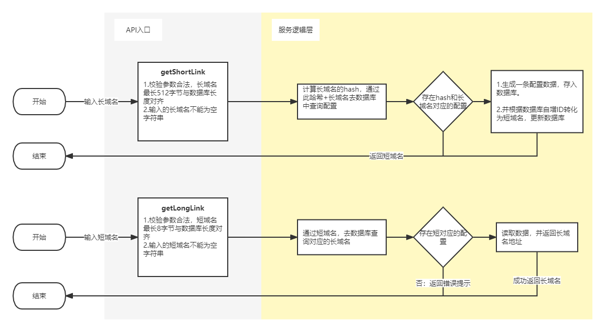
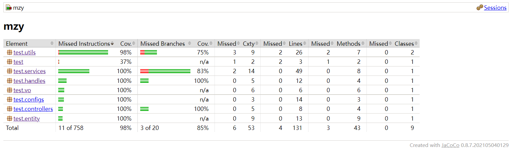
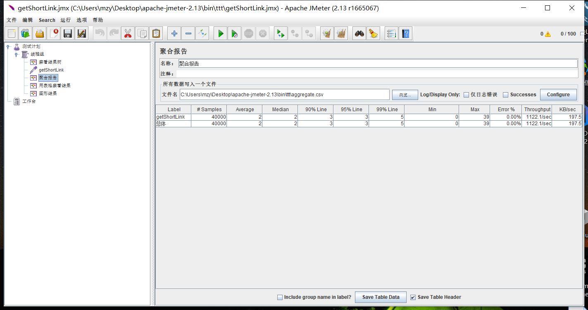
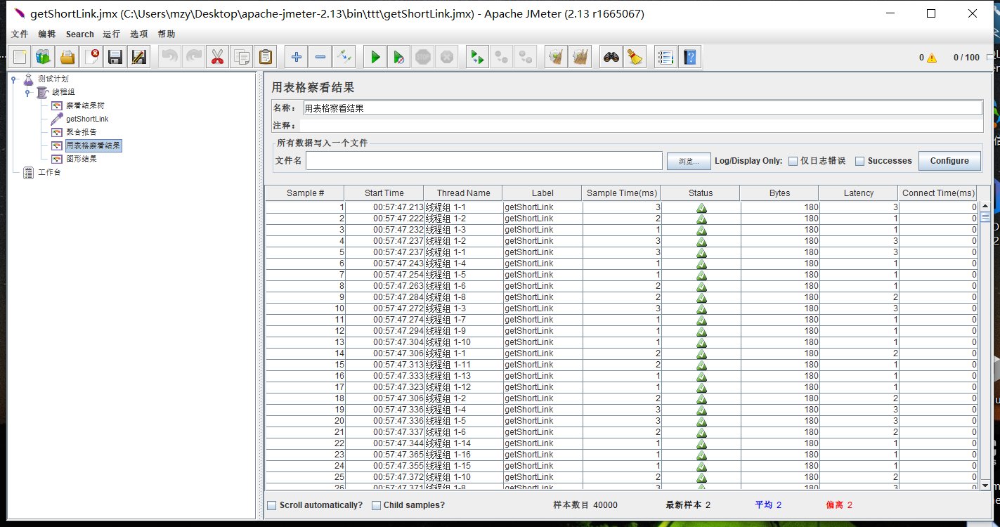
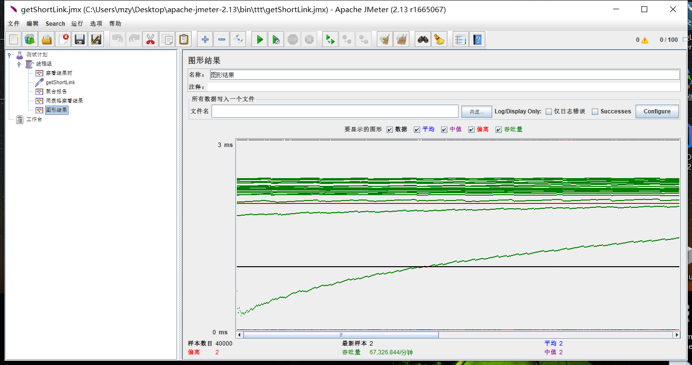
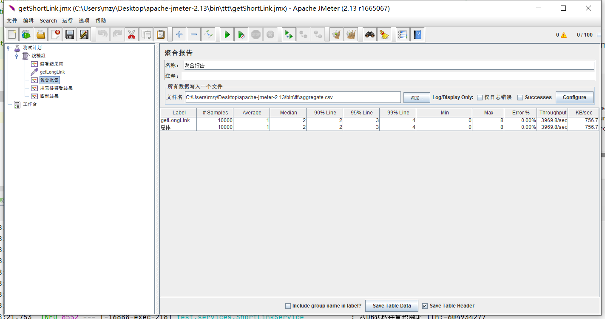

## 项目环境说明
项目使用maven作为包依赖管理,maven settings文件需要设置镜像:
```
   <mirror>
      <id>alimaven</id>
      <name>aliyun maven</name>
      <url>http://maven.aliyun.com/nexus/content/groups/public/</url>
      <mirrorOf>central</mirrorOf>
    </mirror>
```


## 服务说明
1. 系统数据库使用H2，服务启动后可访问数据库地址: http://localhost:16888/h2-console
2. 系统启动后，可以访问服务的swagger api文档,地址为: http://localhost:16888/swagger-ui.html#
3. 系统使用Jacoco进行单元测试覆盖率检测，检测报告路径为 /target/site/jacoco/index.html

## 设计思路
### 一.系统核心逻辑


整个服务提供2个API接口: 1.短域名存储接口; 2.短域名读取接口。
- 1.短域名存储接口：接受长域名信息，返回短域名信息。  
    这个接口包含两个逻辑，**一是**接受一个长域名，并且这个域名是第一次被服务接受，需要为此长域名生成一个唯一对应的短域名。
    **二是**接受一个之前已经接受过的长域名，此时只需要从数据库中找到已经存在的那条配置，并且把对应的短域名返回即可。

- 2.短域名读取接口：接受短域名信息，返回长域名信息。  
    这个接口功能就只有去读短域名的逻辑，直接从数据库中查找是否用存量的域名映射配置。如果没有说明该短域名没有对应的长域名。

### 二.数据库设计
由于服务可能会存储非常多的长域名与短域名的映射关系，所以数据库中创建了2个索引，short_link和long_link_hash。

- short_link是一个唯一索引，因为整个服务的短域名不允许重复，必须确保全局唯一。并且提高通过短域名查询映射关系的效率。

- long_link_hash是一个普通的索引，是将长域名经过hash得到的哈希值存入该字段，主要是用于通过长域名去查找映射关系配置的时候提高查询效率，并且节省数据库索引的存储空间。

## 三.域名转换逻辑
为了让短域名尽量的短，就要让短域名的每一个字符尽可能的能够有更多的表现能力，这里采用的是利用**62进制**表示短域名，其中转换的依据是依赖数据库的自增主键。转化算法是利用**除N取余**法。

## 四.缓存设计
服务提供的两个接口，主要的逻辑就是通过长域名查询映射配置和通过短域名查询映射配置。
尽管数据库表做了索引，但是每次请求如果都要请求到数据库，则会对数据库造成较大压力。
所以该服务对通过长域名查询映射关系和通过短域名查询映射关系都加了两个本地内存缓存，可以很好的减轻数据库的请求压力，提高系统的查询效率和数据库的稳定。

## 五.假设场景
- 当多个请求同时调用短域名存储接口时候，这里可以添加一个分布式锁来避免这种并发情况。
若没有该分布式锁，则这个长域名会在数据库中产生多条记录，但是他们生成的短链接是一样的。此时由于数据库的唯一索引限制，则只会有一个请求成功返回对应的短域名，其他请求失败。
失败的用户再次请求则会返回上个请求成功生成的短域名。这里可以加上一个限制重试次数的事物方法，前一次失败，则在下一次重试即可查询到存量的映射配置。

- 本地内存缓存过期的时候，可能会出现缓存击穿。这里可以加上一个单机级别的锁，例如synchronized或者其他Lock防止击穿。

## 六.可改进的地方
服务目前只做了最简单的基础功能和少许增强服务稳定性的功能。服务也可以增加熔断、限流等逻辑，来处理服务接口高峰期或者遇到黑产用户时候的特殊应对逻辑。

### 单元测试覆盖率报告截图


### Jmeter测试
采用Jmeter进行性能测试，线程组设置线程数量为100，循环800次，

- 下面是对getShortLink短域名存储接口接口的测试结果。从结果可以看出99%的请求在5ms响应，95%的请求在3ms响应。接口平均响应2ms。
并且接口性能很稳定。








- 对getLongLink短域名读取接口的测试结果同样，接口很稳定，响应速度快，下面是线程组采用100个线程，循环100次的测试结果。




## 参考资料
1. https://xie.infoq.cn/article/483fcfbe3f942cb1fa9d9ce20


感谢面试官的阅读，期待加入红杉团队中。