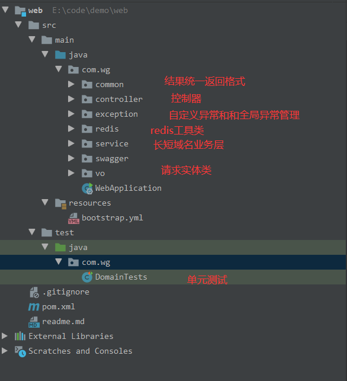
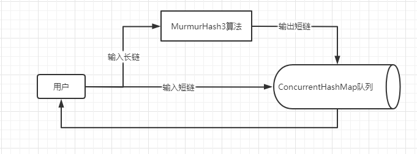
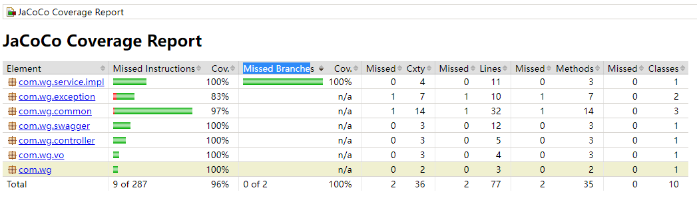
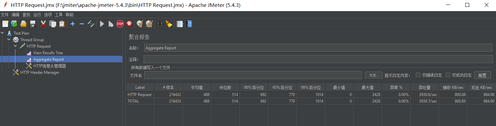

## 基本结构
 

## swagger ui
http://localhost:8080/doc.html

## 设计思路
1. 自增ID
    - 思路：采用自增长方式，将10进制转为62禁止字符串
    - 优点：无碰撞
    - 缺点：不安全，容易被反向遍历获取原始链接
2. 摘要算法
    - 思路：hash算法，采用MurmurHash3算法，输出长度固定，谷歌推出的算法，MurmurHash3也是redis存储算法，碰撞率极低
               （推荐，本次采用的算法)
    - 优点：生成的短码无规律，分布式较好，
    - 缺点：随着短码生成的变多，后期出现的碰撞率也会变大（其实也是忽略不计）
3. 随机数算法
    - 思路：采用Math.round()生成短码，26个小写英文字母，26个大写英文字母，10个数字共62数组成
    - 优点：短码唯一
    - 缺点：在短码已经存在较多的情况下，需要循环生成短码的次数也会越来越多
    
## 架构设计图
  1. 接受长域名信息，返回短域名信息
    /domain/getShortUrl
  2. 接受短域名信息，返回长域名信息
    /domain/getRealUrl  
   

## 扩展
  个人想法
  1. 若是生产环境，可以采用redis和elasticsearch结合使用  
  2. 将最近生成的数据，以及高频访问的数据redis，早期数据和低频访问数据放入es， 或者是直接将早期长链与对应的短链缓存或者es当中的数据删除 
  3. 分布式部署，存储接口和获取接口分布式部署
  4. 集群部署，nginx等工具负载均衡访问
  
## 代码覆盖率
   
## jmeter差压 
 