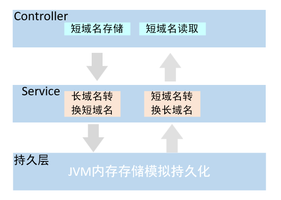
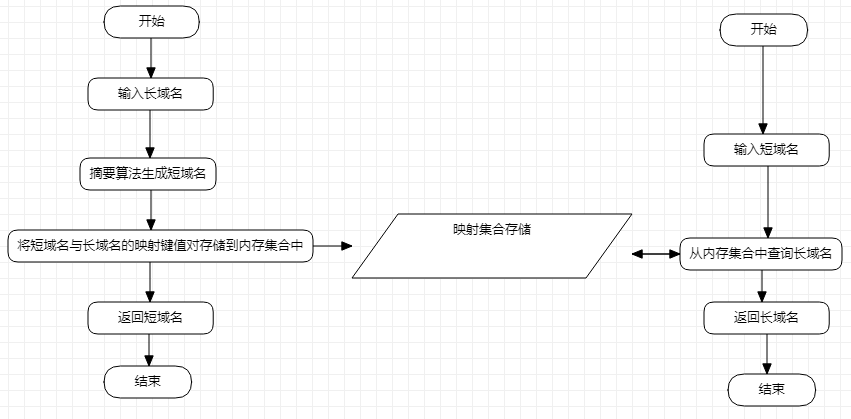
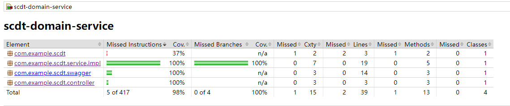

# 设计思路


## 短域名存储接口

​	使用**摘要算法**将长域名转换成短域名并存储，步骤如下：

1. 将长域名进行 MD5 加密转换为 32 位十六进制的字符序列；
2. 将 MD5 序列拆分为 4 段，每段 8 个字节；
3. 将第 2 步中拆分出来的各个字符序列与 0x3FFFFFFF 进行与运算，保留各个字符序列的低 30 位，过滤掉高位
4. 对第 3 步中得到的序列进行拆分，拆分为6段，每段 5 位长度，将其与 0x0000003D 进行与运算，得到 0 ~ 61 之间的索引值，通过该索引映射到由 数字、小写字母、大写字母 组成的元字符中；
5. 由映射得到的元字符拼接得到短域名；
6. 重复以上步骤每个长域名最终可获得4个短域名，从其中随机选取一个作为最终的短域名，通过固定前缀加上生成的短域名作为 key，输入的原长域名作为 value 建立映射关系，并存储到内存映射集合中；
7. 最终将 短域名 返回给请求方。


## 短域名读取接口

​	通过固定前缀加上接受的短域名作为key，从映射集合中取出长域名（实际可考虑为空时的处理逻辑），并返回。


# 架构设计

​	采用典型三层架构设计，如下如所示：



​                                                                                                                           图1 系统架构设计图

## 工作流程



​							                                                                                  图2 系统工作流程图

## 系统运行前提假设


1. 短域名存储接口只提供长域名转换为短域名功能，请求方拿到返回的短域名后需了解按照需求拼接上域名及端口信息；
2. 用户触发了短域名请求后，在请求系统读取长域名信息前，需要将域名及端口信息去除作为参数，这样才能读取到正确的原始长域名信息。
3. 系统提供无效域名清除功能（可以提供接口，由用户主动触发），可将失效域名及时清楚释放内存空间


# JUnit单元测试及Jacoco测试报告





# 其他

swagger 访问地址：

[Swagger UI](http://localhost:8080/swagger-ui.html)


jacoco生成测试报告命令：

```maven
mvn clean test -Dmaven.test.failure.ignore=true
```


