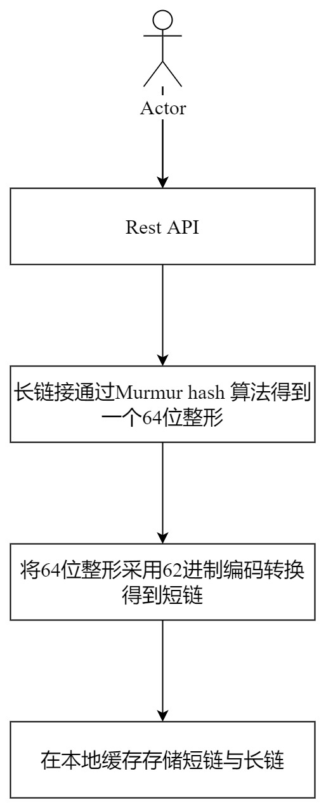

## 背景需求
### 实现短域名服务（细节可以百度/谷歌）

#### 撰写两个 API 接口:
- 短域名存储接口：接受长域名信息，返回短域名信息
- 短域名读取接口：接受短域名信息，返回长域名信息。

#### 限制：
- 短域名长度最大为 8 个字符
- 采用SpringBoot，集成Swagger API文档；
- JUnit编写单元测试, 使用Jacoco生成测试报告(测试报告提交截图)；
- 映射数据存储在JVM内存即可，防止内存溢出；

## 设计思路

基于SpringBoot开发，提供REST API。根据一个长链接得到短链接，目前业内通用的方案是将长链接对应一个64位整数，然后将这个64位整数转为62进制（0-9a-zA-Z）的编码格式得到一个短链。短域名服务是一个读多写少的场景，一般会将短链与长链的映射关系存到缓存中，方便后续读取。本需求中数据存储直接使用JVM内存，常用的本地缓存有EhCache、Guava Cache 以及 Caffeine， 也可以自己封装HashMap实现。

### 长域名转为64位整数
#### 方案一（通过长链接hash得到一个64位整数）

目前比较成熟的hash方案是Murmur hash 算法，Apache 的通用函数库以及 Google 的 guava库均有实现。

#### 生成全局唯一ID对应长链接

1. 使用redis incr
2. 数据库自增ID
3. UUID
4. 雪花算法

全局唯一ID 一般使用如上几种方案，各有优劣。使用Redis 和雪花算法相对好一点，Redis有数据丢失的风险，雪花算法由于依赖于时间，当服务器时钟有问题时，可能会产生重复ID，针对这个问题一般是采用统一的时钟服务器，以时钟服务器时间为准。UUID实现简单，但是存在一定问题，如果是本地缓存我们需要维护一个长链到UUID的映射关系，比较耗内存；如果需要落库，UUID还可能导致页分裂问题。

综上所述，结合需求场景，我们直接使用Murmur hash 算法，该算法比较成熟，且有成熟的库函数提供时使用，避免重复开发，节约开发时间。

### 本地存储选型

#### EhCache

Ehcache是目前比较流行的纯Java开源缓存框架，配置简单、结构清晰、功能强大，是一个非常轻量级的缓存实现。Ehcache的超时设置主要是针对整个cache实例设置整体的超时策略，而没有较好的处理针对单独的key的个性的超时设置，因此，在使用中要注意过期失效的缓存元素无法被GC回收，时间越长缓存越多，内存占用也就越大，内存泄露的概率也越大。

#### Guava Cache

Guava Cache是Google开源的Java重用工具集库Guava里的一款缓存工具。Guava Cache的架构设计灵感来源于ConcurrentHashMap，在高并发场景支持和线程安全上都有相应的改进策略，使用Reference引用命令，提升高并发下的数据……访问速度并保持了GC的可回收，有效节省空间；同时，write链和access链的设计，能更灵活、高效的实现多种类型的缓存清理策略，包括基于容量的清理、基于时间的清理、基于引用的清理等；编程式的build生成器管理，让使用者有更多的自由度，能够根据不同场景设置合适的模式。

#### Caffeine

Caffeine是基于Java8，对Guava缓存的重写版本，在Spring Boot 2.0中将取代Guava，基于LRU算法实现，支持多种缓存过期策略。

本项目中最终采用Caffeine 作为本地缓存。

## 流程图

## 待完善
1. 预防攻击。通过长链接生成短链的服务如果对外暴露，在遭到恶意攻击时可能会长生一下问题：短链ID被耗尽、机器资源被耗光、产生大量垃圾数据。针对恶意攻击，可以添加一些限流策略。缓存要使用淘汰机制，确保内存不会被撑爆
2. 对于高并发场景，若多机部署，本地缓存不支持分布式缓存。
3. 单机部署，访问数受限，若想提高单机并发量，可以考虑使用Netty 提供短链服务
4. 缓存数据量很大时，每次放入缓存前先要检查是否hash冲突，需要查一次缓存，此处可以引入Bloom Filter优化

