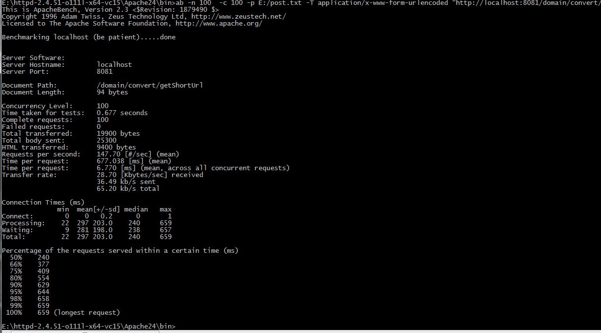

##目录说明
> common 
>存储公共的一些常量类
>
> config 
>一些配置bean，全局处理等类
>
>controller
>controller类
>
>dto
>返回的实体对象
>
>properties
>可配置的配置文件
>
>service
>关键服务类
>
>util
>一些工具类

## 设计思路

- 转换链接使用原子自增类AtomicLong来作为发号器，使用发号器得到号牌后通过char
数组计算得到一个号牌对应的value值，将此值作为短链接。当分布式部署时，应使用snowflake
来进行发号得到全局唯一值来进行计算短链接
- 使用 caffeineCache 作为jvm级缓存，存储长短链接的映射。caffeineCache缓存可配淘汰策略
例如：最大存储多少，单个key的失效时间。当分布式部署时应使用redis进行存储，使全局缓存

- 8位数字+大小写字母62进制，实测当9000亿长度是8，也就是说当使用9000亿次后就长度就超过了
配置的 最大长度值，此时代码会进行归零。一般来说是够用了，同时最大长度值可配，后续如果使用
配置中心例如nacos等，可以动态刷新调整。

##压力测试
`ab -n 100  -c 100 -p E:/post.txt -T application/x-www-form-urlencoded "http://localhost:8081/domain/convert/getShortUrl"`
使用ab进行压测，并发100，执行100次
我笔记本是买了十年了，老笔记本性能不太好，内存增加到了8G
