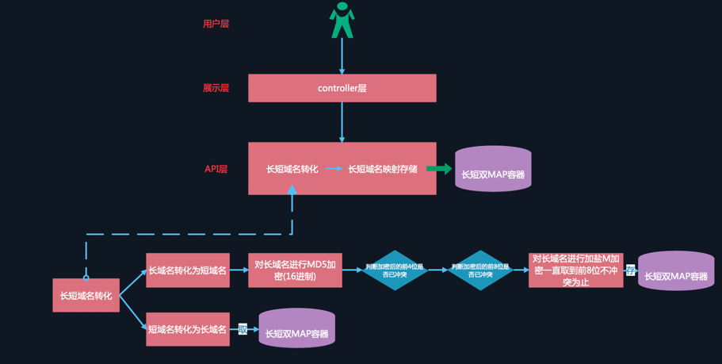

# Java Assignment shican.sc

## 流程图

####如上图：大致分三层，
    用户层 => 展示层 => 逻辑处理+存储层(因为是在内存存储，所以我将逻辑与存储放在了一起)

#### 逻辑算法主要就是长短域名的转化算法。
     我这边是使用的MD5加密，也就是16进制。我将长域名进行MD5加密，然后取前4位进行容器查找，如果存在了冲突，则取前8位进行容器查找，
    如果还是存在冲突，则对当前长域名加上当前时间戳再次进行MD5加密，知道取到的8位短域名不冲突为止,算法便结束退出。
####逻辑存储主要是使用了双map. 
    将长域名映射到短域名与短域名映射到长域名都做了存储，这样方便长短域名各自作为key进行O(1)的查找。

### 关于我
####姓名：石灿
####联系方式：13476240215
####邮箱： m13476240215@163.com
####工作经验：6年互联网JAVA研发经验

#### 我的简历
    请查看java/shican_java/doc/shican.docx文件

