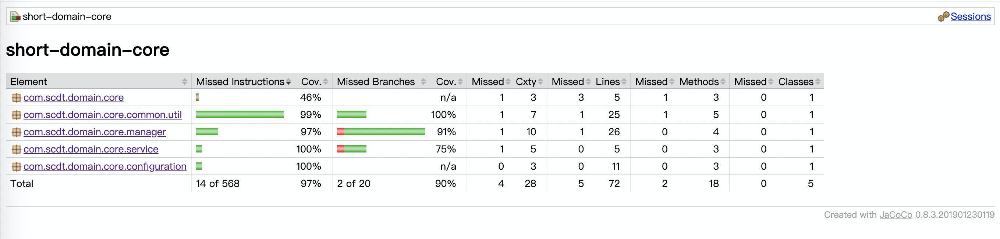
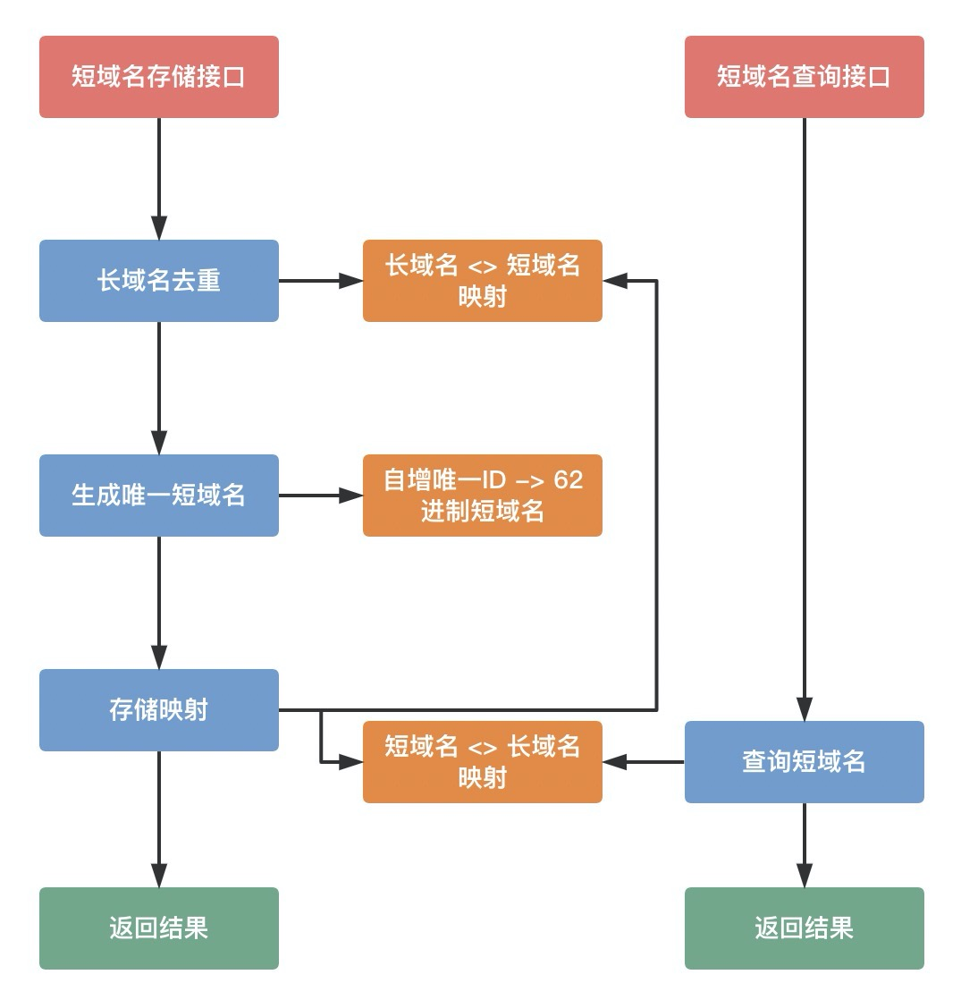

# 短域名服务

#### Swagger API文档

* [http://localhost:8080/swagger-ui/index.html](http://localhost:8080/swagger-ui/index.html)

#### Jacoco

* ```mvn clean test org.jacoco:jacoco-maven-plugin:0.8.5:prepare-agent install -Dmaven.test.failure.ignore=true```
* Jacoco单元测试覆盖率截图



#### 设计思路

* 使用`AtomicLong`生成long类型的自增唯一ID，再将自增唯一ID转为62进制(`0-9数字`、`a-z字母`、`A-Z字母`)的8位字符串表示，例如`rNJJJJJJ3`
* 内存中使用简单的2个Map存储短域名和长域名之间的映射，分别做短域名查询、长域名去重功能

#### 架构图



#### 假设

* 假设短域名存储达到一定数量上限后，不再对外提供短域名存储能力
* 服务重启后，之前保存的短域名数据全部清空
