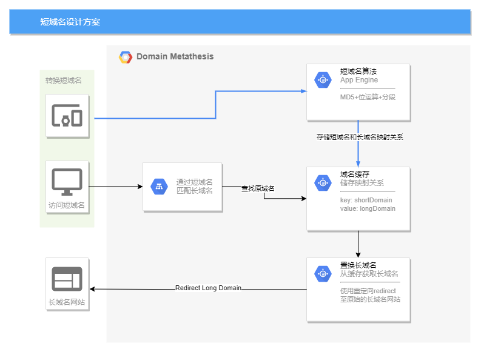
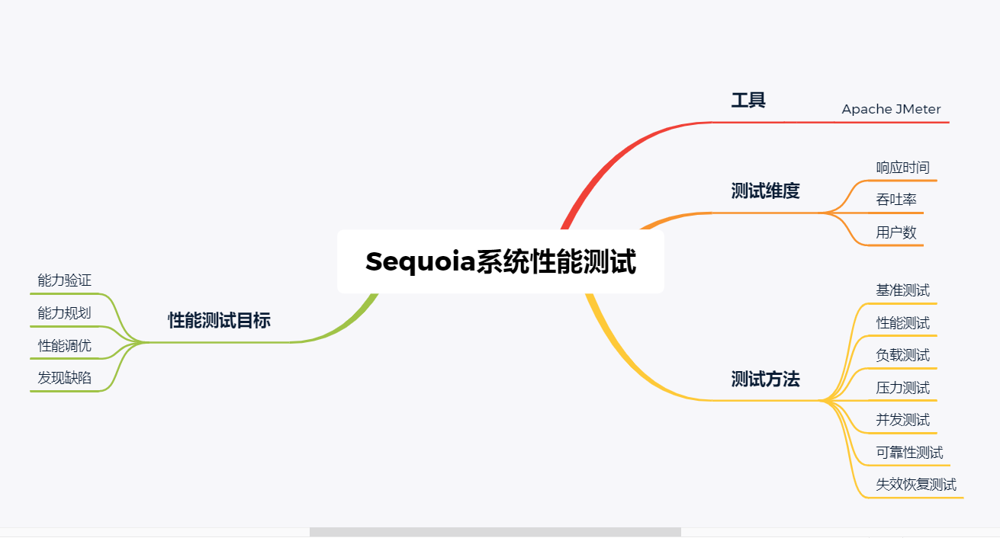
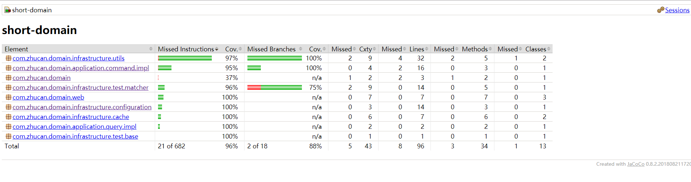

# 红杉测试 - 短域名置换方案设计


## 一、短域名产生的原因
1.微博限制一条字数为140字，那么如果我们需要发一些连接上去，但是这个连接非常的长，
以至于将近要占用我们内容的一半篇幅，这肯定是不能被允许的，所以短网址应运而生了。

2.短网址在项目里可以很好的对开放级URL进行管理。有一部分网址可以会涵盖暴力、
广告等信息，这样我们可以通过用户的举报，完全管理这些链接不出现在我们的应用中。
因为同样的URL通过加密算法之后，得到的地址是一样的。

3.在一些平台在发布消息时会限制字数，如果我们的发的URL过长就很容易就被限制住了

## 二、短连接生成算法
1. 首先将长域名使用md5算法生成32位的签名串,截取为4个小片段, 每段8个字节

2. 对这四段循环处理, 取8个字节, 将他看成16进制串与0x3fffffff(30位1)与操作, 即超过30位的忽略处理;

3. 然后将这30位分成6段, 每5位的数字作为字母表的索引取得特定字符, 依次进行获得6位字符串;

4. 长域名的md5签名串可以获得4个6位串, 选取里面的任意一个即可作为这个长URL的短URL地址;

5. 使用数据库(本服务使用内存Map), 来建立短URL串与原始长URL串的映射关系, 
用于后续访问短域名时置换原始长域名, 并转发至原始地址


## 三、短连接与长连接置换方案


## 四、服务API文档
### 3.1 转换短域名
#### 3.1.1 接口说明
> 输入长域名, 返回基于短域名算法生成的URL数据
#### 3.1.2 请求URL
> POST
#### 3.1.3 请求方式
> /domain/short
#### 3.1.4 请求参数-格式与说明
```json
{
  "domain": "https://github.com/Zhucan123/interview-assignments/tree/master/java"
}
```
|参数名 | 类型 | 是否必填 | 说明 | 示例|
| ---- | ---- | ---- | ---- | ---- |
|domain|string|是|长域名| https://github.com/Zhucan123/interview-assignments/tree/master/java

#### 3.1.6 返回响应-格式与说明
```json
{
  "fullShortDomain": "YBneuy",
  "shortDomain": "192.168.128.1:8080/d/YBneuy"
}
```
属性字段名 | 类型 |  说明 | 示例|
| ---- | ---- | ---- |---- |
|shortDomain|string|短域名|  YBneuy|
|fullShortDomain|string|完整可直接访问的短域名(支持直接访问, 重定向至原始长域名地址)| 192.168.128.1:8080/d/YBneuy|


### 3.2 置换原始长域名
#### 3.2.1 接口说明
> 输入短域名, 返回短域名映射对应的原始长域名
#### 3.2.2 请求URL
> GET
#### 3.2.3 请求方式
> /domain/long
#### 3.2.4 请求参数-格式与说明
|参数名 | 类型 | 是否必填 | 说明 | 示例|
| ---- | ---- | ---- | ---- | ---- |
|domain|string|是|短域名| YBneuy

#### 3.2.6 返回响应-格式与说明
```json
{
  "domain": "https://github.com/Zhucan123/interview-assignments/tree/master/java"
}
```
属性字段名 | 类型 |  说明 | 示例|
| ---- | ---- | ---- |---- |
|domain|string|原始长域名| https://github.com/Zhucan123/interview-assignments/tree/master/java|

### 3.3 重定向原始的长域名地址
#### 3.3.1 接口说明
> 输入短域名, 重定向至原始的长域名地址
#### 3.3.2 请求URL
> GET
#### 3.3.3 请求方式
> /d/{shortDomain}
#### 3.3.4 请求参数-格式与说明
|参数名 | 类型 | 是否必填 | 说明 | 示例|
| ---- | ---- | ---- | ---- | ---- |
|shortDomain|string|是|短域名| YBneuy

#### 3.3.6 返回响应-格式与说明
重定向原始长域名地址

## 五、性能测试方案及结果


## 六、Jacoco单测统计

