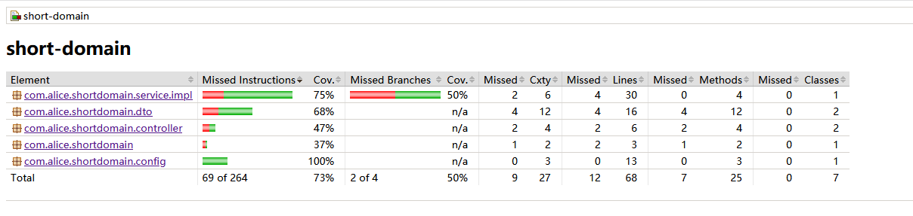

#### 设计思路

1. 生成短域名接口，通过生成一个小于8字符的字符串（随机） 将该字符串作为短域名，并将该字符串以及原来的域名映射到map中。
2. 通过传入的短域名，去掉前缀，从map 中查询出来，返回原来的长域名

#### 问题

1. 保证每个短域名的唯一，但是为对长域名的唯一性做验证，也就是map中可能会有不同的短域名对应相同的长域名，会造成内存的浪费。但是会节省cpu 的算力。
2. 通过LUR cache 存储一定程度上避免了OOM 的发生，但是也会造成数据量的瓶颈（实际应用可以考虑用三方存储，比如redis ,mysql 等）
3. 未考虑对字符串（主要是长域名）进行压缩操作，还是基于对CPU 算力的考虑。
4. **可能我对题目的理解有问题，没有达到需求要求。 （短域名-长域名 的概念不是很理解，只是按照自己的理解实现了简单的功能）**

#### Jacoco 报告

