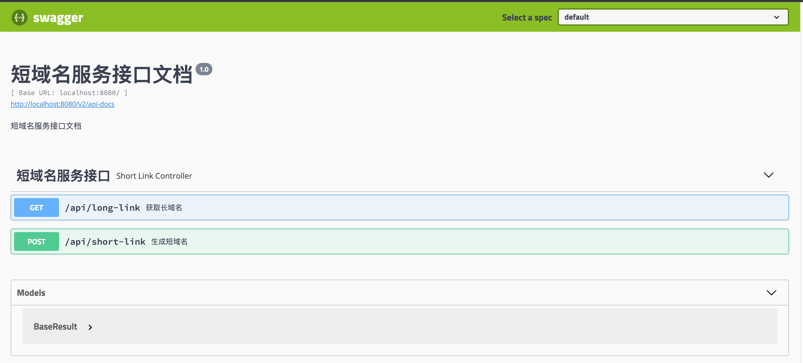
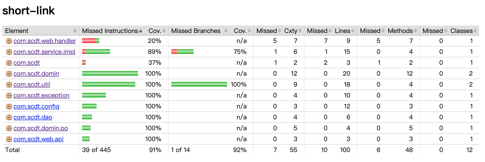

# 短域名服务

## 需求背景

在某些特定的场景下（比如短信、微博、分享链接等）对网址链接的长度需要有一定的限制，便于为推广文案提供更多的空间。此时，需要一个短域名服务将实际的链接转化为短链接。

## 需求描述

撰写两个 API 接口:
- 短域名存储接口：接受长域名信息，返回短域名信息
- 短域名读取接口：接受短域名信息，返回长域名信息。

限制：
- 短域名长度最大为 8 个字符
- 采用SpringBoot，集成Swagger API文档；
- JUnit编写单元测试, 使用Jacoco生成测试报告(测试报告提交截图)；
- 映射数据存储在JVM内存即可，防止内存溢出；

## 业务流程

1. 调用方传一个长域名过来，短域名服务将其转换为短域名返回；
2. 用户点击短域名，短域名服务接收到请求之后，获取对应的长域名，并将其重定向到该长域名；
3. 用户通过重定向后的长域名访问业务数据。

## 设计思路

### 算法选型
短域名一般是由 [a - z, A - Z, 0 - 9] 这62个字母或数字组成，本服务使用8位字符组成，8位字符有62^8个组合，可以满足正常的应用场景。基于冲突和性能考虑，主要考虑以下三种方案：自增ID、摘要算法、雪花算法。

1. 自增ID，包括数据库自增ID、Redis、AtomicLong；  
优点：简单；  
缺点：需要考虑并发控制，ID连续，可能存在安全问题;

2. 摘要算法，通过摘要算法对长域名进行加密计算；  
优点：无规律，相对安全；  
缺点：存在冲突，性能相对较低；

3. 雪花算法  
优点：简单，不连续，性能高；  
缺点：跟时间戳相关，可能存在冲突，转成62进制长度超过限制，需要优化算法；  

由于本服务采用单机部署，内存存储，结合以上分析，采用AtomicLong这种简单且高性能的方案。

### 存储选型
由于本服务采用内存存储方案，所以从HashMap、Ehcache、Caffeine三种主流的方案中选择。这三种方案中，Caffeine所特有的W-TinyLFU算法和满足高性能读写的RingBuffer存储结构，加上简单易用的API，无疑作为首选。

## 作业提交

### Swagger

### 单元测试覆盖度

