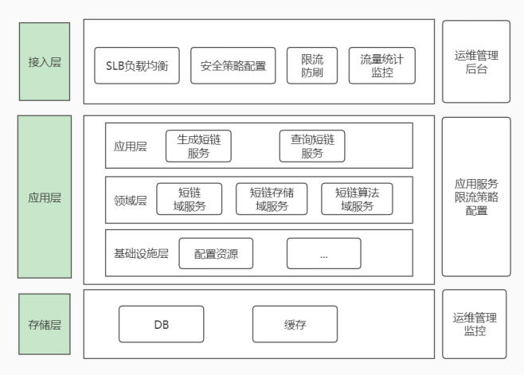
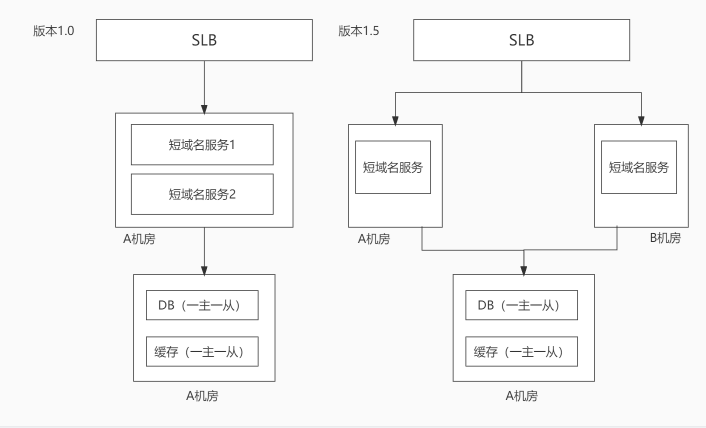
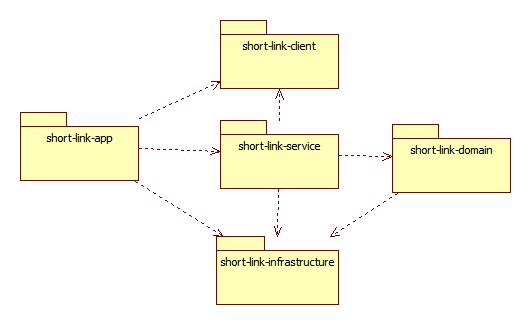
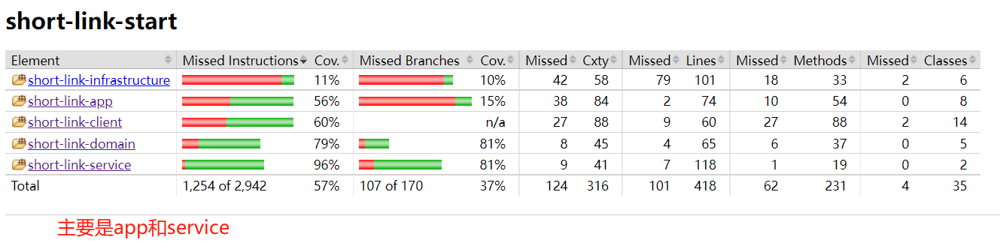
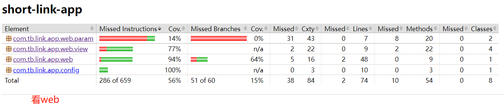
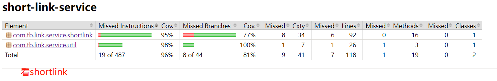
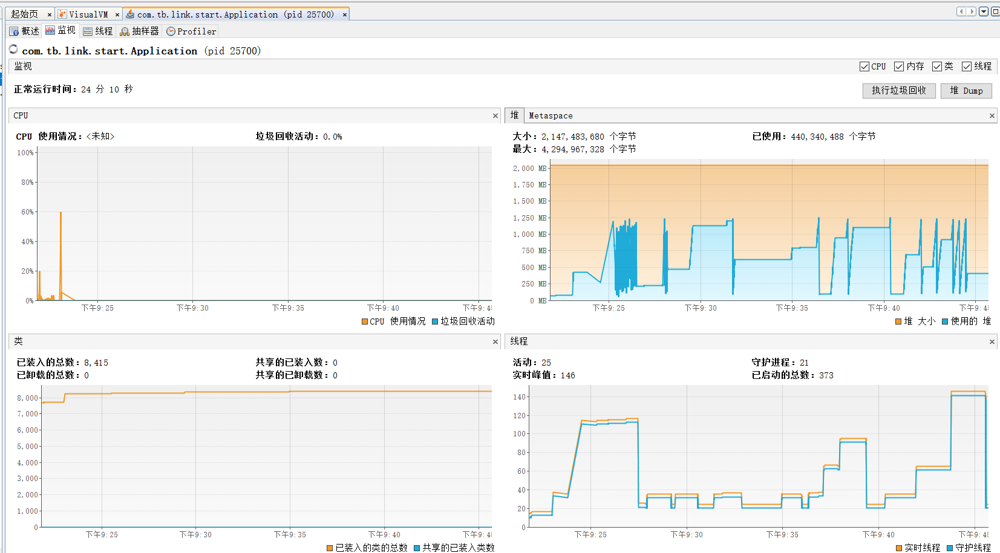

# 作业
实现短域名服务
<br/>

## 架构设计
### 整体架构
 
1. 接入层：流量接入层，通调http调用。
2. 应用层：应用内部根据ddd结构划分。
3. 存储层：DB 和 缓存存储。

### 部署架构
 


### 关键设计

1.短链接生成方法
由于短链一般是由0-9a-zA-Z 62个字符生成，有的短链还有其他符号，暂忽略。
 - 自增Id:在DB中自增一批ID，再通过10进制转为62进制。但随访问量增加，单表存储不够，可用分库分表，每个表中ID每次可取一段出来，如有冲突可重试几次，但是依赖了一个外部存储，有一定成本。
 - Hash:先把字符串Hash算法转为long型（找一种高效的hash算法，能有效减少冲突次数），再通用10进制转为62进制，有冲突时可增加重试次数，不依赖第三方，实现可行。（网上还有其他版本可参考）
 - 随机: 随机从62位中产生，数据量较多时，冲突较大，可重试几次，在架构很简单，调用量不大时，也可考虑，简单，不依赖第三方。
 - 统上分析：选择Hash生成，找到两个高效的hash算法：murmurHash和bkdrHash，murmurHash在guava包中就有工具类，故选用此方法实现hash。
 
2.长短链的存储
 - 存储: 存储在mysql，redis，adb 任一高效的存储中即可，要注意数据量大小，如果是mysql中要分库分表，一般分为2的N次方，便于计算路由。增加时效，过期后可删除即可，减少存储空间。
   
3.高并发访问
 - 如果考虑高并发访问的话，可以把一部分热数据加载到缓存中，如redis中，应用本地可增加一层缓存（但存在极少不一致性），增加缓存有一定成本，访问量增加后再依次增加，本次暂不实现缓存。
 - 大促要评估流量和容量，针对appKey配置限流，保证系统的可用性。
 
4.安全性：
- 短链服务作为基础服务，针对不同调用方访问设置appKey， 普通访问者设置一个通用appKey， 可用于埋点统计和监控等。
- 长链域名白名单：针对不同的appKey，配置长链域名白名单，长链接长度最大为2048或4096。
- 敏感词：如果链接中的长度有涉及敏感词，不能转短链，实现略。
- 短链域名白名单：针对不同appKey中配置可生成的短链域名。
- 链接安全性校验：用户传入的链接是不可信，要对其校验，如：中文编码，非法字符校验等，公司内部要有一个安全库调用，本次暂略。

5.限流：防止流量攻击，在接入层配置入口限流，防刷等，可针对不同apKey配置，如1s访问3~5次，1天最大调用多少次等，在应用层再使用sentinel配置接口级别限流，起到双层保护。

6.监控告警：
- 基础监控：cpu,内存,load,网络进出流量,jvm相关参数等等。
- 业务监控：根据埋点日志配置不同appKey的访问监控，是否存在敏感词，不合法访问，限流指标 。
- 针对监控指标配置告警策略：如N分钟内存持续占用80%，N分钟FullGC达到3次以上，N分钟某个appKey限流M次等 。

### 代码结构说明
1.包结构依赖图： <br>
 <br>
说明：client包作为内部调用接口包，如提供dubbo服务后，client给其他应用调用

2. 类图：因代码量相对较少，略
3. 时序图：因代码量相对较少，略
4. 模块说明：
    - short-link-start:包括启动类:Application和单元测试类。
    - short-link-client:提供一个主要接口:ShortLinkService。
    - short-link-app:http访问入口类：ShortLinkController。
    - short-link-domain:领域层，包括领域模型和域服务类，如：ShortLinkDomainService。
    - short-link-service:调用不同域服务实现业务逻辑，判断等，如：ShortLinkServiceImpl。

5.异常和错误码：本次定义了一个统一异常类，错误码在ErrorCodeEnum中，错误码是xx.xx.xx表示，正式项目中应定义一个规范格式表达。

6.域名白名单：见application-*.propertis中定义，origin.link.domain.whiteList 和 appKey.whiteList配置，信任的域名才能调用。
在http://localhost:7001/swagger-ui.html#/ 地址上先测试生成短域名后，再把短链接，再调用生成查询长链接。
- 生成短链参数形如(域名要在白名单内)：<br>
 ```
 {
   "appKey": "common",
   "expireTime": 86400,
   "originLink": "https://www.github.com/test?key=2&key3=5"
 }
 ```
- 查询长链接参数形如(域名要在白名单内)：<br>
 ```
 {
   "appKey": "common",
   "shortLink": "https://scdt.cn/hneO0sIN"
 }
 ```

7.代码覆盖率：
 <br>
 <br>
 <br>
说明：覆盖测试jacoco依赖已注掉，影响代码和编译，真实环境是不跟代码藕合一起。

8.部署脚本：部署到linux的docket上，还需要构建Docker脚本，脚本可放在应用中略，linux启动脚本略。

9.编译打包：
mvn  clean compile  -e -P dev  <br>
mvn  package -e  -Dmaven.test.skip=true -P dev


### 性能要求
1.前置说明：
    - 流量评估：真实环境下要先进行流量评估，机器扩展，限流等配置完成，直接在线上系进行压测,更新准模拟用户调用的方式。
    - 本次以单机为例进行简单压测。

2.压测方案：
 - 本次主要对这两个接口的正确场景进行压测，有条件可选择压测异常场景。
 - 1.构造一批长链参数，通用线程并发请求，调用短链生成接口，TPS满足每秒N次请求，N可是100，1000等，观测系统基础和业务监控，看是否有报错，报错是否在预期内。
 - 2.构造一批短链参数，通用线程并发请求，调用短链转长链接口，QPS满足每秒N次请求，N可是100，1000等，观测系统基础和业务监控，看是否有报错，报错是否在预期内。
 - 3.异常场景：选择部分异常场景，如参数为空，随机短链，随机appKey，域名不在白名单等，方式类似如上。
 - 以上场景构造出来后，可以同时把多个场景一起打开压测，观测系统指标。
    
3.压测工具：ab / jmeter 本次选用ab压测<br>
1.ab比较小巧，简单易用： －n表示请求数，－c表示并发数，-p 读取数据文件（只能读取一行数据，所以json 用数据表示压测) <br>
 生成短链压测命令：ab -n 1000 -c 20 -T "application/json" -H  "Content-Type: application/json"  -p  "d:/createshortlink.txt"  "http://localhost:7001/shortlink/createPersist"  <br>
 短链转长链压测命令：ab -n 1000 -c 20 -T "application/json" -H  "Content-Type: application/json"  -p  "d:/getshortlink.txt"  "http://localhost:7001/shortlink/recoverPersist"   <br>
 短链转长链的压测文件中放入少量异常场景一起压测，并发和请求数可以依赖增加  <br>
 jvm参数：
 ```
 -Xms2048m -Xmx2048m -server -XX:+UseG1GC
 ```


4.压测结果：
- 写压测指标见：doc/createShortLink压测.txt ，每次增加 -n -c的比例值
- 读压测指标见：doc/getShortLink压测.txt ，每次增加 -n -c的比例值
- 读写同时压测指标见：doc/读写同时压测.txt
- 结论：
    - 单压TPS/QPS 可在 350/s 左右 
    - 同时压测 TPS/QPS 在 100~200之间
    - 分析：由于ab -p 在文件传参数时不支持多行格，故在controller中写了两个压测接口，可传list数据，也就是传一个json数组，会影响参数的大小，如果数组参数可大，QPS就会小，压测参数在10个以内。
- 压测系统指标图 <br>
 <br>
-  压测类：com.tb.link.app.web.ShortLinkController.persistCreateShortLink，com.tb.link.app.web.ShortLinkController.persistRecoverShortLinks  已注掉，压测时可打开。
- 压测数据见：doc/testfile/*.txt


