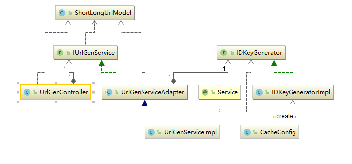

# **短域名服务系统设计**

### 实现目标
 1. 短域名存储接口：接受长域名信息，返回短域名信息
 2. 短域名读取接口：接受短域名信息，返回长域名信息

### 技术方案
>使用技术栈：SpringBoot + SpringCache + Knife4J + Base62 + MD5

* **SpringBoot** 微服务容器
* **SpringCache** 整合GuavaCacheManager + RedisCacheManager 方便后续扩展其他缓存方案
* **Knife4J** 增强版Swagger 快速接入，UI精美，在线调试方便
* **Base62** 针对long型10进制整数编码为字符串
* **MD5** 原始长域名链接的Hash摘要方法

### 概要设计

> * **基础设计**
>   1. 采用模板模式，针对IUrlGenService做了一层抽象骨架实现BaseUrlGenService
>   2. BaseUrlGenService定义了getShortUrl(),getLongUrl()方法，并注入了受Spring管理的cacheManager
>   3. 具体开发者实现类继承BaseUrlGenService后可以实现genLongKey()方法可以个性化设计【长链接】的hash算法
>   4. CacheConfig类使用SpringCache框架的CompositeCacheManager，开发者可以自行注入具体CacheBean实现，如：EhCache，GuavaCache，Redis，Hazelcast ;可在启东时检测如果无redis-server则不注入redisCacheManager
>   5. 配置最大缓存个数，缓存过期时间。
> * **短域名存储接口**
>   1. 对【长链接】--->取加盐值MD5摘要作为hashKey
>   2. 根据1中hashKey查询缓存，命中则直接返回，无需重复存储
>   3. 缓存未命中，则根据IDKeyGenerator注入的Bean调用其getNextId()方法获取long型整数
>   4. 将3中获取的longID & 0x7fffffffffffL操作保证小于62^8^(按要求短域名最长8位)
>   5. 初始化Base62Utils的储存字符串CHARACTERS使其为随机混乱顺序，增强安全性
>   6. 通过Base62Utils将longID & 0x7fffffffffffL映射为小于8位的字符串
>   7. 缓存存储hashKey--->model; shortUrl---->model
>
> * **短域名读取接口**
>   1. 拦截非指定短域名开头的请求(如指定：http://t.cn/)直接拒绝访问
>   2. 根据shortUrl查缓存，未命中则反馈提示获取长链接失败
>   3. 若命中缓存，则判断是否过期，过期则清除该缓存；第三方缓存可以自行清除则在2中已未命中
>   4. 正常命中缓存且有效期内，则反馈查询结果

### 系统流程图

### 核心逻辑UML类图

### Jacoco测试覆盖率

### 接口压测

