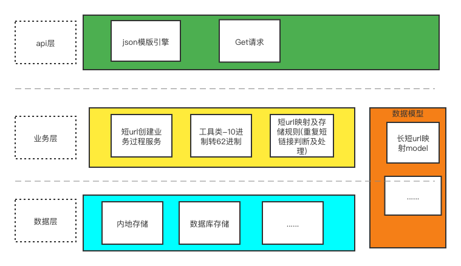
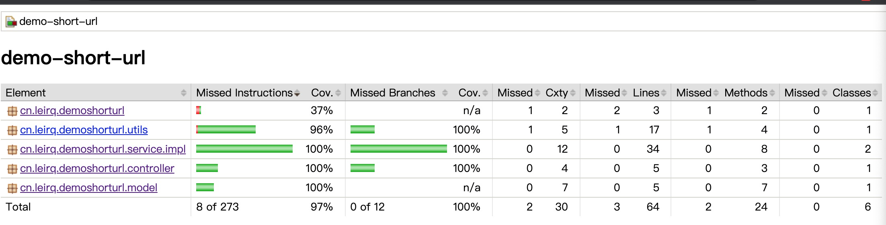
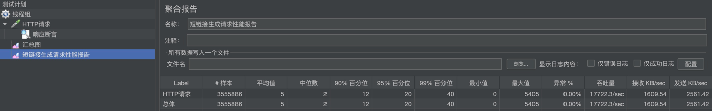
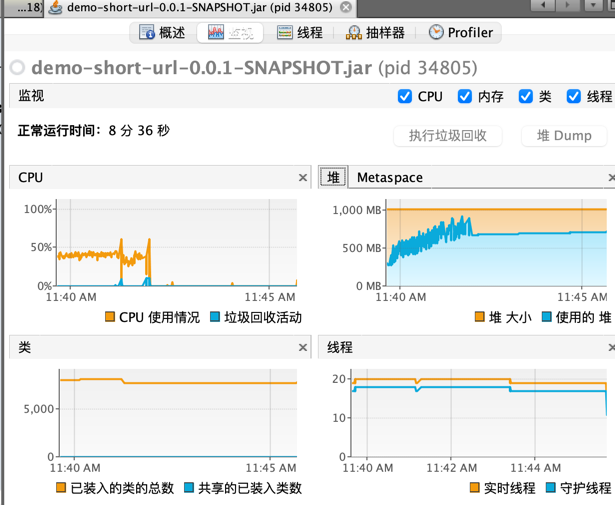

### 短url 设计说明 ###

#### 整体结构 #####

#### 设计要点 ####
1. 采用 MurmurHash 32bit 算法把长url生成hash值
2. hash值再转62进制成短链接url
3. 生成好的长短链接映射用本地内存保存。
4. 同一个长链接多次处理不会生成新的短链接。（用已存在的短链接）
5. MurmurHash算法小概率会重复，此时通过长链接后拼接随机字符串重新生成短链接。

#### 单元测试报告 ####

#### 压力报告 ####
##### 测试目标 ####
1. 测试系统最大吞吐量。
2. 测试环境为本机单个实例， jvm启动内存设置为1G （ -Xmx1024m -Xms1024m ）
3. 程序本身开销集中在通过长链接生成短链接的hash算法上。故只简单压侧短链接的生成接口。
4. 测试工具jemeter， 100线程并发，随机生成长链接调用生成短链接接口。持续200秒，有错误则终止。
5. 收集jemeter聚合报告。
6. 监控过程中JVM及CPU情况。

##### 简要测试结论 #####
1. 峰值QTS 22000/sec 左右， 持续200秒后， 平均QPS 17800/sec 左右。
2. VisualVM监控结果，CPU 维持在44% 上下，线程维持在20个，堆使用大小持续增长，达到上限，触发GC，导致性能下滑。

3. 瓶颈预测，hash算法本身开销不大， 实际项目中， 瓶颈大概率会出现在长短url的映射存储的读写上。本次demo使用的是本地内存，存储上的设计没有体现。