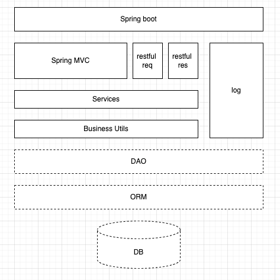
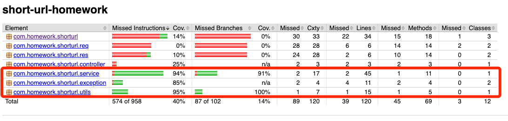

# Getting Started

### 设计思路&所做的假设
设计base62字母表进行短链接的生成，通过生成id对长链接进行映射，保存在JVM内存中的hashmap中。其中id为顺序生成，这样做的好处是不会发生重复id或者
重复存储相同的内容，不好的点在于可能会被他人猜到顺序的生成的算法，为此对短链接的字母表进行了无需排列，避免猜到字母表。

业务模型：

短链接和长链接的转换，这个业务应该不会陌生，但是题目的限制很多，带着问题思考：
* 短链接的算法（这个google很多
* 8字符，8字符意味着短链接的存储数量有上限，那么这个上限是多少，怎么推算？
* "映射数据存储在JVM内存即可，防止内存溢出"，JVM能存多少，如何去计算JVM阈值？如何防止out of memory？是否能做出预警，不要让程序崩溃？
* 以上几点在代码和注释已经体现了就不赘述了，还有众多的边界条件的思考
* 除了基本的单元测试，如何测试性能？在我对自动化测试浅薄理解里面可以使用工具进行压力测试，例如postman [Collection Runner](https://learning.postman.com/docs/running-collections/intro-to-collection-runs/)
  ，前公司有位测试老师写过一套压力测试框架，有空我可以去翻翻~~

技术模型：
* springboot + swagger2 + junit5 + jacoco
* 分层设计：除了MVC常见的分层外，还细分了res req，分别对应请求和响应object，如果以后引入数据层，可以加入dao repository等分层
* 返回封装：封装了带有code的RestResponse
* 可以优化：utils中对于是否是URL的判断方法可以优化；对于Controller的返回状态码，可以加入Exception Adviser全局捕获返回特定的状态码。

### 架构图

### 测试覆盖率报告

