# 基于开闭原则的短域名服务设计文档

##项目背景
短网址也称短链接、短链。由于短信、微博等平台，对于内容有长度限制，过长的 url 不适合直接在微信、短信等平台直接发送原始地址，需要缩短长度。转换后的短网址用于消息发送，也可以避免过多的无用信息影响用户体验。

###项目要求
撰写两个 API 接口

- 短域名存储接口：接受长域名信息，返回短域名信息
- 短域名读取接口：接受短域名信息，返回长域名信息。

限制：

- 短域名长度最大为 8 个字符（不含域名）
- 采用SpringBoot，集成Swagger API文档
- JUnit编写单元测试, 使用Jacoco生成测试报告(测试报告提交截图)；
- 映射数据存储在JVM内存即可，防止内存溢出；
## 项目设计方案
###系统设计之映射算法策略-策略设计模式

项目要求并没有相关具体业务场景介绍，但是不同业务需求对应的设计目标不同。例如有些内部使用场景下，对于服务的用户体验要求不高，但是对于数据保密和效率要求更高，有些场景可能对于用户体验要求更高。对于短域名服务的而言，不同的业务的区别主要体现在映射算法上，因此系统设计时，在映射算法的使用和迭代上符合开闭原则，能够低代价切换映射算法，以满足不同的场景，在后期也能够更好的迭代优化和维护项目。本项目在映射算法选择上使用策略模式，一方面使用策略模式易于扩展，增加一个新的映射算法策略对策略模式来说非常容易，基本上可以在不改变原有代码的基础上进行扩展。另一方面映射数据的封装和保密性更好。  

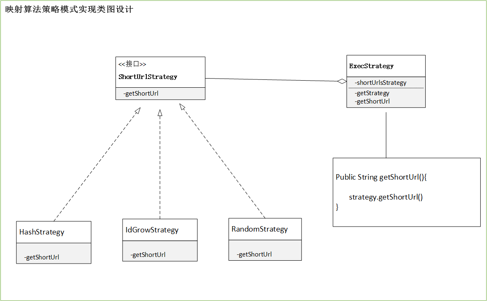  

如图所示，ShortUrlStrategy为策略模式接口的定义，其中定义了获取短链的方法，HashStrategy、IdGrowStrategy、RandomStrategy分别为策略模式的实现，实现获取短链的方法，分别为哈希策略、id递增策略、随机数策略。ExecStrategy是算法策略的执行者，定义了使用那种策略。当我们新增策略只需要实现ShortUrlStrategy接口即可，策略的切换只需要通过ExecStrategy执行策略类选择策略。

###系统设计之映射数据处理算法设计-装饰者设计模式
虽然策略模式能够低代价的实现项目映射算法切换，但是一个算法的映射数据处理要求也是不同的。映射算法计算出一定范围的短域，有些场景由于长度要求的场景需要进一步缩短，例如采用62位进制转换，有些场景由于隐私或者机密，需要对短域进行加密等处理等等。本项目在映射数据的处理上采用装饰者模式，通过具体的装饰类实现对应映射数据功能的动态增加和删减，进一步满足系统的开闭原则。  

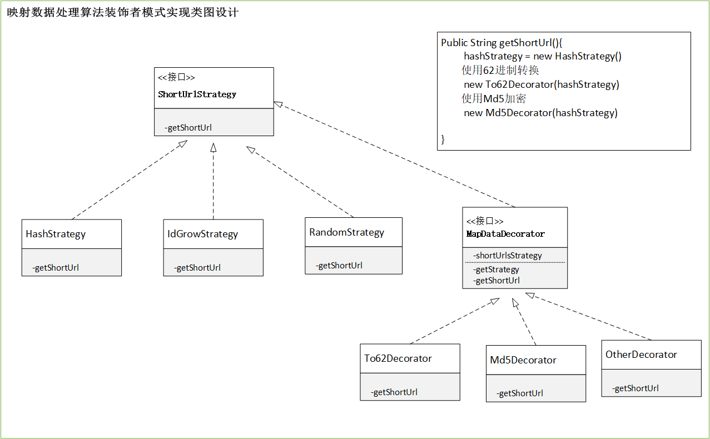  

 如图所示，具体策略HashStrategy、IdGrowStrategy、RandomStrategy被装饰者，MapDataDecorator为装饰者的超类，装饰者和被装饰者有着共同的超类型，To62Decorator、Md5Decorator、OtherDecorator分别为具体装饰者，通过具体装饰者，可以对映射算法策略的映射数据依次包装，这个包装行为是动态的，不限次数的。实现了映射数据的动态处理以满足不同场景需求.

###数据存储和缓存方案 HashMap + Boom filter  + LRU
由于项目要求映射数据存储在JVM内存即可，防止内存溢出。本项目采用哈希表存储数据短域名和查询短域名，由于哈希表的查询和插入数据的时间复杂度都为0(1),满足算法效率要求。短域名读取长域名时，遍历哈希表时间复杂度较高，本项目采用两张哈希表存储，即一张表通过长域名查询存储短域名，另一张表实现短域名读取长域名时。考虑到哈希表冲突问题，查询的时候效率随着数据的增加冲突概率越大，性能也随之变差。因此，本项目采用布隆过滤器进行查询过滤。为了防止内存溢出，本项目将哈希表长度定义为1200，并采用LRU原则对存储数据进行删除。
####方案实现
-	哈希表  
通过单例模式持有两个哈希表，保证数据存储一致性  
  private final Map<String, String> shortUrlFactory = new LRULinkedHashMap<String, String>(size);  
  private final Map<String, String> longUrlFactory = new LRULinkedHashMap<String, String>(size);

-  布隆过滤器：哈希函数不可避免会产生哈希冲突，随着短链接越来越多，冲突概率也会越大。每次生成短链接后，向布隆过滤器中查找是否已经存在此短链接，如果已经存在，则在长链接后添加一个自定义字符串，重新 hash，重复上一步，直到没有哈希冲突，把短链接加入布隆过滤器。这里使用 hutool 工具包中基于 JVM 的布隆过滤器来实现。  
 private static final BitMapBloomFilter filter = BloomFilterUtil.createBitMap(10);

- LRU：通过实现LinkedHashMap接口，实现代码如下  
class LRULinkedHashMap<K,V> extends LinkedHashMap<K,V> {  

    private int capacity;  

    public LRULinkedHashMap(int capacity) {  
        super(capacity,0.75f,true);  
        this.capacity = capacity;  
    }
   
    @Override  
    public boolean removeEldestEntry(Map.Entry<K,V> eldest) {  
        return size()>capacity;  
    }  

###映射算法实现
本项目使用策略模式实现三种主流短链算法，项目默认使用哈希算法策略

####1.哈希算法的实现

- 哈希函数选择  
哈希算法的核心的哈希函数，目前主流的哈希函数有MD5、SHA、MurmurHash，由于短域名服务需要更好的运算速度和更少冲突概率，相比之下MD5，SHA虽然在反解密方面更好，但是加密影响了性能，MurmurHash 是一种非加密型哈希函数，适用于一般的哈希检索操作。对于规律性较强的 key，MurmurHash 的随机分布特征表现更良好。因此选择使用MurmurHash哈希函数。

- 具体实现  
MurmurHash 有 32 bit、64 bit、128 bit 的实现，32 bit 已经足够表示近 43 亿个短链接。MurmurHash 有 32 bit、64 bit、128 bit 的实现，32 bit 已经足够表示近 43 亿个短链接。因此采用32bit。
由于MurmurHash哈希函数值长度为10，大于项目的要求，另一方面MurmurHash函数值为十进制，为了进一步缩短，本项目对哈希值进行62位进制转换，最终结果为6位，满足项目要求。

- 冲突解决  
当哈希函数冲突时，将长链加上自定义字符后重新执行算法，直到解决冲突。  
本项目使用”*“作为冲突字符  

    private static final String duplicate = "*";  
    
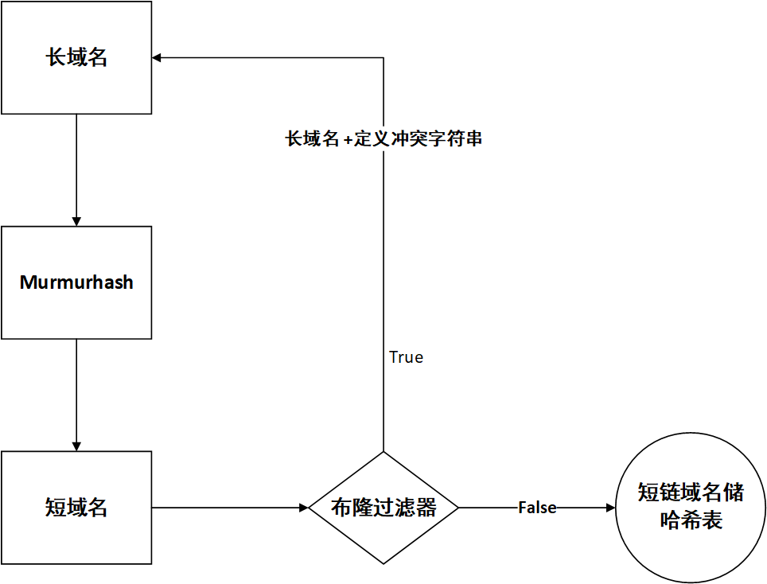

####2.自增序列算法
维护一个 ID 自增生成器。它可以生成 1、2、3…这样自增的整数 ID。当短网址服务接收到一个原始网址转化成短网址的请求之后，它先从 ID 生成器中取一个号码，然后将其转化成 62 进制表示法，拼接到短网址服务的域名。

- id递增器选择  
通常采用数据库的自增id作为序号，由于本项目采用哈希表作为存储，因此选择哈希表数据长度作为序号

- 具体实现   id + baseId  + base62
本项目使用哈希表长度作为递增id，考虑域名位数较少以及分布均匀的问题，在哈希表递增id的基础上baseid+递增id的方式以及62进制转换，baseid定义为十进制1000000000，最后对最终id进行62位进制转换，域名长度为6，满足项目需求。

- 冲突解决  
一个10进制id对应62位进制的数值，因此不会出现冲突问题，当然刚并发环境需要考虑线程安全问题，利用低进制转高进制字符减少特性，可以有效解决域名长度问题。

####3.随机数算法
通过随机数产生的短链作为一个长链的映射数据
- 随机数选择  
由于该算法冲突的概率相对较大，尽可能使用范围较大的随机数，这样就可以降低随机数的冲突概率  
本项目使用
RandomStringUtils.randomAscii(6)
- 冲突解决  
当随机数由于重复冲突时，只需要再次执行随机函数即可，直到没有重复。

###测试方案
 Jacoco单元测试用例执行结果如下：其中分支覆盖率93%，行覆盖率为140/144=97%。

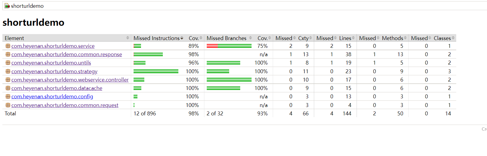

本地执行所有测试用例全部成功

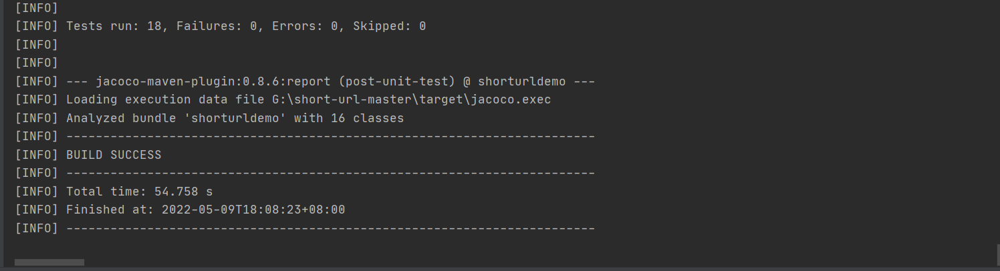

- swagger运行测试

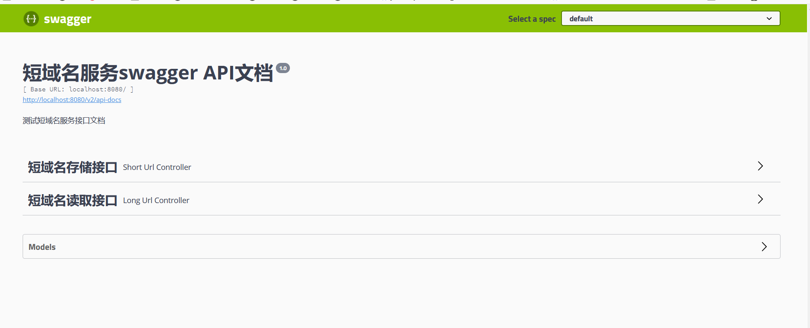

- 短域名存储测试用例

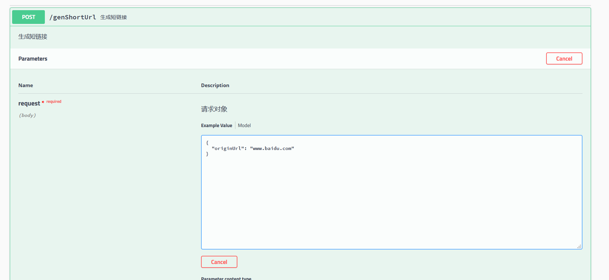  
  
    
    
- 正确返回结果

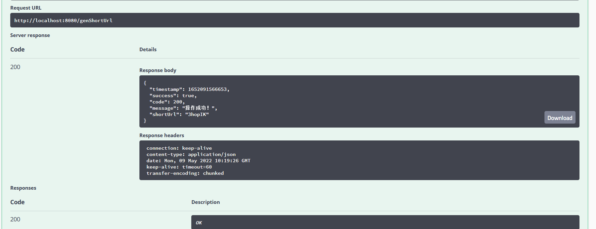
- 错误返回结果  

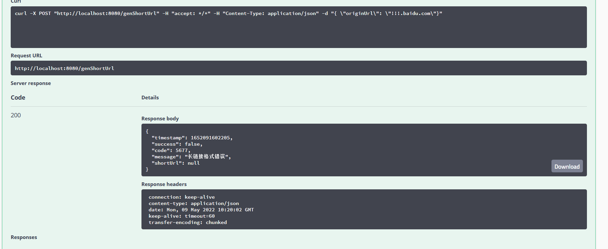  

- 长域名查询测试用例

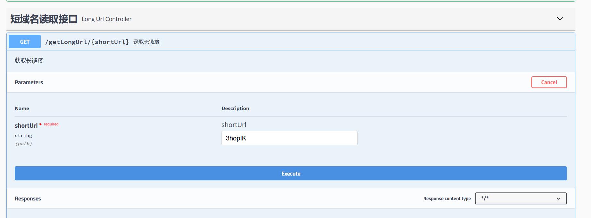  

- 正确返回结果  

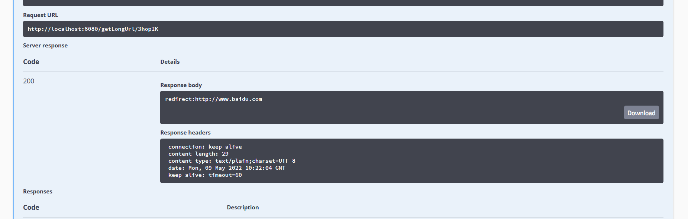
- 错误返回结果  

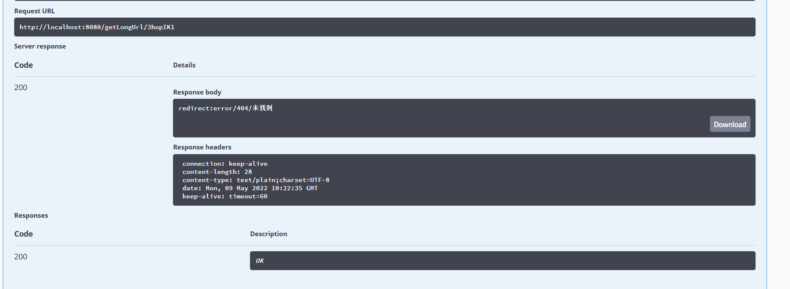

##本地性能测试
### 方案
- 本项目数据存储在内存里，整体就是一个读写操作，主要针对读接口做一个压测分析
- 采用Jmeter工具进行压测，看下在高并发情况下，系统的成功率以及TPS的数据。
### 短域名存储接口

请求参数
{
  "originUrl": "www.${__RandomString(8,1234567890asdfghklxvvnmett,)}.com"
}

- 采用增压的方式，起始线程数5，每两分钟增压5线程，直到20分钟  

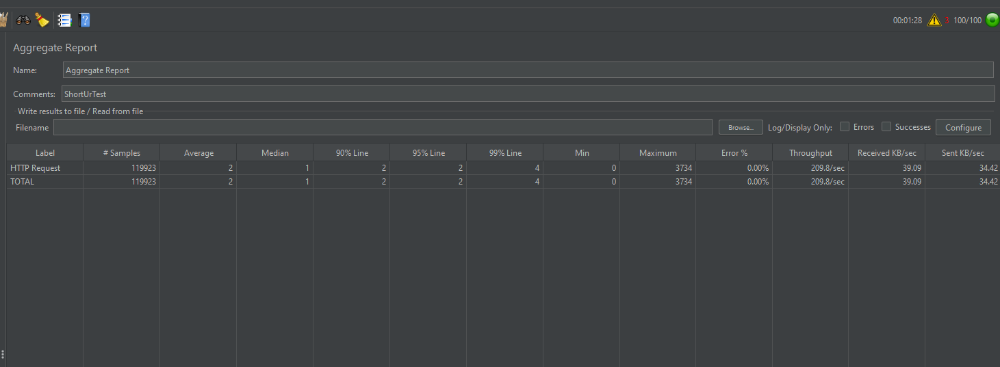

### 长域名域名查询接口

- 增压方式和短域名一致  

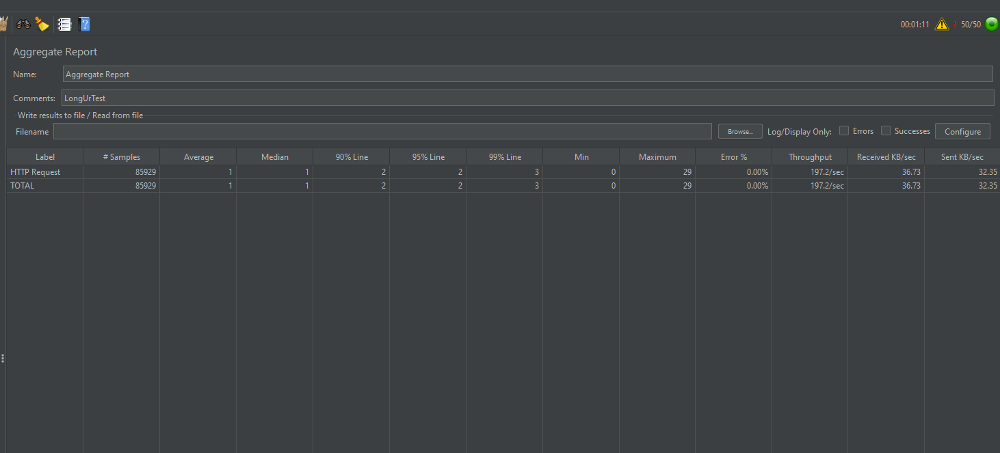     

  
- 成功率100%， tps平均在200/s左右

### 扩展思考
- 

