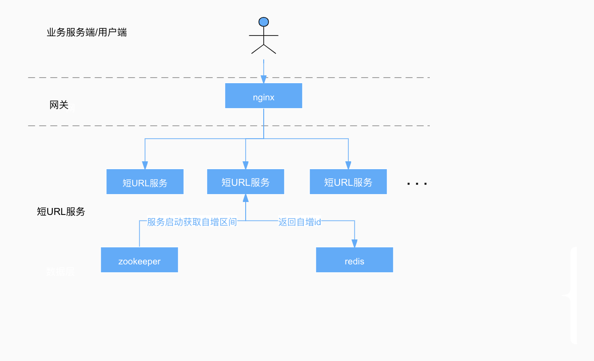

# 短URL

## 架构设计思路
### 需求解读
  核心需求是为原始URL生成一个短URL，短URL后缀最长为8位，并保存映射关系，当请求短URL时，可以根据短UR重定向到原始链接
### 设计思路
短URL映射算法一般有两种，一种是计算原始ULR的hash，一种是采用自增id的方式。现在我们要求的最长后缀是8位，我们以数字和大小写字母来组成后缀，
  那么最多能容纳62^8=218340105584896(218万亿)，这个数量完全能满足容量要求。 
  * 对于计算原始URL hash值的方式，当存在hash冲突时，我们需要对原始URL做降级处理，比如重新计算hash等
  * 自增id的方式是位每次映射申请产生一个自增数字，再把数字映射成字符串，可能会存在一个原始URL对于多个短URL的场景，不过我们目前的容量是可以满足这种场景的

自增id的方式处理起来相对比较简单，本次也是选取的第二种方案
### 方案实现
- 常用的id自增方案有redis的increase、MySQL的auto_increase以及Zookeeper的顺序节点的方式，这里我们选择redis的自增方案
- 将218万亿分成16个区间（按服务要求切分），每个区间约13.6万亿容量，对应16个redis的自增key
- 服务启动时，会去zookeeper创建路径为"/short-url/node-(0-15)"的临时节点，创建某个节点成功，则获取这个节点对应的自增区间
- 每次请求获取到自增id后，再映射成62进制的数字和大小写字母的字符串（字母和字符串经过随机扰乱），拼接短URL前缀返回
  

### 其他设计
为了保证原始URL的合法性，需要用户事先注册，标注自己注册的域名，并获取clientId和secret，申请短URL时，需要携带secret和原始链接计算的签名，服务端比对后确认是否是合法的URL