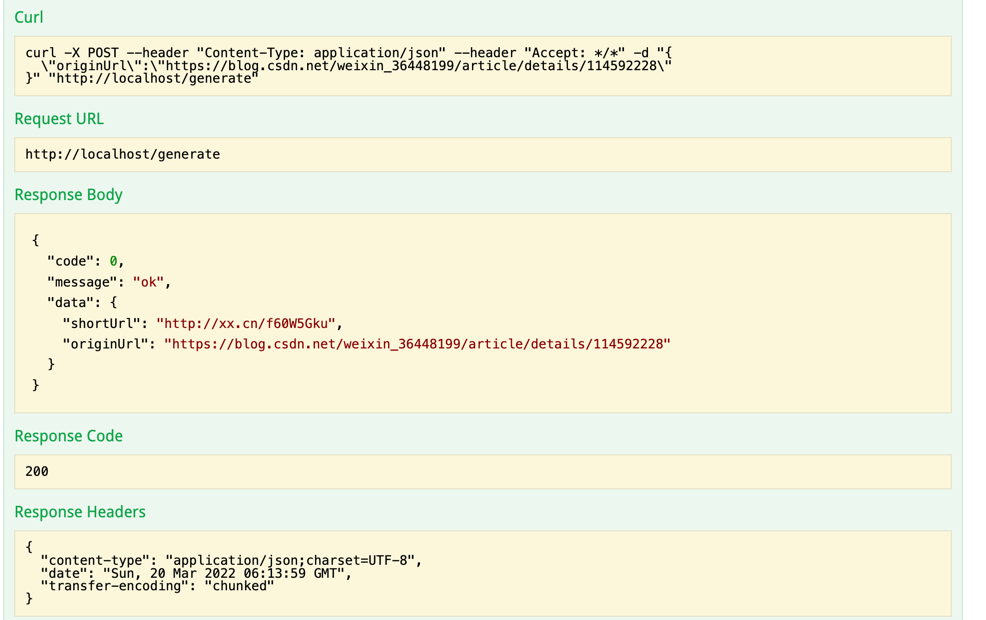

**1 设计文档**：[设计文档](docs/设计文档.md)

**2 集成 Swagger API 文档效果**

短链接生成接口：

测试短域名读取接口：

1.修改/etc/hosts文件

2.在浏览器访问:http://xx.cn/a/f60W5Gk9

3.浏览页面重定向到原始页面

**3 JaCoCo 测试覆盖率**

**4 性能测试方案和测试结果**

机器配置：
>CPU 2.2 GHz 四核Intel Core i7
>内存 16 GB 1600 MHz DDR3

JVM参数设置：
>-Xmx4G -Xms4G
>-XX:NewRatio=4
>-XX:+UseConcMarkSweepGC
>-XX:CMSFullGCsBeforeCompaction=0
>-XX:+UseCMSCompactAtFullCollection
>-XX:CMSInitiatingOccupancyFraction=80

Jmeter线程组设置：100个线程，循环100万次，每次请求不同的URL

结果与分析：

以上是生成短链接的请求测试，100个线程生成了324万条记录，平均耗时11ms，95%耗时32ms，正常情况。但是CPU使用率达到60%多，再增加线程CPU会比较吃紧，还是在没有读请求的情况下，以读写10:1的比例计算，实际生成短链接TPS在100以下，另外324W链接已经达到将近50%内存，预估3.2G内存只能存600W条数据。