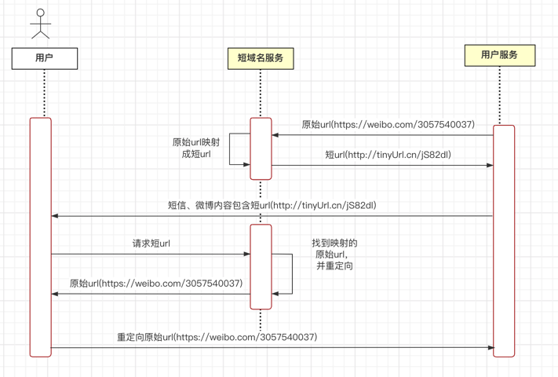
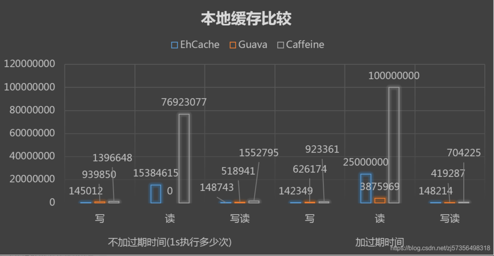
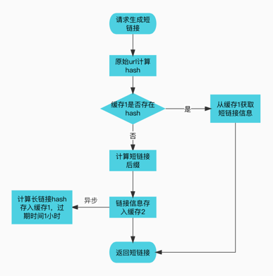
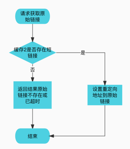
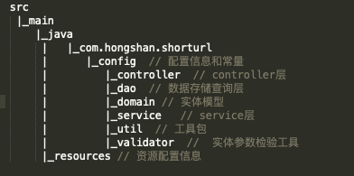
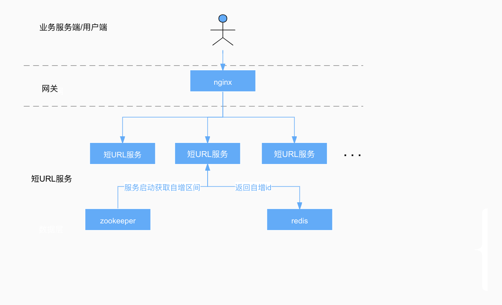

# 1 需求

## 1.1 需求描述

实现短域名服务（细节可以百度/谷歌）

撰写两个 API 接口:

- 短域名存储接口：接受长域名信息，返回短域名信息
- 短域名读取接口：接受短域名信息，返回长域名信息

## 1.2 实现要求

要求：

- 短域名长度最大为 8 个字符
- 映射数据存储在JVM内存即可，防止内存溢出

限制:

- 采用SpringBoot，集成Swagger API文档；
- JUnit编写单元测试, 使用Jacoco生成测试报告(测试报告提交截图)；

## 1.3 需求调研

### 1.3.1 是什么

短域名服务，即短地址服务（也叫 短网址：Short
URL）就是为了让一个很长的网站链接缩短为一个短的链接，然后通过访问短链接重定向到原始的长链接，因为微博内容有字数限制，所以短地址就是为了这个而产生的。大部分微博、手机短信、邮件提醒等地方已经有很多应用模式了，并占据了一定的市场（
[百度百科](https://baike.baidu.com/item/%E7%9F%AD%E5%9C%B0%E5%9D%80/2760921?fr=aladdin)
）。


### 1.3.2 现有实现

1. [微博短网址服务](https://sina.lt/index.html)
2. [TinyURL](https://tinyurl.com/app/)
3. [百度短网址服务](https://dwz.cn/console/operation)

### 1.3.3 算法原理

- hash算法：

> 将长链接+ key(随机字符串，防止算法泄漏)计算MD5后得到32位的一个字符串，再根据这个字符串通过一些算法计算得到6～8位字母数字组成的字符串，形成短链接的后缀
>
>优点：能确保相同的长链接地址只生成一个短链接，不会重复存储；
>
>缺点：存在hash冲突的风险，对于需要存储大量长链接的服务风险不好把控
>
>微博短链接服务的hash算法实现
>```java
>char[] chars = {'a', 'b',/*...*/'z', '0', '1',/*...*/'9', 'A', 'B', 'C',/*...*/'Z'};
>String[] hash(String originUrl) throws NoSuchAlgorithmException {
>    MessageDigest md5 = MessageDigest.getInstance("MD5");
>    byte[] results = md5.digest(originUrl.getBytes());
>    String hashHexStr = Hex.encodeHexString(results);
>    String[] hashKeys = new String[4];
>    for (int i = 0; i < 4; i++) {
>        String temp = hashHexStr.substring(i * 8, i * 8 + 8);
>        long value = 0x3FFFFFFF & Long.parseLong(temp, 16);
>        StringBuilder buffer = new StringBuilder();
>        for (int j = 0; j < 6; j++) {
>            long index = 0x0000003D & value;
>            buffer.append(chars[(int) index]);
>            value = value >> 5;
>         }
>         hashKeys[i] = buffer.toString();
>     }
>     return hashKeys;
>}
>```

- 自增算法

> 每次映射都从全局自增器获取一个10进制的long型数字，再将10进制数字转成62进制的字母和数字组成的短字符串，为了防止被看出增长规律，可以对62个字母数字做乱序排列，然后初始化数字从一个比较大的数字开始
>
> 优点：没有hash冲突的风险，一个短链接只对应一个长链接，本次需求是8位字母和数字，总共能生成62^8≈21万亿个链接，已经完全够用，实现比较简单高效；
>
> 缺点：相同的长链接每次申请都会生成不同短链接，造成额外的存储，需要借助其他手段来控制一个长链接只生成一个短链接。另外短链接名称只能递增，一旦用完不能绕回

参考:
[短网址服务系统如何设计](https://www.jianshu.com/p/d1cb7a51e7e5)

# 2 方案设计

## 2.1 概要设计

- 短链接后缀算法选择：根据需求调研的结果，并结合需求实现的要求，8位字母数字能组成21万亿的组合，在正常情况下，这个量级完全不用担心用完，我们可以采用自增算法来生成短链接，对于相同长链接生成不同的短链接造成的存储冗余，我们可以通过计算hash的方式来判断是否有相同的长链接已经申请过，但是存储hash本身也需要内存来存储，对于这种hash数据我们只保留1个小时，主要是防止重复提交的请求
- 实现方式：根据短域名服务的交互图，我们知道短域名服务要实现两个功能，一个是根据长链接生成短链接并存储映射关系，第二个是根据短链接获取长链接并重定向，对应需求中的两个API接口

## 2.2 技术选型

- 语言和框架 jdk8，SpringBoot(版本不限制)
- 因为本次链接数据是存在内存的，所以缓存的选取是本次的重点，缓存工具有jdk自带的HashMap和ConcurrentHashMap，第三方缓存工具Guava Cache， Caffeine
  Cache。HashMap不支持并发读写，忽略，因为所有数据存在缓存，我们需要对过期的缓存数据清除，ConcurrentHashMap没有这个功能，排除，GuavaCache的过期策略支持expireAfterAccess和expireAfterWrite，不能根据key来设置，似乎也不满足。而且从性能上对比上看，Caffeine是我们最合适选择
  
  参考：[本地缓存框架性能对比](https://www.cnblogs.com/cnndevelop/p/13429962.html)
- 其他: Swagger 3.0

## 2.3 详细设计

### 2.3.1 接口设计

1. 短链接生成:
```
POST /generate
```
requestBody:
```json
{
  //原始链接
  "originUrl": "https://zhuanlan.zhihu.com/p/329684099",
  // 过期截止时间，精确到毫秒(ms)
  "expireAt": 1647675090
}
```
responseBody:
```json
{
  "code": 0,
  "message": "ok",
  "data": {
    // 生成的短链接
    "shortUrl": "http://xx.cn/SiO932kL",
    // 过期截止时间，精确到毫秒(ms)
    "expireAt": 1647675090
  }
}
```
2.获取原始链接（请求成功会重定向到原始链接）: 
```
GET /{suffix}
```
responseBdoy:
```json
{
  "code": 0,
  "message": "ok",
  "data": {
    "originUrl": "https://zhuanlan.zhihu.com/p/329684099"
  }
}
```
错误码（code）说明：

| code | 说明  |                
| ---- | -----|
| 0    |请求成功| 
| 404  |原始链接不存在或已过期| 
| -1   | 服务异常|
### 2.3.2 流程设计
1. 生成短链接流程图



2. 请求原始链接流程



3. 包路径说明

备注：其他设计详见代码注释
# 其他说明
本次设计主要是基于单机模式，欠缺高性能、高可用方面的考虑，如果作为企业级短域名服务，可以考虑对自增区间做分段设计，用Zookeeper来对分段的workId作动态管理，当某些服务挂掉时，可以启动新服务来接替挂掉的workId，当然缓存我们不能再使用本地缓存，需要迁移到分布式缓存中，另外自增器也可以用redis来代替。 另外需要对长链接的域名做限制，只有受信域名才能申请短链接，这需要开发后台提供注册.
