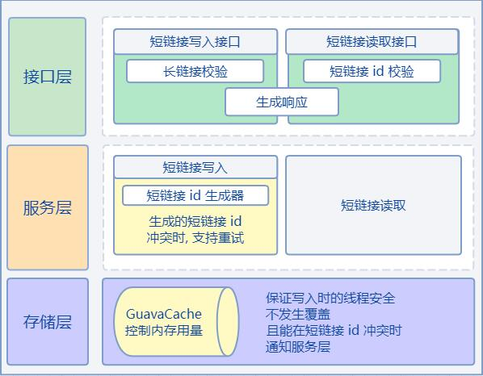
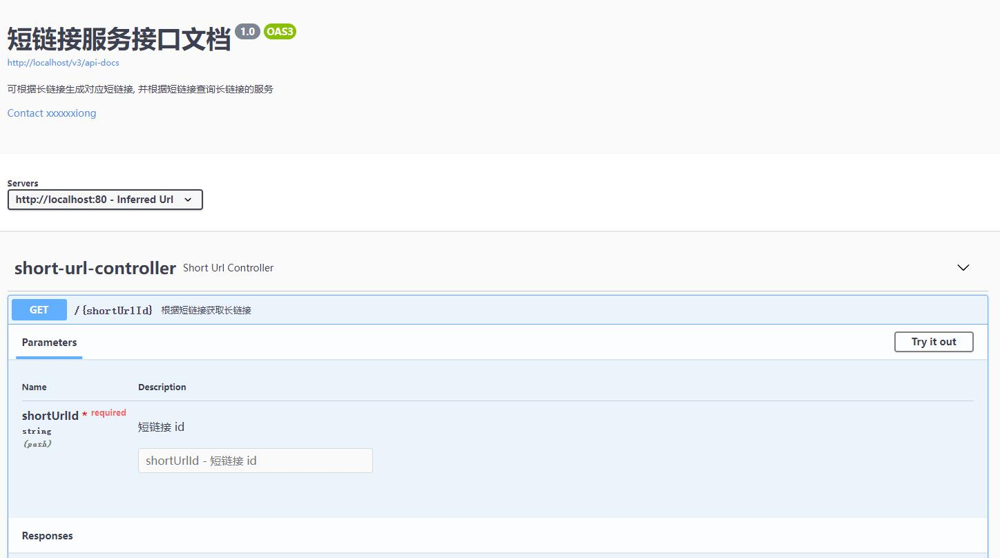
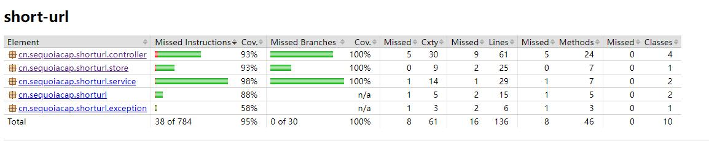
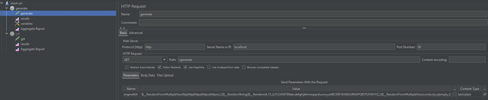
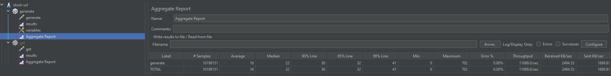
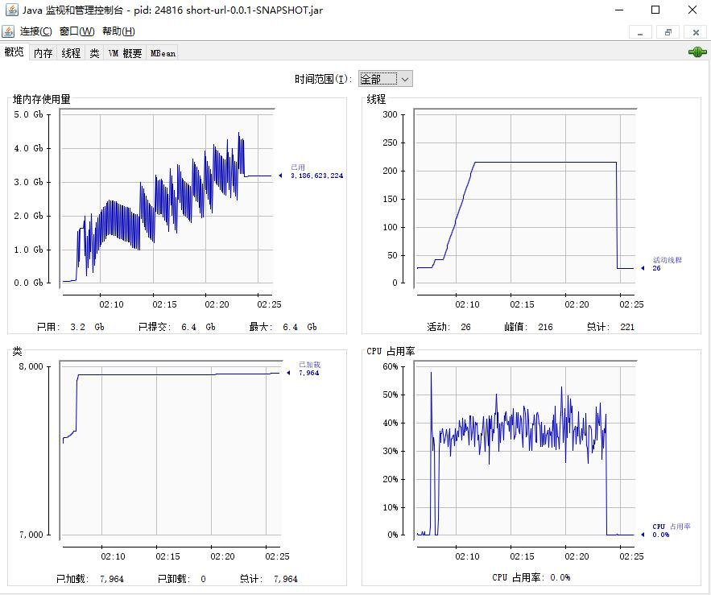
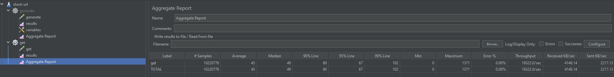
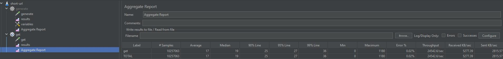
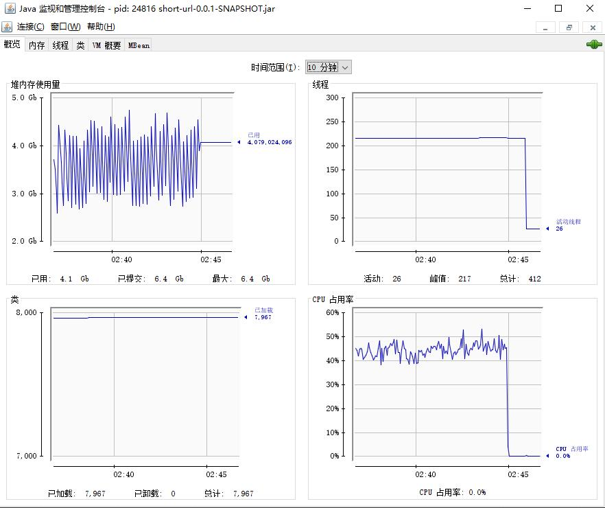

# 短链接服务

## 设计思路

+ 短链接存储接口
    1. 对传入的长链接求 murmur3 32 位 hash, 结果是一个 int 型数字
    2. 然后将这个数字转为 [0-9a-zA-Z] 这些元素组成的 62 进制的数字, 这个数字即为短链接 id
        + 这里最大的 int 转出来也只有 6 个字符, 符合短链接不超过 8 个字符的要求
    3. 尝试写到 GuavaCache 中
        + 如果写入成功则短链接 id 可用
        + 否则是发生了冲突, 更改 hash 算法的 seed, 重新生成再尝试写入, 最多重试 10 次
    4. 系统域名/短链接 id 即为返回的短链接


+ 存储设计
    + 使用 GuavaCache, 将短链接 id 和长链接的映射关系写在 JVM 堆中
    + 使用 GuavaCache 的根据 weight 剔除缓存的功能, 保证不出现 OOM
        + weight 最大设置为 2.8G, 整个堆设置为 6G, 老年代配置 4G, 70% 给我们写入的数据使用  
          剩下的空间给 GuavaCache 自己的 entry 以及整体项目其他部分使用, 可根据实际情况调整
        + 写入的每组数据 weight 的计算使用 (key.length + value.length) * 2byte (char)
    + 使用 Striped 锁保证写入的线程安全
        + 相同的 key 一定使用同一把锁, 如果有相同的 key 在同时写, 需要等待前面的写完, 避免覆盖
        + 不同的 key 用同一把锁, 在内存友好的情况下, 尽量保证写入的并发性能


+ 短链接读取接口  
  可直接读取 GuavaCache 中的数据即可, 读取不到说明不存在或者已被剔除

## 结构设计图



## Swagger 接口文档

启动服务后访问 [localhost/swagger-ui/index.html](localhost/swagger-ui/index.html)


## 单元测试覆盖率



## 性能测试方案

+ 使用 Jmeter 来进行测试, 使用 JConsole 观察 CPU 和 内存使用情况  
  来确定系统最高能支撑的 TPS 和 QPS
+ 机器配置: 6C16G

1. 使用如下命令启动应用

```
java -server -Xmx6G -Xms6G -Xmn2G -XX:+UseG1GC -XX:MaxTenuringThreshold=6 -XX:ParallelGCThreads=8 -XX:ConcGCThreads=8 -jar short-url-0.0.1-SNAPSHOT.jar
```

2. 测试写性能
    + Jmeter 启动 200 个线程, 随机生成长链接不断去写入, 同时将响应的短链接提取到文件中
    + Jmeter 压测配置  
      
    + 压测结果  
      
      平均响应时间 16 ms, 99 线 30 ms, TPS 11089, 看压测情况目前还没有达到系统瓶颈  
      最大值 702 ms 偏高, 可根据日志查看是否有多次 hash 冲突, 排查具体原因
    + JConsole 结果  
      
      CPU 稳定, 线程数稳定, 内存正常增长


3. 测试读性能
    + Jmeter 启动 1000 个线程, 从上一步结果文件中随机取短链接去访问
    + 压测结果  
        
      平均响应时间, 99 线都比较高, QPS 19322, 整体性能略差, 说明系统无法支撑 1000 的并发
    + 线程调整为 500, 再压测一次  
      
      平均响应时间, 99 线均变好, QPS 也到了 24542
    + JConsole 结果  
        
