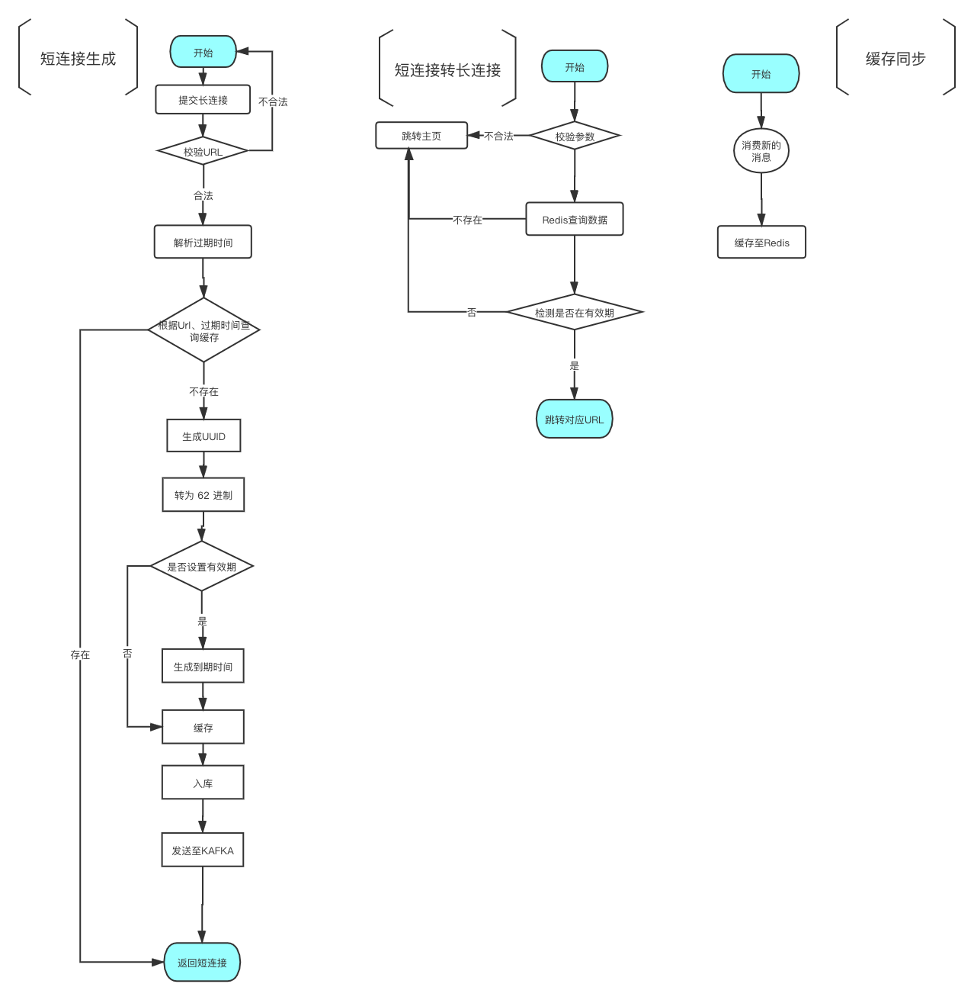

# 短域名服务

* [问题解决](#Question)

  * [高可用、容灾、高并发访问](#Cocurrent)
  * [全球不同地理区域访问体验](#location)

* [技术选型](#Technology)

* [架构设计](#design)

* [CI/CD pipeline](#pipeline)

* [监控告警](#monitor)

  

 <span id="Question"> </span>
## 问题解决

 <span id="Cocurrent"> </span>
### 高可用、容灾、高并发访问

使用分布式发号器解决分布式部署uid问题，同时可以将其作为分片键做分库分表

##### 单机压测结果

```shell
服务器配置：
2核CPU

JAVA 服务内存分配: 1G

Server Software:        nginx/1.14.1
Server Hostname:        127.0.0.1
Server Port:            80

Document Path:          /gen
Document Length:        27 bytes

Concurrency Level:      400
Time taken for tests:   5.734 seconds
Complete requests:      10000
Failed requests:        0
Total transferred:      1820000 bytes
Total body sent:        1830000
HTML transferred:       270000 bytes
Requests per second:    1743.94 [#/sec] (mean)
Time per request:       229.366 [ms] (mean)
Time per request:       0.573 [ms] (mean, across all concurrent requests)
Transfer rate:          309.96 [Kbytes/sec] received
                        311.66 kb/s sent
                        621.62 kb/s total

Connection Times (ms)
              min  mean[+/-sd] median   max
Connect:        0   12 100.3      1    1053
Processing:    29  185 249.0    123    1505
Waiting:       28  184 249.0    123    1503
Total:         29  197 278.5    125    2170

Percentage of the requests served within a certain time (ms)
  50%    125
  66%    152
  75%    166
  80%    177
  90%    213
  95%   1118
  98%   1181
  99%   1303
 100%   2170 (longest request)

```

##### 集群压测结果

```shell
服务器配置：
2核CPU

JAVA 服务内存分配: 1G
服务数量: 3

Server Software:        nginx/1.16.1
Server Hostname:        luman.work
Server Port:            80

Document Path:          /gen
Document Length:        0 bytes

Concurrency Level:      1000
Time taken for tests:   17.570 seconds
Complete requests:      100000
Failed requests:        0
Write errors:           0
Non-2xx responses:      100000
Total transferred:      9500000 bytes
Total body sent:        18400000
HTML transferred:       0 bytes
Requests per second:    5691.50 [#/sec] (mean)
Time per request:       175.701 [ms] (mean)
Time per request:       0.176 [ms] (mean, across all concurrent requests)
Transfer rate:          528.02 [Kbytes/sec] received
                        1022.69 kb/s sent
                        1550.71 kb/s total

Connection Times (ms)
              min  mean[+/-sd] median   max
Connect:        0  128 408.3      3    7031
Processing:     0   40  53.6     30    1077
Waiting:        0   37  53.2     27    1074
Total:          0  168 415.8     36    7072

Percentage of the requests served within a certain time (ms)
  50%     36
  66%     48
  75%     59
  80%     69
  90%   1026
  95%   1059
  98%   1094
  99%   1186
 100%   7072 (longest request)

```


由于压测工具 ab 不支持动态参数传递，所以测试方法较为简单粗暴。未测mysq瓶颈。

UID并发瓶颈大概为：28节点部署的情况下14400 UID/s 。但是由于机器码每次重启会变动，所以单节点每天重启12次的情况下可运行68年（参考于官方文档）


 <span id="location"> </span>

### 全球不同地理区域访问体验

整体策略如下

1. 分地区解析不同dns
2. 缓存层简易实现数据同步

异地多活主要难点在于不同地区数据中心数据同步问题。不管是数据库层同步还是基于 CRDT 算法的缓存层同步都比较复杂，调研了一下认为实现起来比较困难。找到一个基于 CRDT 的 redis 实现 `redislabs` 。由于是商业付费项目所以无法使用。

所以决定基于消息队列做一个简单的数据同步功能

不同地区生产完短连接后会生产消息，同时每个地区会实时消费消息并存入缓存。这样不同地区读取数据是会产生一定延迟，并且会出现一定的冗余数据。但不会影响整体业务流程。

示例:

[demo](http://a.luman.work)

服务器资源较小 nginx 做了频率限制

海外dns解析与大陆为不同服务器，可以通过挂代理/取消代理测试。大概有 10s 延迟，原因为 kafka 的提交策略配置。


 <span id="Technology"> </span>

## 技术选型

基于 `springboot` `kafka` `redis` `mysql`  [UidGenerator](https://github.com/baidu/uid-generator )  简单开发


<span id="design"> </span>

## 架构设计

### 业务流程图



 <span id="pipeline"> </span>

## CI/CD pipeline

* 集成 spring cloud config 实现配置中心
* 基于 aws 的 CodePipeline CodeBuild CodeDeploy 实现自动化部署

研究了一下 aws ，感觉功能性还是很强的。配置项很多，可拆分的组件也很多。简单的只做了一个部署流程，部署服务器为海外服务。

由于IAM 账号能看到 spring cloud config 的密码，就没在文档里提供账号密码。需要查看辛苦给我发下邮件。


 <span id="monitor"> </span>

##监控告警

[脚本地址](./monitor/)
