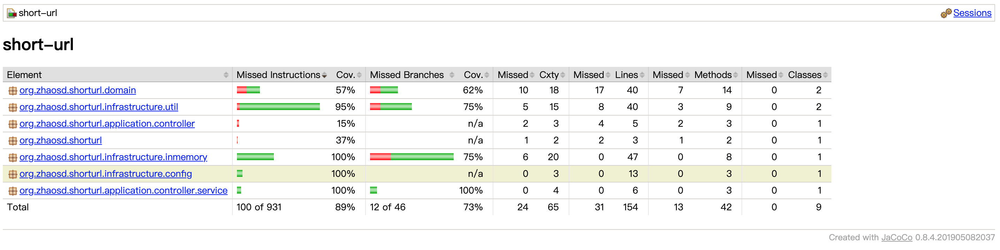

# short-url
实现短域名服务

## 项目运行步骤
* clone代码
* 用idea编辑器打开
* load gradle
* 运行gradle的Tasks/application/bootRun

## swagger访问地址
http://localhost:8080/swagger-ui/
提供俩个接口，分别如下：

1、写短链接数据接口： POST /url/to-short 长连接转短链接

2、读长连接数据接口： GET  /url/to-long  短链接回查长连接

## Jacoco单元测试覆盖率

## 设计思路及假设
项目采用DDD领域驱动设计，架构采用六边形架构。

其结构分为：
* 领域核心层domain
* 基础设施层infrastructure
* 应用服务层application

### 领域核心层domain
领域核心层主要汇聚业务领域相关的概念，将业务需求抽象成独立的业务领域服务代码。
* 我们设计了Url聚合根，用来聚合长连接转短链接的业务功能。
* Url采用充血模型，将项目核心转码功能封装到聚合根对象中：toShortUrl
* 领域层抽象了聚合根的存储仓库：UrlRepository，有了该抽象，我们就可以很容易的扩展领域对象的存储实现，比如保存在内存中或保存在各类不同的数据库中
* 领域服务对象：UrlDomainService，该对象封装了领域层对外提供的服务接口，主要是修改变更领域对象状态的操作类接口

### 基础设施层infrastructure
基础设施层封装了项目需要实际运行的基础设施，包括下面的组件
* config目录下的配置类，项目调用了Swagger，类似的配置代码放置在该目录
* inmemory目录存放了基于内存实现的领域对象仓库实现类，如果想支持mysql，也可以创建mysql实现的仓库类，可以通过MyBatis或JPA等不同方式来实现
* util目录存在项目用到的通用工具代码，比如加解密、字符串处理、日期处理等

### 应用服务层application
应用服务层用来存放领域核心层对外提供的服务接口，比如Rest接口，或Command cli接口等。
* controller目录用来存放Rest接口代码
* service目录用来存放查询类应用服务，该类服务不需要调用领域实体对象代码，只通过仓库来查询数据

## 防止内存溢出方案
在InMemoryUrlRepository内存存储实现类中加入了防止内存溢出代码，具体方案如下：

### 假设
假设内存中最大可以存储10万条记录

### 具体方案
当存储的记录数大于10万条记录时，系统会自动清空内存中一般的记录，防止内存溢出

在UrlDomainServiceTest中有一个用来测试内存溢出的测试用例：testOutOfMemory
* 在没有该机制的时候，的确会发生内存溢出
* 增加该机制后，不会再发生内存溢出

