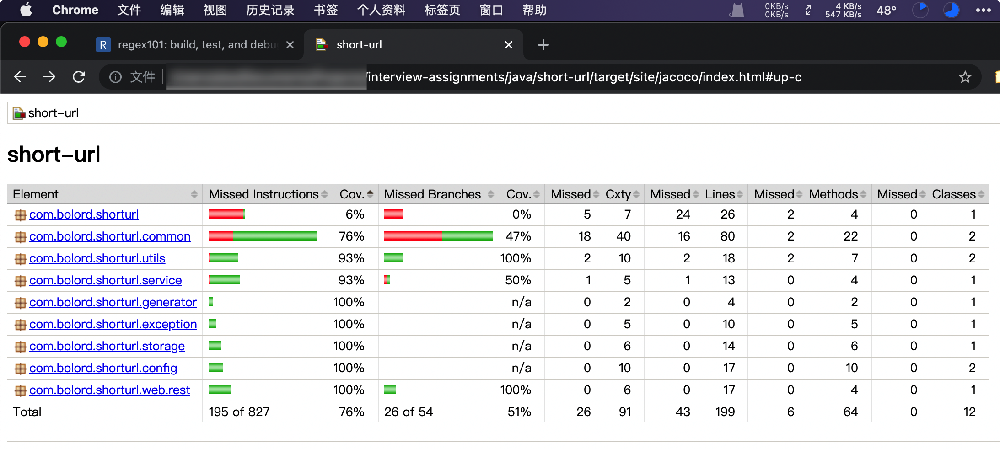
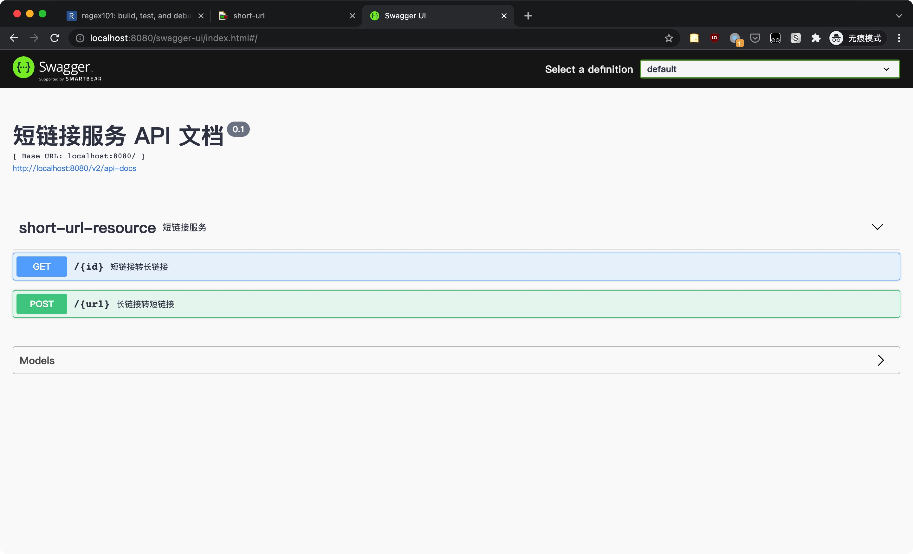
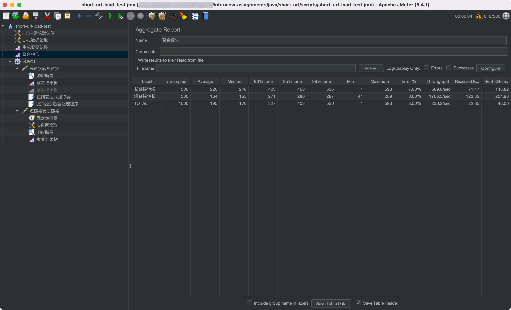
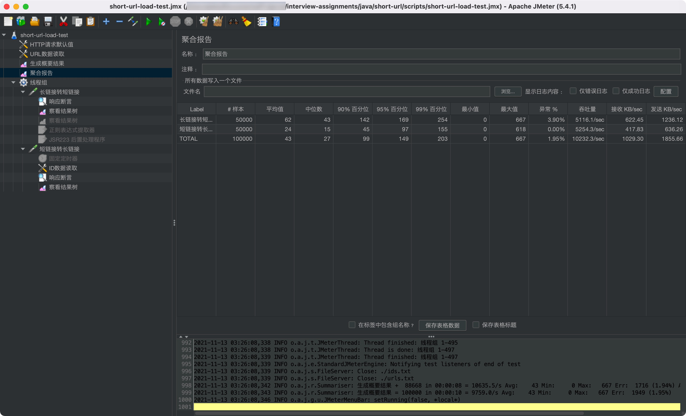

# 短域名服务

[TOC]

## 需求分析

> 撰写两个 API 接口：
>
> - 短域名存储接口：接受长域名信息，返回短域名信息
> - 短域名读取接口：接受短域名信息，返回长域名信息。
>
> 限制：
>
> - 短域名长度最大为 8 个字符
> - 采用SpringBoot，集成Swagger API文档；
> - JUnit编写单元测试, 使用Jacoco生成测试报告(测试报告提交截图即刻)；
> - 映射数据存储在JVM内存即可，防止内存溢出；

分析：

- 短域名长度最大为 8 个字符
  - 合法域名最短为 4 个字符，如 `t.cn`，不带协议的完整格式 `t.cn/{id}` 需要占用固定 5 个字符，只剩下 3 个字符的空间，使用 62 进制`（A-Za-z0-9）`转化后最大可用量为 `62 ^ 3 = 238328`，很可能会不够用，即使使用 `Base 64 URL Safe` 的字符来提高可用量，增长也并不明显。所以这里假设短链接的 ID 长度最大为 8 个字符，最大可用量为 `62 ^ 8 = 218,340,105,584,896`，可以满足长期大量使用。
  - 因考虑性能和哈希碰撞问题，计划采用自增 ID 的方式来实现，而自增会带来新的问题，就是 ID 可能会被猜测或者穷举出来，可以考虑使用 2 个字符来做随机，剩余 6 个最大可用量为 `62 ^ 6 = 56,800,235,584`，可以满足长期大量使用。
- 提升性能
  - 使用 Spring WebFlux 替代 Spring WebMVC。
  - 使用 Caffeine 替代 ConcurrentHashMap 本地缓存，提供最大缓存参数 `short-url.max-cache-size`防止内存溢出。
  - 使用 LongAdder 自增替代 AtomicLong。


可能存在的问题：

- 无效短链接的默认返回值
- 超时处理
- 短链接的状态管理（禁用，失效）
- 短链接的统计（访问统计，性能统计，长链归属统计等）


扩展性考虑：
- 集群模式
- 预编码的 ID 池（避免实时大量编码和计算）
- 数据存储方式扩展


## 设计方案

### 长链转换短链流程

```flow
st=>start: 开始
e=>end: 结束
op=>operation: 校验和过滤（格式、黑白名单...）
gid=>operation: 生成唯一标识（10进制）
enc=>operation: 编码唯一标识（62进制）
save=>operation: 保存映射数据
build=>operation: 构建返回短链接
err=>operation: 返回错误信息
cond=>condition: 是否通过

st->op->cond
cond(yes)->gid
gid->enc->save->build->e
cond(no)->err
err->e
```

可优化的点：

- 唯一标识预编码，如果采用自增方式生成唯一标识，可以预先生成编码好的唯一标识，做好映射，利用空间换时间。


### 短链转换长链流程

```flow
st=>start: 开始
e=>end: 结束
op=>operation: 校验和过滤（格式、黑白名单...）
gurl=>condition: 映射数据中是否存在
redirect=>operation: 返回 302 重定向
save=>operation: 保存映射数据
err=>operation: 返回错误信息
cond=>condition: 是否通过

st->op->cond
cond(yes)->gurl
cond(no)->err
err->e
gurl(no)->err
gurl(yes)->redirect
redirect->e
```

可优化的点：

- 根据需求，由于当前映射数据存储在 JVM 内部，可以直接判断是否存在。如果存储到如 Redis、MySQL 等数据库，可以维护一个布隆过滤器做前置过滤，避免无效请求压力到缓存或数据库服务器。


## 单元测试




## 接口测试

启动项目，访问 [Swagger UI](http://localhost:8080/swagger-ui/index.html)，因短链接转长链接接口，服务器会响应 302 重定向，在 Swagger 页面执行测试会出现问题，无法查看响应，可以查看浏览器控制台，或者使用测试工具。




## 性能测试


### 测试结果

> 服务器和客户端都在本机，可能存在不稳定因素，测试结果只作为参考

> 动态存取：因短链接 ID 有部分随机性，需要根据长链接转短链接的响应结果，动态提取 ID 并保存到文件，以保证短链接转长链接可以正常响应。测试计划内使用`正则表达式提取器 + JSR223后置处理器`动态更新了列表，禁用后则不会继续更新 ids.txt 文件，导致每次循环访问的都是文件内的 ID，可能会影响测试结果




在 `500` 个并发线程的场景下，开启动态存取，执行 `1` 次可以达到：

- 长链接转短链接 - `589/TPS`
  - 错误率 7% 是因为 urls.txt 列表里存在部分不合法的链接，响应了 400 Bad Request
- 短链接转长链接 - `1706/TPS`




在 `500` 个并发线程的场景下，禁用动态存取，执行 `100` 次可以达到：

- 长链接转短链接 - `5116/TPS`
  - 错误率 3.9% 是因为 urls.txt 列表里存在部分不合法的链接，响应了 400 Bad Request
- 短链接转长链接 - `5254/TPS`


### 测试方法

使用 JMeter 工具测试，提供 jmx 测试文件，通过 JMeter 打开 `short-url-load-test.jmx` 文件进行测试，或者通过以下命令测试并生成测试报告：

```bash
cd ./interview-assignments/java/short-url/scripts
./jmeter -n -t ./short-url-load-test.jmx -l ./result.csv -e -o ./report/
```


### 测试环境

- 硬件：

  服务器 + 客户端 `MacBook Air M1 2020 8GB`

- Java版本：

  ```bash
  java version "1.8.0_281"
  Java(TM) SE Runtime Environment (build 1.8.0_281-b09)
  Java HotSpot(TM) 64-Bit Server VM (build 25.281-b09, mixed mode)
  ```

- JVM参数：

  `-Xms1G -Xmx1G -XX:MaxMetaspaceSize=256M -XX:+UseConcMarkSweepGC`

- Spring Boot Profile：

  `prod`

- JMeter版本：

  `5.4.1`
