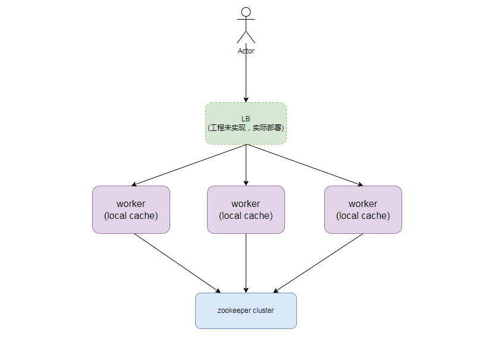
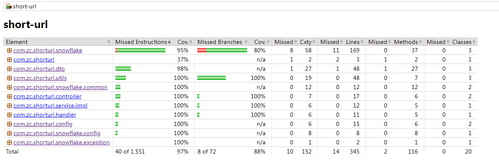

# short-url
## 简介
一个限定条件下的分布式短链接生成系统。主要框架 springboot + ehchace + zookeeper。

## 系统设计
### 背景
#### 题目分析与几点需求澄清
本人对题目中的以下几点限制和需求做出分析与澄清：

> 需求1：映射数据放在JVM，防止内存溢出

采用LRU策略即可，有一定时效性，允许长时间不用失效。

> 需求2：按照生产级的要求编写代码

为了与上面第一个点（放内存中）不冲突，考虑将所有映射数据放内存中，但是防止重启后数据丢失，
做了落盘，重启时全部加载到内存中。考察ehchace可实现该需求1与需求2。

> 需求3：短域名长度最大为8个字符

考察多种算法后采用leaf改进的snowflake id生成算法，生成分布式唯一id后转62进制， 由于8个字符限制，对考察多种算法后采用leaf改进的snowflake id位做了自定义修改。
具体细节在详细设计章节中描述。

#### 场景假设

假设一下场景需求，考虑qps和存储。 实际生产大概率是在数据库的硬盘中。

假设微博或者Twitter要实现短域名，他们的日活跃用户数量为1亿。

写： 平均每天每10个人发一条带url的微博，则写的qps 为 1亿 / 10 / 86400（一天的秒）= 100， 
每天有活跃时间和非活跃时间，假设峰值为300好了。

读：由于存储在内存中，完全能满足读的性能。

存储：假设一条需要100字节，一天需要容量 1亿 * 100B / 10 ≈ 1G，如果LRU缓存最大容量设置1G，则可保证大概至少一天的时效性。

### 详细设计
在满足上面的题目需求与场景假设前提下，做了以下考虑与设计：

#### 短链接生成算法
考察发现主要有以下2大类：

1. 摘要算法

  由于该算法本质上是一种hash映射， 大空间映射到小空间，肯定会存在冲突，需要做冲突避免策略，策略主要逻辑是
查询到重复后，加后缀继续生成hash，然后继续判断是否重复，直到不重复插入存储；虽然本题要求存储在内存中，查询重复判断损失很小，
但是如果放在真实生产环境的数据库中存储，性能损失较大，所以不太想选择该方案。


2. 自增id

  生成自增id后转base62, 62位的字符包括a-z， A-Z， 0-9 ，可采用混淆保证一定的安全性。
  主流有以下几种方案：

- 数据库自增：采用传统MySQL等自带auto_increment的特性，生成id；
  可采用多台数据库，设置步长方式解决单机性能问题；采用提前批量获取id的方式优化性能；
  缺点：扩容数据库时，重新设置步长比较麻烦；另外这种方式全局不太有序。
    
- 经典snowflake id：时间戳+机器ID+序列号的经典生成方式，不依赖任何组件，时间戳在高位保证整体趋势递增；缺点：存在时钟回拨的问题，而且机器ID需手工配置保证唯一也是个问题。
 
- 改进snowflake id: 参考美团Leaf的方案，引入zookeeper, 可解决时钟回拨与机器ID自动分配的问题。如果zk集群故障，本地还有缓存机器ID可使用。

综合考虑后，采用改进的snowflake id生成算法，但是还存在问题需要考虑： 
- 8位62进制最大数为 62^8 - 1 = 218340105584895，而snowflake生成的id最大数为
2^63 - 1 = 9223372036854775807， 显然转换为62进制又会存在截断冲突问题，要么增加进制数（不可能，URL有效字符限制），要么减少snowflake id的位数，
所以这里采用自定义缩短snowflake id位数的方式，经过计算采用47位的id组成可满足：2^47 - 1 = 140737488355328，即总共要缩短16位；
- 具体组成为 41位毫秒时间戳 + 3位机器ID + 3位序列号， 我们来看看该组成方式是否满足需求，
每秒能够生成的id最大数量为 1000 * 2^3 * 2^3 = 64000， 完全能够满足上面假设场景的300qps。
- 我们可以再存储一份longUrl到shortUrl的映射，减少重复生成的同时提高性能，这份缓存大小可设置为shortUrl到longUrl的1/100，只保存较热点的url。


#### 架构设计图




#### Jacoco覆盖率




## 系统性能测试
时间有限，这里只简单说一下测试方案：

- 压力测试系统方案，考虑的LRU策略，可采用热点数据和冷数据组合来压测，观测LRU命中率，有效性，qps, 耗时分位数p99, p50, 内存 cpu消耗等指标；
- 主要可能出现的问题及调优：根据真实具体场景比如热点数据的比例，qps和内存消耗调整LRU配置；是否出现崩溃和full gc情况，开启HeapDump和gc日志，具体分析调整JVM参数或者代码；

## 使用

### 环境
- JDK 11
- Docker 18+

### 快速启动
`````` shell script
# 进入项目根目录
cd short-url

# 修改配置，主要是zk地址和本地缓存目录
vim src/main/resources/application.properties
vim src/main/resources/ehcache.xml

# 执行docker脚本，构建服务镜像
cd scripts/docker
./build.sh

#启动服务
sudo docker-compose up -d
``````

### 接口调用
参考swagger: http://localhost:${server.port}/swagger-ui/index.html

