# 短域名服务
## 需求分析
- 短域名服务，两个接口
  - 接口1：可根据原始链接生成短链接，并保存到系统，若已经生成且保存过，则直接返回已生成的短链接。
  - 接口2：可根据短链接查询系统中对应的原始链接。

- 短链接限制8字符（不包含域名）。
- 不可重复，一个短链接只能对应一个原始链接。

## 设计思路
### 短域名生成算法
目前比较通用的方法有两种：自增序列算法、摘要算法

- 自增序列算法：
  - 生成自增id（可用mysql主键id、雪花算法等），然后id转化为62个字符[ a - z, A - Z, 0 - 9]，10进制转62进制，8个字符总共可以表示62^8≈218万亿。
  - 优点是不会重复。
  - 缺点需要增加第3方依赖复杂化，mysql主键id依赖mysql，雪花算法机器id分配依赖第3方存储，单机情况下也可硬编码，同时存在时钟回拨问题，最简单的解决方式是直接抛异常。

- 摘要算法：
  - 先md5生成32位加密串，取前10个字符，看成16进制对应40个bit位，每5个bit位可表示0~63，可对应到62个字符[a - z, A -Z, 0 - 9]的index，40个bit位共可表示8位这样的字符，合起来即为所需的8位短串。
  - 优点：内存操作，简单可靠。
  - 缺点：可能有重复，概率极小。

本次需求采用摘要算法，重复性问题在业务层来解决，借鉴乐观锁/CAS里的思想，可假定不重复，重复时再重试。

### 服务架构
- 本次采用单机部署，暂不考虑分布式，若后续有分布式诉求，可考虑前置nginx做反向代理及负载均衡。

### 存储结构
- 此次需求采用JVM内存存储，暂不考虑持久化，重启会导致存储数据丢失。若有持久化诉求，可考虑mysql做可靠存储，redis缓存提升读性能。
- 内存存储使用两个map存储短链接及原始链接对应关系，分别是以短链接及原始链接作为key，便于查询。
- 为保证map内存不溢出，使用LRUCache，当容量超过最大限制时，删除掉最近最少使用的数据。
- 为保证线程安全，使用读写锁做并发控制保证两个map数据一致性。

## 具体实现
### 整体结构
- 整体架构：

    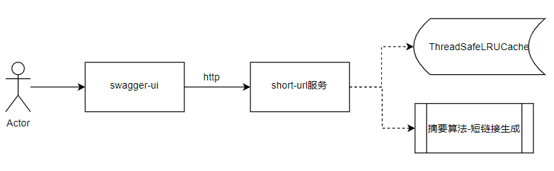
- 获取短链接流程：

    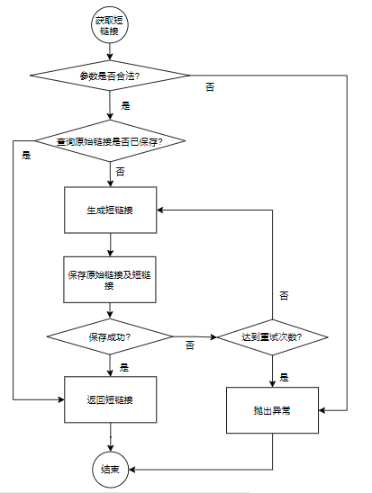
- 获取原始链接流程：

    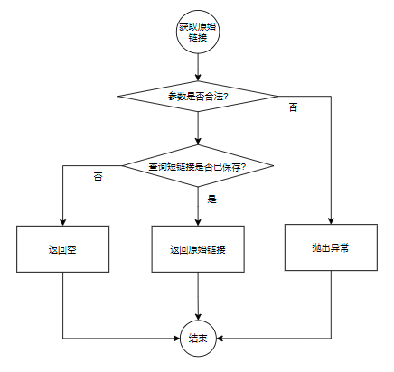
    
## 测试
### 功能测试
- 单元测试及覆盖率：

    
    
    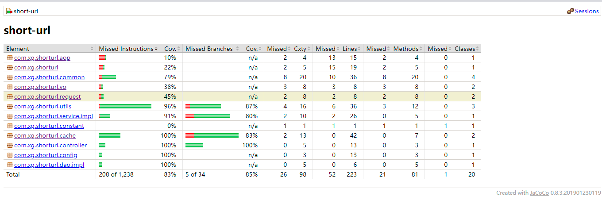
- 页面测试：
  - swagger-ui：http://localhost:8080/swagger-ui.html#/short45url45controller
  
   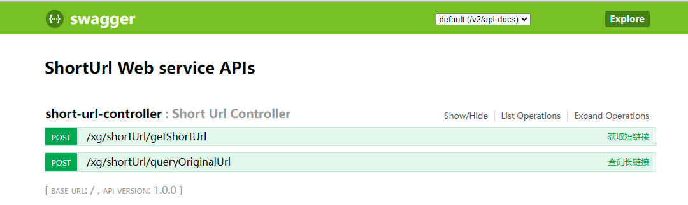
  -   获取8位短链接
  
   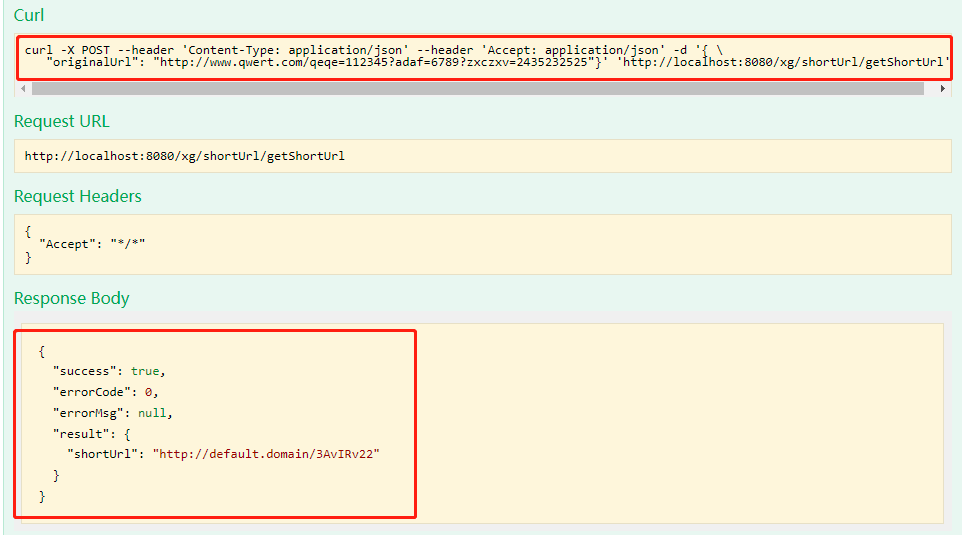
  - 获取原始链接
  
   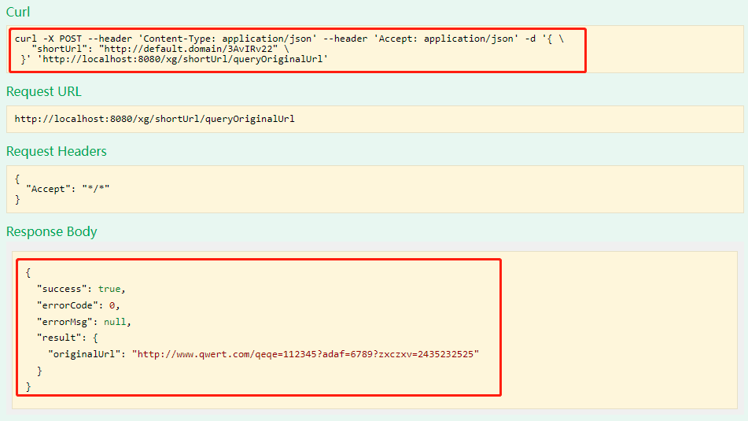

### 性能测试
#### 观测指标
- 机器cpu load、机器内存占用率、平均响应时间、最大响应时间、吞吐率等

#### 测试工具
- JMeter：Apache的一款纯java编写性能测试开源工具软件，可使用该工具对服务http接口进行整体测试。
- Java visualVM：JVM自带的可用于对Java应用程序进行性能分析的一款可视化工具。

#### 参数配置
- 机器配置：4核8G
- Tomcat参数：使用springboot内置tomcat, 默认参数maxThreads=200, maxConnections=10000
- JVM参数：jdk1.8, -Xms512m -Xmx512m, -XX:+UseParallelGC(默认值)
- Java应用层参数：LRUCache.maxSize=100000

#### 测试方案
- JMeter设置线程组，对服务两个接口同时发起请求，获取短链接(写)及查询原始链接(读)。
- JMeter对接口入参链接中加入随机值，以Mock随机流量。
- 以不同的并发数循环请求5min。
    
#### 测试结果

    | 并发数 | Throughput(/s) | Avg rt(ms) | 99% line | Cpu使用率 | 内存 |
    |   10   |      1429      |     6      |    46    |    60%    |  -   |
    |   20   |      1432      |     13     |   130    |    70%    |  -   |
    |   50   |      1368      |     35     |   375    |    90%    |  -   |

- 结果分析：系统吞吐率在1400左右，并发越高，rt越低。受系统性能限制，太高的并发数反而吞吐量下降，这与cpu上下文切换、内存等因素有关。
- 完成测试截图
    - 10并发-JMeter测试报告
    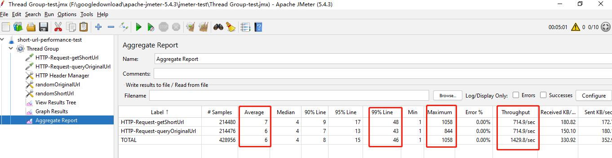
    - 10并发-JVM监控
    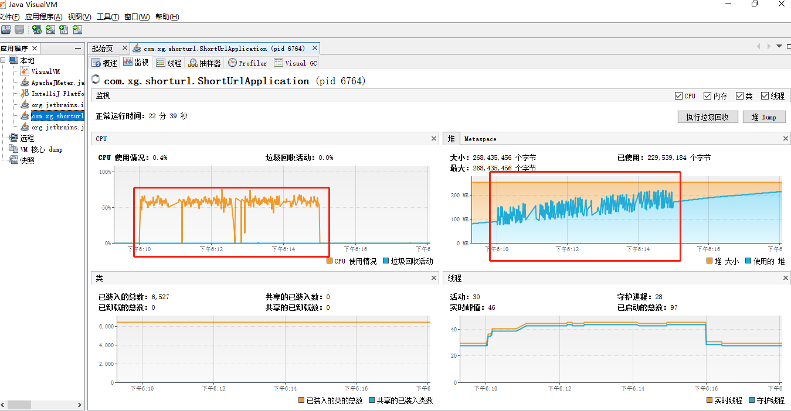
    - 10并发-JVM内存分析
    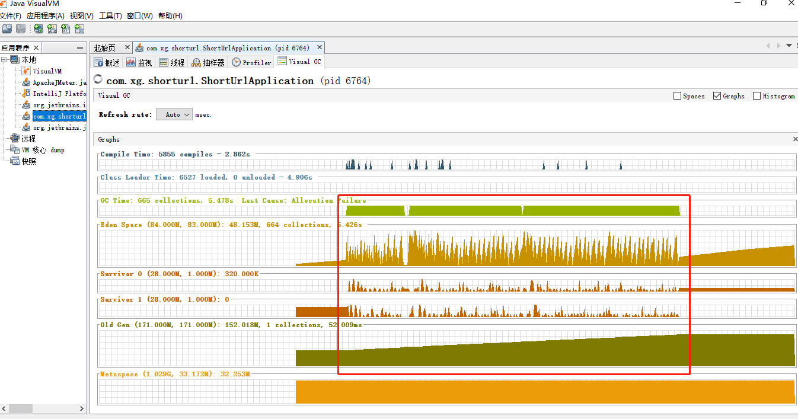
    - 20并发-JMeter测试报告
    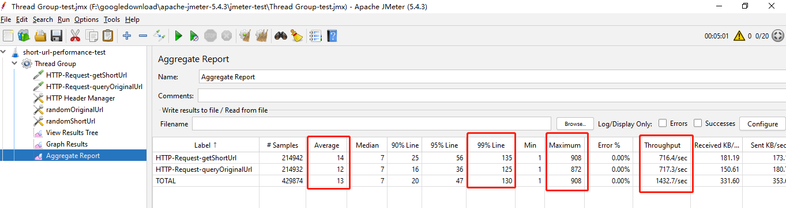
    - 20并发-JVM监控
    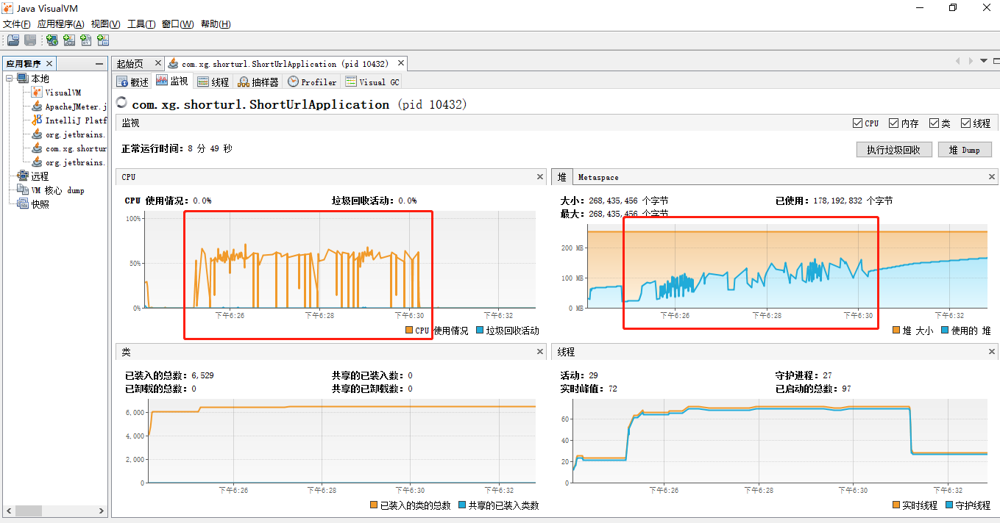
    - 20并发-JVM内存分析
    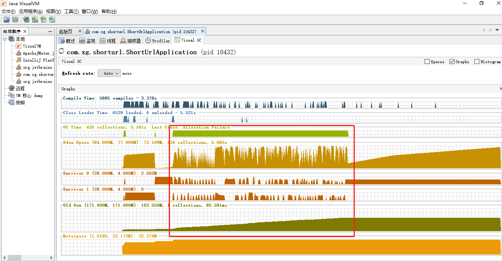
    - 50并发-JMeter测试报告
    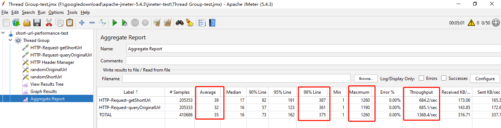
    - 50并发-JVM监控
    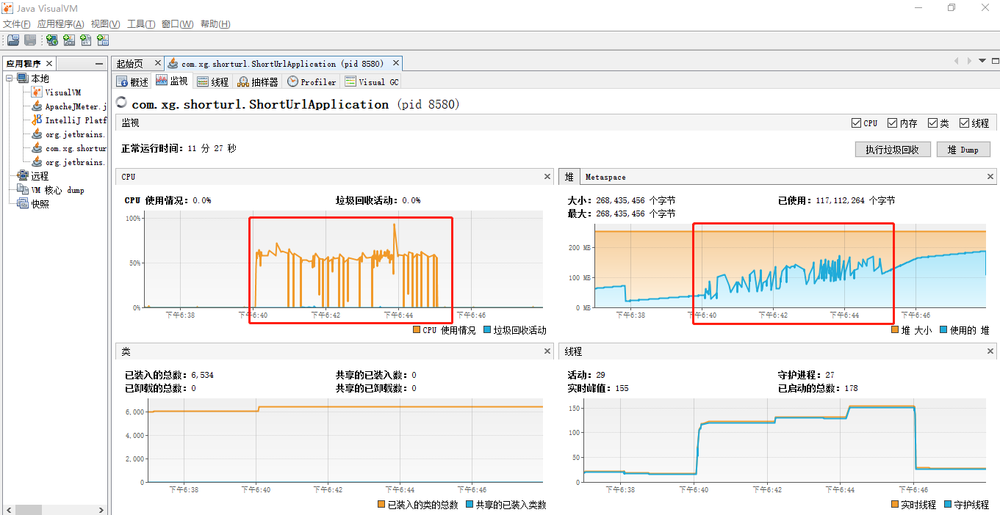
    - 50并发-JVM内存分析
    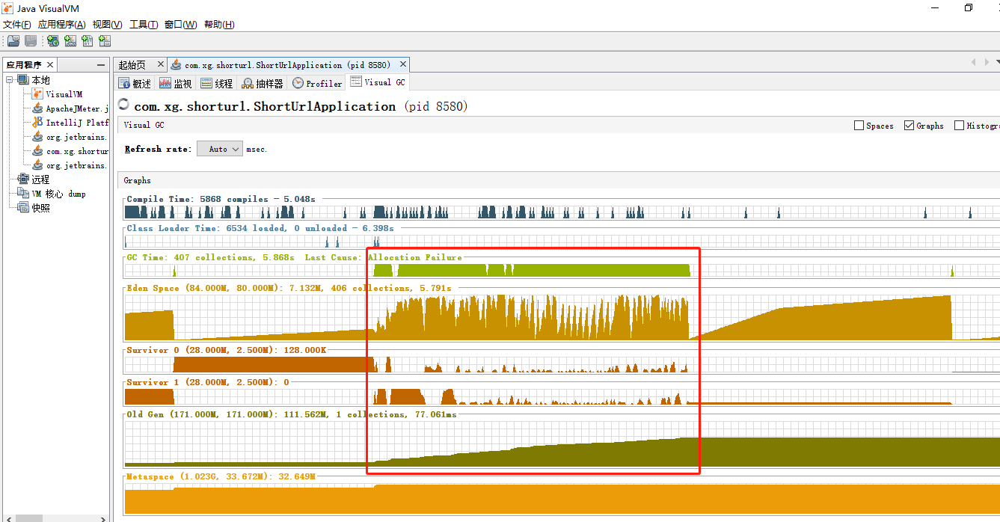
