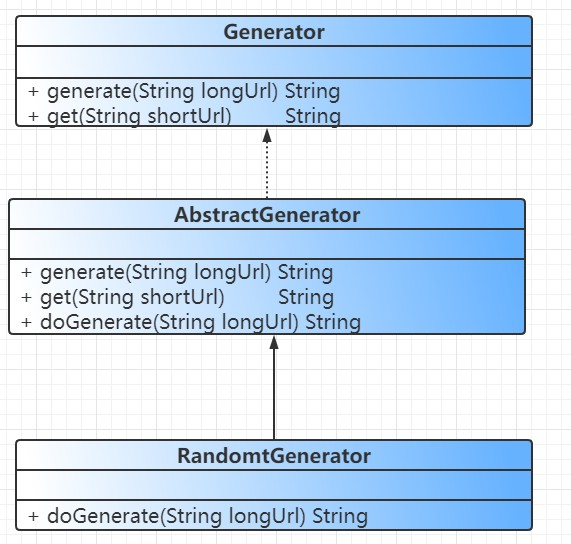
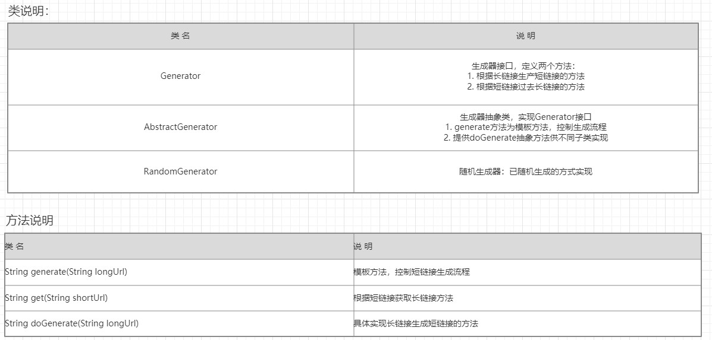
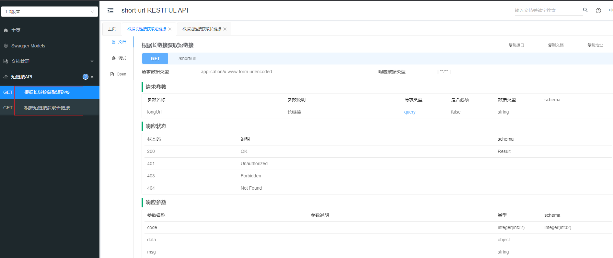
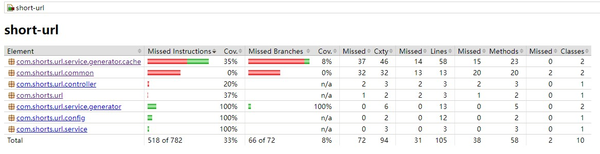

# short-url设计文档

## 1. 设计思路
下面是我的一些思考：  
Q: 如何实现长链接到短链接的转换且短链接最大8位字符？  
A: 我能想到的有下面几种方式：
1. 在数字和英文字母中随机生成长度为8的字符串
    - 优点：实现方式简单
    - 缺点：存在不同长链接生成相同的短链接的情况
    - 解决方式：生成短链接后，从缓存中拿到原始长链接和现有长链接做对比，如果不一样说明发生了冲突，此时可以参考HashMap的方式，采用链地址法解决这种冲突
2. 通过一种可逆算法，实现长链接和短链接之间的转换可逆，这样还可以省去存储的开销
    - 但是是否有这种算法，未知；能否自己实现？目前我实现不了。。。
3. 通过发号器的方式。每来一次请求，发号器累加1,累加结果作为短链接的值。
    - 优点：实现简单
    - 缺点：有8位字符限制，很容易达到上限。另外生成的短链接有规律，很容易被攻击
    - 解决方式：可以考虑实现数字到字符串的转换

Q: 相同的长链接生成的短链接是否一样？  
A: 我自己实现了LRU缓存，默认大小500，可以调整。最近生生成的500个长链接如果重复生成的话，可以得到相同的短链接。  

本项目中，我采用的是第一种方式。

## 2. 架构设计

## 3. swagger-ui地址
项目启动后访问：http://localhost:8080/doc.html

## 4. 单测覆盖率 

